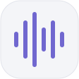
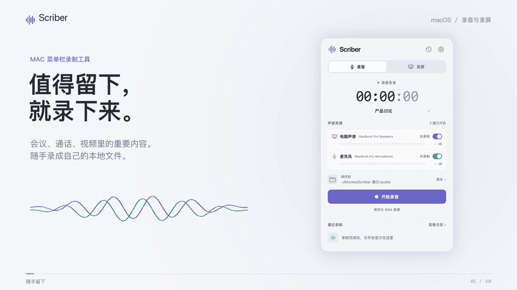

<p align="center"></p>
<h1 align="center">Scriber</h1>
<p align="center"><a href="README.md">简体中文</a> · <strong>English</strong></p>
<p align="center"><strong>Record it. Put it to work.</strong><br />Audio and screen recording from your Mac's menu bar. Keep what matters as local files.</p>
<p align="center"><a href="docs/USAGE.md">User guide</a> · <a href="https://raw.githubusercontent.com/luyao618/dayscribe/main/video/scriber-intro-en.mp4">One-minute demo (MP4)</a> · <a href="#get-started">Get started</a> · <a href="docs/ACCEPTANCE.md">Validation status</a></p>

[](https://raw.githubusercontent.com/luyao618/dayscribe/main/video/scriber-intro-en.mp4)

<p align="center">↑ 10-second preview · <a href="https://raw.githubusercontent.com/luyao618/dayscribe/main/video/scriber-intro-en.mp4">Download the full 60-second MP4</a><br /><sub>1080p · English narration and presentation text · English and Chinese subtitles · Real native app footage</sub></p>

## Why Scriber

A useful discussion in a meeting, a decision on a call, an explanation in a video. Save what you hear and see as local media, ready to replay, share, or hand to your own agent.

Scriber puts recording in a small panel you can open whenever you need it. Choose your audio sources and capture area, start recording, and keep the files when you finish.

- **Control each audio source.** Switch system audio and your microphone independently. Live levels and status indicators show whether each source is receiving sound.
- **Get separate audio with every screen recording.** Save an MP4 with sound and a matching M4A in one recording, without extracting the audio afterward.
- **Keep your files locally.** Choose the destination, play or rename recordings in history, and reveal them in Finder. Use the files with your preferred tools.

Scriber handles recording and file management. Summarization, transcription and analysis happen in the other tools you choose.

## How to use it

1. **Open the panel.** Click the waveform icon in the menu bar, or press the default shortcut, **⌥R**.
2. **Choose what to record.** For audio, select system sound and/or your microphone. For screen recording, also choose a region, a window or an entire display.
3. **Start recording.** Check the elapsed time and audio status, and edit the filename while recording. Closing the panel keeps the recording running.
4. **Stop and save.** Files are saved automatically to your chosen folder. Play them in history or open their location in Finder.

| Mode | Files you get |
|---|---|
| Audio recording | One M4A mixing the audio sources enabled during recording |
| Screen recording | One MP4 with sound + a separate M4A with the same base filename |

Screen recording supports a **selected region, a single window or an entire display**. Drag to select a region, then press Return to start; Esc cancels. Audio and screen recordings can use separate destination folders. Each screen recording's two files stay together.

## Get started

Scriber requires an **Apple Silicon Mac running macOS 26+**. The current v0.1 is intended for personal use and is built from source with a local signature. Building also requires **Xcode 26**.

The interface supports English and Simplified Chinese. At launch, Scriber uses English when the primary system language is English; otherwise, it defaults to Simplified Chinese. You can also choose a language for Scriber under macOS **Language & Region → Applications**. Restart the app after changing the language. Existing filenames and save locations stay unchanged.

```sh
git clone https://github.com/luyao618/dayscribe.git scriber
cd scriber
./scripts/build-app.sh release
open build/Scriber.app
```

On first use, follow the macOS prompts to grant **Screen & System Audio Recording** and **Microphone** permissions. The current implementation also needs Screen & System Audio Recording permission for microphone-only capture. Quit Scriber before rebuilding it.

The default folders are `~/Movies/Scriber/录音` for audio and `~/Movies/Scriber/录屏` for screen recordings. Click the destination row in the panel to change them. The app runs without Python, FFmpeg or cloud services.

See the [user guide](docs/USAGE.md) for permissions, shortcuts, renaming and recovery instructions.

## Current status

v0.1 includes the recording panel, independent audio sources, all three screen capture modes, paired files, history management and recovery handling.

Real-time **eight-hour audio** and **two-hour screen recording** runs have file-duration, full-decode and resource-use records. The eight-hour audio recording retained a microphone recovery warning after an input-device change, so it does not establish uninterrupted audio. Physical headset switching, microphone continuity, and lock/sleep/lid behavior are assigned to the project owner for later personal validation, with bugs reported as encountered. See the [validation overview](docs/ACCEPTANCE.md) for results and scope.

## Documentation and development

Some linked guides are currently in Chinese.

- [User guide](docs/USAGE.md): permissions, audio and screen recording, destinations and history.
- [Development and validation entry points](docs/DEVELOPMENT.md): builds, signing, real capture checks and implementation behavior.
- [Requirements and scope](SPEC.md) · [Detailed validation log](docs/VALIDATION.md).
- [Product film and production source](video/README.md): storyboard, captions, provenance, local player and rendering instructions.
- [Panel design](design/DESIGN.md) · [Interactive prototype](design/index.html): the approved visual baseline; the prototype uses demo data.
- [Goal and small-PR delivery workflow](GOAL.md).

The earlier dayscribe direction is [archived](docs/archive/dayscribe/IDEAS.md). The old ASR experiment remains in [PR #4](https://github.com/luyao618/dayscribe/pull/4) and is outside the current Scriber feature set.
