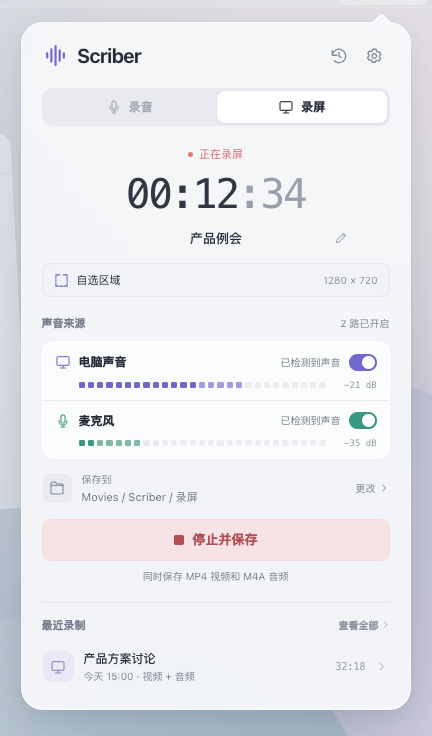

# Scriber（暂定名）

一个 macOS 一键录音 / 录屏工具。

目标很简单：需要记录时快速开始，结束后拿到可用的音频或视频文件。

首要场景是自己录下 Teams 等会议，直接获得本地媒体文件，交给 agent 总结、分析和沉淀。

第一版面向自己的 Mac 使用，兼顾超过 6 小时的长录音、通常不超过 2 小时的录屏，以及有线 / 蓝牙声音设备。

```text
选择录音或录屏 → 开始录制 → 停止 → 保存文件
```

- **录视频**：保存带声音的视频，同时保存独立音频。
- **只录音**：电脑声音和麦克风可以分别开关，最终保存一个合成音频文件。

每次从小面板确认设置后开始。录完自动保存，历史列表支持播放、改名和在 Finder 中定位文件。

> 2026-09-16 重新确定方向。Scriber 为候选名称；主面板已接入双路音频引擎。运行中独立声音启停已通过内置与 USB 设备实测，全屏录制已通过测试入口实测，范围选择与正式入口已通过实际界面操作验证。

## 原生应用开发

当前主面板使用 AudioRecorder，默认选择两路声音并记住后续选择，分别显示真实电平、麦克风设备提示与文件名，停止后显示最近保存的 M4A。运行中声音切换、独立采集流启停和 AppKit 退出保存已通过真实验证。全屏／窗口／区域 MP4+M4A 已有真实采集验证，正式录屏入口和原生选择器已接入，实际点击流程已验证。录制已使用目标目录中的独立临时文件，完成写入后防覆盖保存；面板支持录制前、录制中和保存后改名，已通过实际界面操作验证；录音、录屏目录可分别设置并记住，录制中更改从下一次生效；新录制已登记到持久化历史索引，历史列表、搜索和 Finder 定位已接入；详情播放已接入，详情支持历史记录改名。

需要 macOS 26+、Apple Silicon 和 Xcode 26。运行 `./scripts/build-app.sh` 构建并本地签名，随后双击 `build/Scriber.app`，或运行 `open build/Scriber.app`。菜单栏波形图标用于打开和收起面板，面板右上角设置菜单可退出应用。

脚本默认构建 debug，传入 `release` 可构建优化版本。重新构建前先退出 Scriber，脚本会拒绝覆盖正在运行的应用包。若本机只有一个有效 Apple Development 签名身份，脚本优先使用它以保持更新身份稳定；否则使用本地 ad-hoc 签名。可用 `SCRIBER_SIGN_IDENTITY` 明确指定身份或指定 `-` 使用 ad-hoc，无需创建新证书。

录屏操作：在面板切到「录屏」，通过范围行选择「自选区域／单个窗口／整块屏幕」，再点「选择范围并录屏」。区域模式拖动框选后按回车或「开始录屏」，Esc 取消；窗口／屏幕模式使用 macOS 选择界面。停止后生成同名 MP4 和 M4A，最近录制可在 Finder 中同时定位两份文件。区域首次拖动、系统窗口／屏幕选择、取消和录制中退出保存均已通过原生实际操作验证。

短时真实麦克风检查：先退出普通 Scriber，再运行 `open build/Scriber.app --args --show-panel --microphone-check /absolute/output/directory 5`。该入口现在使用同一双路引擎的麦克风模式，需要麦克风及屏幕与系统音频录制权限，保存 M4A 和 result.json 并退出。中途退出会标记为 interrupted，不算完成请求的时长。测试音频请保留在本地，不提交进仓库。

也可运行 `scripts/check-microphone.py --seconds 5`，或 `scripts/check-microphone.py --seconds 30 --interrupt-after 2` 验证录制中退出。脚本需要 ffmpeg / ffprobe，仅用于检查文件时长和完整解码，不是应用运行依赖。

电脑声音检查：`scripts/check-system-audio.py --seconds 8` 会通过系统播放两段很轻的已知频率测试音，并从实际录制文件检查频率、顺序、时长和完整解码；`--seconds 30 --interrupt-after 5` 可验证异步退出保存。仅写音频，不保存屏幕画面。首次需要在系统设置中允许 Scriber 的屏幕与系统音频录制权限。

双路混音检查：`scripts/check-system-audio.py --sources both --seconds 8`。麦克风声学校准可使用 `--sources microphone --microphone-device BuiltInMicrophoneDevice --playback-device BuiltInSpeakerDevice`，短测试音只通过内置扬声器播放，录制只取麦克风，保持系统默认设备设置。其他设备 UID 可通过`xcrun swift tools/PlayAudioFixture.swift --devices` 查询；使用 `--expected-microphone-rate` 检查实际输入采样率。每次只生成一份 M4A，原始媒体和诊断数据保存在忽略提交的 artifacts/ 下。这些短测不能替代设备切换、蓝牙和 8 小时 / 2 小时验收。

主面板与运行中切换检查：`scripts/check-source-switching.py` 会录制 11 秒并检查声音开关、底层回调、输出信号和最后一路保护；支持 `--sources` 与 `--microphone-device`。AppKit 退出检查可用 `scripts/check-system-audio.py --panel --sources both --seconds 30 --interrupt-after 5 --quit-via-appkit`。这两项已通过实际采集验证；测试时 Mac 需解锁并亮屏。

全屏录制检查：`scripts/check-system-audio.py --video --sources both --seconds 8`，或直接 `open build/Scriber.app --args --display-video-check /absolute/output/directory 8 --audio-sources both`。会真实录下主显示器，输出同名 MP4（有声音）和 M4A；支持 `--quit-via-appkit --seconds 30 --interrupt-after 5` 验证退出保存，`scripts/check-source-switching.py --video` 验证录屏中切换声音。视频测试时长包含采集流准备前确定的公共起点，可能比指定等待时间稍长。独立音频与 MP4 解码后的声音样本对应；AAC 容器显示时长可能仍有几十毫秒编码填充。原始媒体仅保存在本地 artifacts/，不提交。

文件名操作：点击计时器下方的文件名或铅笔，输入后按回车或勾号确认。Esc／关闭面板丢弃未确认的编辑。录制中改名不移动正在写入的文件；保存后改名会同时修改视频与音频，并在重名时自动编号。输入无效名称仍可停止录制，使用上一次已确认名称。每种模式在本次运行中保留最近确认的自定义名称供下次录制使用；默认自动名称仍按时间生成。

保存位置操作：点击主面板的保存位置行，或设置菜单中的「保存位置设置」，分别为录音、录屏选择文件夹。选择后自动记住，取消保留原设置。录制中主面板显示本次目录和「下次生效」提示；保存后的文件仍在原位置。录屏的视频和独立音频一起使用录屏目录。

历史操作：点击顶部历史图标或「查看全部」，按名称搜索录制；每次录屏的视频和独立音频显示为同一条记录。点击记录名称进入详情，可播放／暂停、通过进度条定位、切换视频或独立音频；每次打开和切换都先暂停。收起面板暂停预览，返回列表释放当前播放器并保留搜索条件。行末文件夹按钮在 Finder 中定位可用文件。详情标题旁的铅笔可修改历史名称；回车或勾号确认，Esc 取消。改名会先暂停并释放预览，同步处理本次已保存的视频与音频，重名时一起编号。缺失和未完成的文件会明确标出；刷新失败时保留已显示的记录。重启后，最近录制和历史会恢复。

历史存储：正式应用在开始媒体写入前登记本次录制，索引位于 `~/Library/Application Support/Scriber/history.json`；每次录制的名称、时长、文件位置与状态保留在对应的 `session.json`。改名后读取同一份记录，避免路径副本不同步。启动和刷新历史时，会从默认及当前保存目录识别 Scriber 自己的旧记录文件；不会扫描导入无关媒体。旧记录没有时长信息时显示「—」。索引损坏或写入失败会明确拒绝开始录制，保留已有索引与媒体。

文件命名检查：给 `scripts/check-system-audio.py` 追加 `--rename-check`，可验证录制开始前指定名称、录制中拒绝非法名称及应用新名称，同时保持写入路径不变；停止后验证最终名称、会话记录与完整解码。支持与 `--video`、`--panel`、`--quit-via-appkit` 组合。这是调用真实录制器的检查；面板改名、键盘操作及保存后双文件改名的实际 GUI 验证见 docs/VALIDATION.md。

窗口／区域采集检查：`scripts/check-capture-targets.py` 会临时显示一个四色测试窗口，通过真实窗口录制和区域裁剪验证输出尺寸、位置、颜色及双文件；完成后关闭测试窗口。`--display-id <ID>` 可验证外接屏。单次测试可给 `check-system-audio.py --video` 追加 `--capture-window <window ID>`，或 `--capture-display <display ID> --capture-region x,y,width,height`；区域使用该显示器左上角为原点的逻辑点。正式范围选择 UI 已接入并通过实际点击验证。

只读权限检查：`open build/Scriber.app --args --capture-permission-check /absolute/report.json`。该入口只查询本应用权限，不触发录制或修改系统权限。

[实现说明与验收标准](SPEC.md) 已就绪，包含平台默认值、长时录制目标、设备变化处理及建议 Goal 文本。

[Goal Prompt](GOAL.md) 已包含逐步提交小 PR、检查与自审通过后自动合并的交付要求。

## UI 原型

[打开面板原型](design/index.html) · [设计说明](design/DESIGN.md) · [验证记录](design/QA.md)

常驻菜单栏的小面板，支持演示录音、选区录屏、录制中改名、双声音电平、保存路径和历史记录。声音与文件均为演示数据。

本地预览：运行 `python3 -m http.server 8765 --bind 127.0.0.1`，打开 [http://127.0.0.1:8765/design/](http://127.0.0.1:8765/design/)。



第一版聚焦录制入口、录制状态、停止与文件保存。具体交互和录制范围见 [IDEAS.md](IDEAS.md)。

旧 dayscribe 的 AI 手账方案已归档到 [docs/archive/dayscribe/](docs/archive/dayscribe/IDEAS.md)。
旧 ASR 探针保留在 [PR #4](https://github.com/luyao618/dayscribe/pull/4) 和原有分支中，不属于新应用。
