# Native implementation validation

This log concerns the native application. Browser-prototype checks in design/QA.md do not prove capture functionality.

## Native application shell — 2026-09-16

- Environment: Apple Silicon, macOS 26.6.2, Xcode 26.6, Swift 6.3.3.
- SwiftPM debug compilation passed; generated bundle executable is Mach-O arm64.
- App Info.plist passed plutil validation; bundle identifier is com.luyao618.Scriber.
- Local ad-hoc app signature passed codesign --verify --strict.
- App launched through Launch Services and running Scriber process was observed.
- Build script refuses to overwrite an already-running Scriber bundle; guard verified.
- Native view rendered using SwiftUI ImageRenderer and visually inspected. This is an offscreen render of the application view, not a desktop screenshot or proof of menu bar interaction.
- Automated native GUI connector timed out and then was unavailable in the current tool inventory. Actual menu bar/mode-switch confirmation was requested from the user and remains pending.


## Microphone recording — 2026-09-16

- Real capture used the system-default MacBook Pro built-in microphone. The attached Jabra USB headset was the default output; its microphone and Bluetooth routes have not yet been validated.
- A requested 5-second capture produced a 48 kHz, mono AAC/M4A with a 5.013333-second container duration, decoding without errors. Measured peak was -48 dBFS. This was ambient input, not an identifiable calibration signal.
- A separate requested 30-second capture completed normally; AVAsset presentation duration was 29.972 seconds and measured peak was -21.4 dBFS.
- Graceful-quit testing initially exposed a termination deadlock. Stack evidence showed AppKit waiting inside a main-actor task while completion was queued to the same actor. The file itself was already closed and playable.
- The microphone-specific quit path now uses AVAudioRecorder.stop's documented synchronous file-close guarantee. A corrected check requested 120 seconds but sent SIGTERM after about 2 seconds: the process exited, the result reported interrupted, and its 2.069333-second file decoded successfully. This is not counted as a 120-second recording.
- Final normal-capture regression on the developer-signed build also passed an actual 5-second recording and complete decode. Local evidence is retained in ignored artifacts/microphone-check-* and artifacts/microphone-quit-check-* directories; audio is not committed.
- Reproducible scripts/check-microphone.py checks passed: --seconds 5 produced 5.013s AAC and normal process exit; --seconds 30 --interrupt-after 2 produced 2.155s AAC, interrupted status and process exit. Both files completely decoded. Evidence is retained in ignored artifacts/mic-check-6s6x5iq6 and artifacts/mic-check-kylhpe4x.
- Build signing now prefers the sole existing Apple Development identity for consistent update identity. No new certificate, credential, or trust setting is created.
- The native meter is drawn from actual measured dBFS using SwiftUI segments. Screenshot below is an offscreen idle-view render, not hardware/screen-capture evidence.


## PCM writer component — 2026-09-16

swift test passes three cases: generated PCM fixture encoded to AAC and fully decoded with expected frame count/duration/RMS/peak; a repeated old timestamp is rejected while the already-written valid prefix remains playable; an empty capture cannot report success. These are codec/component tests, not evidence of actual system-audio capture.

## System audio source — 2026-09-16

- Initial real capture was denied by macOS TCC: zero frames and no media output. The diagnostic reported failure, not success. Later app-owned public permission preflight reported both screen and microphone authorized; no TCC database or permission setting was changed by the implementation.
- Actual ScreenCaptureKit capture passed through the current Jabra USB system output: requested 8s, media timeline 8.02s / 384960 frames, stereo AAC completely decoded. Two externally played stimulus frequencies (880Hz and 1760Hz) were detected with strong energy relative to a 3127Hz control frequency. Trailing silence was retained.
- A separate 30s-request check stopped via SIGTERM after about 5s: 5.16s / 247680 frames retained, result correctly marked interrupted, process exited and file decoded completely. The measured tone centroids were 1.282s and 3.281s, confirming the two stimulus segments' order and approximate two-second separation.
- Evidence remains local in artifacts/system-audio-check-tty2hz1l and artifacts/system-audio-check-1twzdhgq. The WAV is only the playback stimulus; the analyzed M4A came from the actual macOS capture callback.
- Codec cases additionally cover stereo planar and interleaved PCM. All five cases pass. Diagnostic UI rendering is offscreen evidence only.
- Microphone regressions after the system-source integration passed: normal 5s capture (5.013s container) and 30s-request/2s interruption (2.112s container), both with process exit and complete decode. Evidence is in ignored artifacts/mic-check-j703d3rw and artifacts/mic-check-xj5uzvxb.


## Approved native panel restoration — 2026-09-16

- Restored the approved panel structure and palette: 390pt pearl surface, rounded brand/header actions, inset mode selector, split-color clock and filename, two-source card, destination, rectangular start/stop action, and recent recording section. The recording state uses the real microphone's elapsed time, filename and measured power; no demo values are injected.
- Offscreen SwiftUI renders below were visually compared with design/screenshots/panel-preview.png. They show idle audio/video states; the approved reference shows an active video recording. The native host fitting sizes are 390×631pt for audio and 390×678pt for video. NSPopover now follows preferred content size instead of a fixed 400pt height.
- System audio selection, video recording, renaming, destination changes and full history remain explicitly unavailable at this increment. Recent recording displays the latest successful microphone file from this app session and reveals that actual file in Finder. This is not yet persistent history.
- Debug build and Apple Development bundle signature verification passed. A real 5s microphone regression produced a 5.013s AAC/M4A that completely decoded; measured peak was −34.2dBFS. Local evidence: artifacts/mic-check-4j6uhz8e. No capture or writer code changed in this PR.
- The desktop CUA connector again timed out after launching the application. These images are offscreen renders of the native SwiftUI view, not desktop screenshots. Menu-bar clicks, dynamic popover resizing, keyboard navigation and nested settings interaction still require actual GUI verification.


## Common-timeline mixer component — 2026-09-16

- Added a queue-confined 48kHz stereo PCM mixer with a fixed two-second ring per source and a 250ms holdback for callback arrival differences. Output blocks are emitted synchronously. These bounds apply to the mixer component; complete capture-pipeline memory behavior still requires integration and long tests.
- Seven generated-PCM tests verify cross-source arrival ordering and capture-time offsets, left/right channel preservation, source changes inside a buffered block, pre-epoch trimming, gaps and final silence, per-source RMS and saturation counts, explicit rejection of late/overlapping/excessively distant data, and propagation of downstream write failures. A wraparound test verifies old samples are cleared and buffered duration stays bounded.
- The mixer sums selected sources and clamps samples to the legal PCM range, reporting the number of saturated samples. Source changes cannot disable every source or rewrite audio already emitted.
- All seven mixer cases plus the existing five AAC writer cases pass. Debug app build/signature verification passes. These are deterministic component checks, not evidence of actual mixed hardware capture, device resampling or the required 8h/2h recordings. The approved panel is unchanged in this increment.

## Streaming native PCM conversion — 2026-09-16

- Added a queue-confined AVAudioConverter adapter for continuous native PCM to interleaved 48kHz stereo. Mono maps equally to left/right; stereo retains its channel order. Converter state survives packet boundaries, and CoreMedia sample data is copied into a bounded input buffer. Each input call accepts at most one second of native audio; output has an explicit size ceiling.
- Initial independent impulse tests exposed the latency introduced by primeMethod.none (48 output frames for 16kHz, 17 for 44.1kHz). Switching to normal priming removes the shift; both impulse positions now fall within one output frame of their known source times. Temporary input starvation uses noDataNow; final endOfStream drains the filter tail.
- Eleven converter cases pass: six native-rate/layout/representation combinations (16/44.1/48/96kHz, mono/stereo, planar/interleaved, Float32/Int16), two fractional-tail/CoreMedia cases, two impulse-timing cases, and invalid-input/lifecycle handling. Streaming results match single-buffer conversion within 0.00005 sample amplitude, retain known tones and channel identity, and have the correct cumulative duration. Fractional final duration is rounded down once to the last complete 48kHz frame (less than 20.84µs), without per-packet truncation.
- All 23 component cases (13 test functions across three suites) pass, as does the native debug build/signature check. These generated fixtures do not prove actual microphone/system mixing, device switching, or long-duration capture. Native capture timestamp mapping and integration are still next.

## Actual mixed audio pipeline — 2026-09-16

- AudioRecorder now feeds selected ScreenCaptureKit system/microphone outputs through continuous native-format conversion and a common earliest-capture epoch into one M4A. Startup data is bounded (8MiB, 256 buffers, two-second timestamp span) and ordered by capture time once each selected source arrives. Writer rejection propagates before mixed PCM is reclaimed; shutdown drains converter/mixer tails before closing AAC.
- Fresh app-owned preflight confirmed both screen/audio and microphone permissions. Actual SCK source timestamps share the host clock; the first mixed test preserved the microphone's 233.99ms later start. Measured cumulative source clock skew was zero frames in these short captures; this does not establish long-duration synchronization.

| Actual source selection | Native rates | PCM timeline / ffprobe container duration | Local evidence |
|---|---|---|---|
| System + built-in microphone | 48k + 48k | 8.233979s / 8.298667s | artifacts/system-audio-check-7287lqrh |
| Built-in microphone only, acoustic fixture | 48k | 8.032s / 8.085333s | artifacts/system-audio-check-qg9wtf6q |
| Jabra BIZ 2400 II USB microphone only, acoustic fixture | 16k → 48k | 8.000s / 8.064000s | artifacts/system-audio-check-sd3ldai7 |
| System + Jabra USB microphone, interrupted after ~5s of a 30s request | 48k + 16k | 5.214375s / 5.269333s | artifacts/system-audio-check-6qipotlj |
| System only regression | 48k | 8.020s / 8.064000s | artifacts/system-audio-check-ptgy7o4n |

AAC container durations currently exceed the submitted PCM timelines by about 44–65ms. Both measurements are retained separately; precise presentation timing and codec padding must be checked when integrating synchronized video and independent audio output.

- Every listed capture produced exactly one fully decoded stereo AAC/M4A, with identifiable 880/1760Hz stimulus segments in the expected order, zero reported clipping, and successful process exit. Source-frame and native-rate reports verify the actual selected inputs. Acoustic checks disabled system capture and played the fixture through built-in speakers using AVAudioPlayer.currentDevice; this is sound recorded by physical microphones, not a fixture injected into the encoder. Default input remained the built-in microphone and default output remained Jabra after validation.
- The first Jabra acoustic attempt (artifacts/system-audio-check-vfo9nhsp) captured/converted/decoded correctly but failed tone identification because the signal was too weak. It is retained as failed calibration evidence. A repeat with fixture peak 3000/32767 instead of 1000 passed the same thresholds; the checks were not relaxed. Bluetooth and live device changes are still untested.
- Twenty-five component cases pass, including complete adapter→encoder checks for source offset/both frequencies and refusal to report success if a selected source never arrives. Debug build, bundle signature and fixture-tool compilation pass. The diagnostic panel below is an offscreen native render, not proof of desktop interaction. The normal approved panel still uses the earlier microphone path; real mixed controls are the next UI increment.


## Live panel integration — 2026-09-17

- The approved panel now uses AudioRecorder for both source toggles, measured independent levels, microphone-device help, elapsed time, filename, last saved file and asynchronous stop. Default-both source selection is persisted; disabling every source is rejected with a visible message. The old separate AVAudioRecorder path is removed.
- Initial shared-stream trials (artifacts/source-switch-check-u5efy63s and source-switch-check-p_thn9wb) passed recorded-signal gating but **failed** callback-stop checks: captureMicrophone=false continued delivering nonzero microphone PCM. The replacement owns separate system/microphone SCStreams sharing one host-clock mixer/encoder. Each disabled stream is explicitly stopped and its converter tail drained before restart. A locked-session trial (source-switch-check-zpgw307m) correctly failed with zero frames; it is not counted as capture evidence.
- On the unlocked Mac, all four independent-stream trials below passed: system-only → microphone-only → both transitions, rejection of an empty selection, stopped raw callbacks for disabled sources, resumed callbacks for active sources, suppression of the 880Hz system fixture while system capture was off, exactly one fully decoded M4A and process exit. Default playback output was Jabra USB; no system/Teams device settings were changed.

| Initial sources / microphone | PCM timeline / AAC container | Local evidence |
|---|---|---|
| Both / built-in 48kHz | 11.537063s / 11.584000s | artifacts/source-switch-check-bx4wgi4y |
| System, add built-in microphone | 11.065292s / 11.114667s | artifacts/source-switch-check-cn1up1nj |
| Built-in microphone, add system | 11.019375s / 11.072000s | artifacts/source-switch-check-nmx5p8cy |
| Both / Jabra USB 16kHz | 11.155438s / 11.200000s | artifacts/source-switch-check-kwpuia6x |

- These are requested 11s captures. The media timeline includes source startup before both streams have finished starting; the diagnostic wall timer begins when the recorder reports recording. Short capture duration can therefore exceed the requested wait. PCM and AAC durations remain separately recorded.
- The first AppKit quit trial (artifacts/system-audio-check-zx77nz2b) **failed**: calling terminate from a main-dispatch block entered AppKit's nested termination loop while holding the queue needed by the asynchronous stop task. A process sample was retained; the hung diagnostic was force-stopped for repair. SIGTERM now enters AppKit from RunLoop.main.perform, outside a dispatch drain or Swift task.
- Corrected AppKit terminateLater/reply validation passed (artifacts/system-audio-check-0hk8jtbp): a 30s request interrupted at about5s, PCM5.350375s / AAC container5.397333s, one fully decoded M4A with both ordered fixture tones, interrupted status and actual process exit. This is not a30s capture.
- Unified microphone-command regressions also pass: normal5s request →5.120s AAC (artifacts/mic-check-amyc3_k7); 30s request interrupted at about2s →2.112s AAC (artifacts/mic-check-ap2nftfg). Both fully decode and exit; ambient input only, not new acoustic calibration evidence.
- Twenty-seven component cases pass (17 test functions), including persisted nonempty selection and a16kHz source stop/restart with preserved epoch and flushed resampling tail. The updated app build and Apple Development signature verification pass without compiler warnings.
- The recording/saved screenshots below render our own native panel from actual capture state, not fixture UI state. They preserve the approved layout and show actual measured levels and saved-file data. CUA getApp still times out (-10005); desktop clicks, keyboard navigation and actual popover resizing remain unverified.


## Video writer component — 2026-09-17

- Added queue-confined H.264/MP4 plus stereo AAC writing. The screen adapter supplies BGRA frames and both tracks use one zero-based timeline; mixed48kHz Float32 PCM can be sent unchanged to this encoder and the separate M4A writer on the same serial queue. No pending sample arrays are retained. Invalid format/timing, missing tracks, encoder backpressure and write failures are explicit errors; a rejected sample still permits finalization of the valid prefix.
- Three generated-fixture cases pass (two test functions): normal encoding; a rejected old video timestamp followed by a completely decoded valid prefix; and empty/missing-track/invalid-dimension lifecycle checks. A1.2s fixture contains30 picture frames starting at200ms, with the picture changing from red to blue and audio changing from silence to880Hz at700ms. All picture timestamps survive within1ms, decoded tone onset is within30ms of the known event, and MP4/M4A tone onsets match within one48kHz sample.
- Initial assertions incorrectly counted the AVAssetReader-generated leading black gap buffer as an extra encoded picture. Inspection showed black at0, then all30 real frames at their original200ms-and-later timestamps. Tests now explicitly require the black leading gap, all30 picture timestamps and the700ms color transition; no timing tolerance was widened.
- All30 component cases (19 test functions) pass, along with debug app build/signature and self-review. These are generated codec/timing fixtures, not actual screen-capture or2h synchronization evidence. The panel still explicitly disables recording video; actual capture integration follows separately.

## Actual main-display capture and paired files — 2026-09-17

- AudioRecorder's diagnostic video mode now runs a dedicated ScreenCaptureKit display stream alongside independently controlled system/microphone streams. BGRA screen frames and both audio encoders use one host-clock epoch. The screen adapter retains only the latest surface, holds a static final picture to the audio endpoint, and reports blank/suspended/failed capture or missing initial picture instead of normal recording. Intentional stop is distinguished from interruption.
- Actual main display backing size is3456×2234. The initial trial (artifacts/system-audio-check-1ey_ci_c) failed before capture because CoreGraphics returned scaled desktop dimensions1728×1117. Dimensions now use SCK contentRect×pointPixelScale rounded to even H.264 values.
- A subsequent trial (artifacts/system-audio-check-pxe9czch) recorded129 frames and preserved standalone audio but failed MP4 finalization because host-clock arithmetic rounded the requested endpoint just below the exact PCM frame time. Video completion now normalizes to the same48kHz frame grid. Invalid endpoints preserve a decodable written prefix and report an error instead of cancelling the existing output. Partial audio/video success is reported explicitly.

| Real scenario | Shared PCM/video endpoint | SCK / encoded picture frames | Local evidence |
|---|---|---|---|
| Both, built-in microphone, normal8s wait | 8.475729s | 238 /239 | artifacts/system-audio-check-ig7gsjqk |
| System + Jabra USB16kHz, AppKit quit at about5s of30s | 5.500375s | 72 /73 | artifacts/system-audio-check-bz82nqqz |
| Audio source switching during11s video | 11.462271s | 289 /290 | artifacts/source-switch-check-dj9acjsi |
| Built-in microphone only, acoustic fixture | 8.224917s | 155 /156 | artifacts/system-audio-check-nc0n664t |
| System only, normal8s wait | 8.201813s | 85 /86 | artifacts/system-audio-check-qzdo2lal |
| Final endpoint build: both, AppKit quit at about5s of30s | 5.439396s | 36 /37 | artifacts/system-audio-check-s10hnr3k |

- Each scenario produced one H.264/AAC MP4 plus one corresponding M4A, both completely decoded, then exited. The additional encoded frame holds the last actual captured picture to the common endpoint. Static screen captures have variable frame intervals, so received-frame count is not expected to equal30×seconds. First encoded picture PTS matches the source's relative host timestamp within2ms; source PTS/DTS are strictly increasing. One extracted frame was visually inspected for readable content and complete display bounds, and remains private under ignored artifacts.
- Fixed-tone checks identified880/1760Hz in the expected order. Paired audio comparisons were exactly equal over the decoded common timeline. The microphone-only fixture was played through built-in speakers with system capture disabled, verifying physical microphone capture. Source-switch checks verified disabled raw callbacks stop and video continues through changes; offline analysis uses the video's common epoch. No Teams/default device settings were changed.
- The initial ffmpeg null decode guessed a constant output timebase for variable-rate picture samples and printed repeated-DTS messages. Rechecking the same file with `-fps_mode passthrough -enc_time_base:v demux -xerror` succeeded with empty stderr; the script now preserves the source timebase and checks actual packet PTS/DTS ordering explicitly.
- Final M4A writing now ends the presentation session at the last submitted PCM sample. The final paired trial decoded exactly261091 samples from **each** file, with maximum sample difference0. MP4 timeline is5.439396s; M4A format/container metadata still reports5.504000s because of AAC padding, while its decoded presentation matches the shared endpoint. The validation distinguishes container duration from presentation/sample duration.
- Pure-audio regression also passed on the final build (artifacts/system-audio-check-0tgl6_5_):8.171688s submitted PCM, both identifiable tones, complete decode and process exit. All32 component cases (20 functions), app build/signature, script syntax and self-review passed. Added checks cover explicit common epoch/leading silence/final silence, audio sample mirroring, exact audio presentation duration and playable video prefix after an invalid endpoint.
- Full-screen recording is available through `--display-video-check` / `scripts/check-system-audio.py --video`; the normal approved panel still disables video until its range selector is implemented. These short tests do not establish content-level long-duration A/V sync, window/region selection, desktop GUI interactions, device transitions or the required2h recording.

## Window/region target resolution — 2026-09-17

- Added explicit display, window and display-local region targets. A window limits only the picture; system sound remains global. Region geometry clips a drag to its starting screen, converts AppKit bottom-left global points to top-left local points, and derives even backing-pixel dimensions. Missing targets and invalid geometry are rejected instead of falling back to another screen. Native picker filters can use the same resolver when the UI is connected.
- Three new component cases cover offset/negative display coordinates, clipping, Retina and fractional dimensions, nonfinite/empty/off-display geometry, and strict diagnostic argument parsing. All 35 component cases (23 functions), native build/signature, script syntax and self-review pass.
- Actual target tests display a separate app-owned four-color window and record it **through ScreenCaptureKit**, first as an independent window and then as a rectangle on its display. No fixture pixels are passed to the encoder. Each test verifies the MP4/M4A pair, exact 960×600 output, all four quadrant locations and decoded primary colors. The helper checks its real window frame against the requested location and closes after testing.

| Display used for the fixture | Target-check evidence | Window capture | Region capture |
|---|---|---|---|
| Main display 1 | artifacts/target-check-wptt8l7i | system-audio-check-eyu70gh6 | system-audio-check-wn75movr |
| External display 2, left of main | artifacts/target-check-phzk0_nx | system-audio-check-o60r1qqo | system-audio-check-m23c_eve |
| Portrait display 3, vertical offset | artifacts/target-check-knomwyvs | system-audio-check-t_60uyl8 | system-audio-check-ys0xlsv7 |

All three tested screens exposed 2× backing scale. The six captures passed; the extracted fixture-window frame below was also visually inspected. Ordinary desktop recordings remain local; this image contains only our test fixture.

- The first window-color trial (target-check-kcrww8t_ / system-audio-check-w320whgw) failed: SCK used the display profile and the encoded video had no color tags, turning pure sRGB green into roughly RGB(127,255,82). Explicit sRGB capture and sRGB-transfer/BT.709-primary/matrix output corrected the colors to near pure primaries. Original color thresholds were retained; packet color tags are now checked too.
- The first external-region trial (target-check-h8ywcpin) failed because the **fixture helper** passed a global origin to NSWindow's screen-relative initializer, doubling the screen offset. A geometry probe confirmed requested x−1540 versus actual x−3140. The helper now uses a local origin and reports/asserts its actual global frame. Production region geometry did not need changing; the corrected external and portrait checks passed.
- A nonexistent window ID (artifacts/target-invalid-5pc_yv9n) reported an unavailable-target error, zero screen/audio frames, no successful media and process exit. It did not record the main display as a fallback.
- Reproduce with `scripts/check-capture-targets.py` or `--display-id <connected display ID>`. The approved panel still awaits its native range chooser; these tests verify target resolution and actual recorded bounds, not GUI selection clicks.


## Native range selector and video panel — 2026-09-17

- The approved panel now starts video through its range choice. Single window/display use SCContentSharingPicker; region mode opens an overlay per display, shows backing-pixel dimensions, confirms with Return/keypad Enter or the start button, and cancels with Escape. Mode/range lock during recording; source toggles remain live. The panel shows actual video time, filename, target, source levels and save state, and recent recording references the paired files.
- All 36 component cases (24 functions), native build/signature and self-review pass. Synthetic events on our unattached overlay view verify clipping and input logic; they remain separate from the actual GUI checks below. A prior automatic panel capture (artifacts/system-audio-check-dxxln4o4) also passed with 8.388208s /402634 identical decoded audio samples.
- After macOS preflight reported Accessibility and screen capture authorized for the responsible ChatGPT host, the agent performed native GUI validation using scoped AX snapshots/actions, System Events keys, authorized HID mouse input and window screenshots. The unavailable CUA connection did not require the user to perform the tests. Evidence is retained under artifacts/gui-validation; raw recordings stay local.
- Actual menu-bar opening and audio/video mode switching resize the content from390×631pt to390×678pt. Range and settings popovers open and their controls work. Escape cancels region selection; the OS picker's Cancel returns without starting another recording.
- The first real drag on a non-key display initially only activated its overlay; a second drag selected correctly. Added acceptsFirstMouse so selection begins on the first drag. The fixed build passed a **first** native drag from(200,200) to(680,500), Return start, locked range controls, and UI Stop, producing the expected960×600 picture. This defect was not detected by direct synthetic view events.

| Actual GUI flow | Recorded duration / audio frames | Local evidence |
|---|---|---|
| Fixed first region drag → Return → Stop | 3.481229s /167099 | gui-validation/region-native-result.json |
| OS Share “Scriber Capture Fixture” Window → live source changes → Stop | 3.139354s /150689 | gui-validation/native-window-result.json |
| OS Share Built-in Retina Display → close/reopen panel → Stop | 73.700333s /3537616 | gui-validation/native-display-result.json |
| Audio Start → Stop | 2.390875s /114762 | gui-validation/native-audio-result.json |
| OS display choice → Settings → Quit while recording | 3.356271s /161101 | gui-validation/native-active-quit-result.json |

- Every listed video produced fully decoded MP4/M4A files with exactly matching decoded audio and submitted frame counts. The window file was960×600 with the expected four fixture colors, proving the native picker selected that window. Display capture was3456×2234. Audio mode produced only M4A. Closing/reopening the panel preserved recording and advancing frame counts.
- During the actual window recording, disabling/re-enabling the microphone updated the checkbox and capture selection. Attempting to disable the remaining computer source preserved it and displayed the last-source warning. Both sources were restored afterward.
- Actual Settings→Quit finalized both video/audio and exited. The earlier idle Quit caused AXPress to return cannotComplete because the process had already exited; process disappearance verified the successful action. A direct CGEvent postToPid key attempt did not prove delivery and was replaced by System Events for keyboard tests. An initial recording with uncontrolled input was excluded from agent-controlled selection evidence. A screenshot timing exception delayed the display test's stop, so its actual73.7s duration is reported above, not a claimed3s test.
- The real saved-panel screenshot below was captured from the native window and visually checked against the approved layout. The fixture was closed and the tested app exited. Filename/path/history editing, global shortcut, device transitions, recovery and long-duration tests remain separate work.


## Closed recording file safety — 2026-09-17

- `RecordingFileSet` relocates a closed M4A or MP4/M4A pair with a shared basename. Unicode names are normalized; empty/hidden/path/control/overlong names are rejected. A collision in either extension advances the whole pair to the same numbered suffix. macOS `RENAME_EXCL` enforces no overwrite at the actual move, including a collision arriving after preflight.
- Seven new filesystem cases pass: name validation; existing file/dangling-link collisions and unchanged-name operation; collision during the second move; injected disk-full rollback; rollback blocked by a new source occupant; invalid/missing/aliased/symlink inputs and absent destination; concurrent paired saves. Tests use real temporary directories and exclusive moves; disk-full/access errors are injected at the move boundary, not claimed as physical disk-exhaustion tests. Failure results retain per-file locations, including a split pair after failed rollback. No recordings or directories are deleted.
- Existing generated-codec cases now relocate their closed outputs before decoding. Four audio variants retain duration/decoded samples; three MP4/M4A variants retain H.264/AAC, picture timing and matching tone onset after paired relocation. All **43 component cases (31 functions)** pass. Local evidence: `artifacts/file-set-tests.log`.
- This increment is the tested file-operation primitive. The recorder still uses its existing output paths until the next session/UI integration PR; no filename/path controls or crash recovery are claimed here. Pair movement is not an atomic filesystem transaction, and cross-volume moves deliberately fail without copying/deleting. Session staging must be created on the destination volume.

## Real recorder session files — 2026-09-17

- The recorder now creates a private UUID staging directory on the chosen destination volume and keeps encoder URLs fixed. A desired title is supplied before capture or changed during recording. Stop freezes that title, closes the encoders, then uses the exclusive relocation primitive; final audio/video summary URLs and recent-file Finder targets reflect the actual result. A partial save lists only successfully published files and retains unfinished media. The panel keeps showing the desired title and destination, with its approved layout unchanged.
- Each session retains a small atomically written `session.json` with its ID, start time, title, actual paths, closed/published members and finalization error. Filesystem work runs outside the main actor and media queue. This descriptor does **not** yet provide crash recovery: abrupt termination during encoding or paired relocation is still part of the later recovery increment. In-flight name changes currently become durable at finalization.
- Four new session cases cover paired collision suffixes and manifest round trip; publishing only the closed member while retaining incomplete media; manifest-write failure retaining closed files in staging; and rejecting an invalid initial title before permissions/capture/filesystem creation. All **47 component cases (35 functions)**, native build/signature, Python syntax and self-review pass (`artifacts/session-files-tests.log`, `session-files-build.log`).

| Real capture with a title change during recording | Duration / decoded audio frames | Local evidence |
|---|---|---|
| Built-in microphone + system sound, one M4A | 8.1618125s /391767 | system-audio-check-_f4tw_pf |
| Owned fixture window, 960×600 MP4 + M4A | 8.206625s /393918 | system-audio-check-ev5uuayq |
| Region video, 640×480, AppKit quit during capture | 5.441875000s /261210 | system-audio-check-99z2aq8r |

- Each run rejects `../outside`, applies “录制中改名 Café” while frames are arriving, proves the open writer path stays unchanged, and verifies the final media/manifest paths after stop. Audio signals, ordered test tones, full media decode, paired audio equality and process exit pass. These are real ScreenCaptureKit runs with a diagnostic name-change action, **not** clicks on an editable filename field; the UI editing controls follow separately.
- The first audio attempt (`system-audio-check-_c1thner`) completed 8.149416667s but the Python harness stopped before decode because Foundation returned the path name in decomposed Unicode. The harness now compares the basename after NFC normalization, matching Swift String's canonical comparison; the full recording/decode was rerun successfully. No audio thresholds were relaxed.
- The following images are offscreen native panel renders from the real renamed recording and saved video states, visually checked for title/destination and recent pair display. They are not evidence of a GUI rename action. Raw media remains local.


## Native filename editing — 2026-09-17

- The approved centered filename/pencil row is now editable. Return/checkmark confirms, Escape or closing the panel discards the unconfirmed draft. The field focuses after attachment and disables autocorrection. A name can be supplied before audio or video, changed while writing, or changed after saving. Saved paired rename uses the no-overwrite primitive and updates session metadata, summary URLs and recent Finder paths. Invalid in-flight text does not block Stop: the last confirmed name remains in use and is shown in the error hint.
- Each mode retains its last confirmed custom title for subsequent recordings during this app run; collisions are numbered. With no custom title, start still generates a timestamp. Folder preferences and full history are separate increments.
- Added a component case for repeated saved-pair renames, collisions, retained bytes and metadata, and invalid-name refusal. All **48 component cases (36 functions)** and native build/signature pass; diff self-review completed (`artifacts/name-ui-tests.log`, `name-ui-build.log`).
- Fresh Accessibility/screen/input preflight passed. Actual scoped AX controls, foreground-checked HID Unicode text, Command+A and Return/Escape keyboard events exercised the normal app. These tests do not call a hidden rename diagnostic action.

| Native GUI flow | Real duration / audio frames | Evidence under artifacts/gui-validation |
|---|---|---|
| Audio: cancel/invalid name, Chinese title before/during recording, saved collision rename | 4.209020833s /202033 | name-audio-result.json |
| Region video: initial/in-flight Chinese title, Stop with invalid draft, saved paired collision rename | 5.613375s /269442 | name-video-result.json |

- Renaming preserved the full SHA-256 of each encoded file. All renamed media fully decodes; the video's two decoded audio streams are byte-identical and contain269442 samples. Existing collision fixtures were preserved, old renamed paths disappeared, and the session manifests contain the new actual paths. Actual Quit was verified by process exit. Raw test recordings remain local.
- GUI testing found and fixed two shell issues: the accessory app had no Edit menu, so Command+A selected zero characters; a transient NSPopover consumed Escape before SwiftUI's handler, retaining an unconfirmed draft. The app now provides standard responder edit commands and cancels the draft when its main popover closes. Deferred focus was verified on the final video build by AXFocused=true after one pencil click.
- Harness limitations were kept separate from product results: AXSetValue changed the displayed text without triggering SwiftUI's binding, so tests use real text input. Redundant frontmost activation and closed-popover animation timing interrupted some observations. The video was already safely stopped; saved rename continued on those same files (name-video-gui.log → name-video-rename-hid.log), without restarting capture or changing its reported duration. No keyboard/GUI success is inferred solely from an action's return code.


## Native recording destinations — 2026-09-17

- The approved two-card destination subpage opens from the main destination row or settings. Audio and video use separate persisted folder preferences; video and standalone audio share the video preference. The system NSOpenPanel runs asynchronously, supports folder selection/creation, and leaves preferences unchanged on Cancel. A directory is captured before start's first suspension, so changing a preference cannot move the active session. The main panel shows the current directory and a visible/accessibility “next recording” hint; after saving, a changed preference is labeled as the next destination.
- Two component cases cover independent preferences and restoration, invalid file/missing-directory rejection, the initial destination snapshot, and retaining an unavailable absolute preference instead of silently substituting the default. All **50 component cases (38 functions)**, native build/signature and self-review pass (`artifacts/destination-tests.log`, `destination-build.log`).
- Actual normal-app GUI checks selected existing local folders through the native parent menu and folder rows, cancelled the chooser, changed directories during real capture, restarted the app and captured again. The current/next checks temporarily used the Scriber parent folder and its existing audio/video children; the original effective preferences were subsequently restored with the app closed and verified after relaunch. No recorded media was moved to implement a preference change.

| Real GUI capture | Duration / audio frames | Evidence under artifacts/gui-validation |
|---|---|---|
| Audio, change destination while recording; save to the initial folder | 4.5903125s /220335 | directory-audio-current-result.json |
| Next audio after app restart; use the persisted new folder | 2.5409375s /121965 | directory-audio-next-result.json |
| Region video, change destination while recording; keep MP4/M4A in initial folder | 4.514458333s /216694 | directory-video-current-result.json |
| Next region video; both files use the new video folder | 2.620375s /125778 | directory-video-next-result.json |
| Quit path while folder chooser is open during audio | 4.274770833s /205189 | directory-picker-quit-result.json |
| Direct AppKit termination while folder chooser is open during audio | 2.954979167s /141839 | directory-appkit-picker-quit-result.json |

- Every listed media file fully decodes. Both video pairs are960×600 and have byte-identical decoded audio with the exact reported frame counts. Frame counters advanced while the chooser was open. Quit cancelled the chooser, finalized audio, preserved the folder preferences and exited; the second quit used `--quit-via-appkit` to exercise terminateLater directly. Original folders are confirmed in directory-restored-preferences.json and both quit results. The tested app is exited.
- Harness limitations remain separate from acceptance: long path input/AXSetValue in the system Go-to-Folder field was not a reliable edit under the active input method; those attempts were not counted. Folder navigation then used actual menus and rows, with pointer targets verified by AX hit-testing. The harness now waits for visible controls before toggling an animating popover. An earlier failed UI-cleanup attempt left an84.4s audio trial running until a verified graceful termination; it is retained locally but excluded from successful directory-switch acceptance. Later cleanup always falls back to graceful termination of its own recording process. A late restore-only UI observation failed after the successful video checks; effective preferences were restored through the app's preferences while closed and verified on relaunch. Neither input-source settings nor clipboard contents were changed.
- These are short real capture and native GUI checks, not the required long tests or crash-recovery acceptance. Actual screenshots below show the current/next path hint and the restored destination subpage; raw media remains local.


## Durable history registry — 2026-09-17

- Normal-app recordings now register their stable session ID/date/manifest URL in `~/Library/Application Support/Scriber/history.json` **before** opening encoders or starting streams. The registry holds no duplicate media paths. Each manifest includes optional schema version, presentation duration and capture error; rename preserves these and the registry reads its current name/paths. Older manifests without these fields remain readable, with unknown duration represented explicitly.
- Registration reads the existing index under a cross-instance file lock and atomically replaces it after validation. Only an absent file starts an empty index; corrupt/future/duplicate/linked/oversized indexes are refused and preserved. Missing/unreadable individual manifests and missing/unfinished/non-regular media are reported per entry without dropping other entries. Manifest paths are constrained to that session's staging or destination directory. File availability is based on the recorded encoder-close state and filesystem, not a fresh decoder certification.
- Registry registration failure refuses capture before media starts. Manifest reads run outside the registry actor so a slow recording folder does not hold up local index registration. Index and manifest reads are bounded. A failed metadata read blocks rename before moving files; a later successful rename retry clears its file-operation error while retaining any original capture error and duration.
- Nine new component cases cover store/process-style recreation and current renamed metadata; idempotent rediscovery; concurrent separate-store registration; corrupt/future/duplicate indexes; missing/unfinished entries; unrelated media paths; linked/oversized indexes; failed writes (including a valid existing index in a read-only fixture directory); legacy manifests and corrupt-metadata rename refusal. All **59 component cases (47 functions)**, native build/signature, independent reader build and self-review pass (`artifacts/history-store-tests.log`, `history-store-build.log`). Initial tests exposed FileHandle's missing-file Cocoa code4 versus260; index reads now use explicit POSIX ENOENT handling and refuse links/non-regular files.

| Actual normal-app recording | Duration / audio frames | Evidence under artifacts/gui-validation |
|---|---|---|
| Audio registered before writing, then saved | 4.011333333s /192544 | history-audio-result.json |
| Video from a fresh app process, preserving the first reference | 4.229645833s /203023 | history-video-result.json |

- The native Start/Stop flow used real capture. A separate `ReadRecordingHistory` process observed the active audio as unfinished with unknown duration, then observed the finalized name, exact presentation duration, paths and available files. After app restart, the video created one additional grouped entry, preserving the audio entry. After app exit, fresh reader processes returned both records. All media fully decodes; MP4 and M4A decode to203023 identical audio samples. Evidence: history-registration-result.json and artifacts/history-registration-gui.log. The app exited and raw media remains local.
- Rebuild the read-only reader with `xcrun swiftc -parse-as-library Sources/Scriber/RecordingFileSet.swift Sources/Scriber/RecordingSessionFiles.swift Sources/Scriber/RecordingHistoryStore.swift tools/ReadRecordingHistory.swift -o artifacts/ReadRecordingHistory`, then pass an absolute index path.
- This PR supplies persistent data and recorder integration. History list/discovery/playback UI and crash recovery remain separate; no rendered history list or successful recovery is claimed. Existing unindexed beta recordings are left intact for the next discovery increment; unrelated media is not imported.

## Native persistent history list — 2026-09-17

- The approved history subpage now shows real grouped recordings, name search, compact dates, known durations, refresh and Finder actions. Main-panel recent recording restores from history. Live rows use the current recorder title/timer; preparation, recording, saving, incomplete and unavailable states remain explicit. Legacy records without duration show “—”, not a guessed value. Playback/detail and per-history rename are the next increment.
- Startup, history refresh and directory changes discover only direct `.scriber-UUID/session.json` descriptors in default/current known recording directories (including the Scriber root). Unrelated media, nested searches and symlinked session directories are skipped. Valid discoveries are registered in one locked atomic update, and already registered identities do not rewrite the index. Invalid descriptors report warnings; a corrupt registry is never implicitly rebuilt.
- The observable model coalesces refresh requests, preserves its last good rows on read failure, and rechecks current files before Finder reveal. Three new component cases cover constrained/idempotent discovery, corrupt-index preservation, and missing-file/failure model behavior plus safe unknown/large-duration formatting. All **62 component cases (50 functions)**, native build/signature and self-review pass (`artifacts/history-list-tests.log`, `history-list-build.log`).
- Actual native GUI initially displayed13 indexed/discovered real sessions. Numeric keyboard search “62266” returned one grouped pair, “99999” returned the empty-match state, and reopening after restart restored the unfiltered list. Finder AX selection confirmed the exact MP4/M4A pair, excluding the same-name collision fixture. Evidence: history-search-result.json, history-finder-result.json and scoped AX snapshots under artifacts/gui-validation.
- For a known QA video only, a guarded temporary hardlink preserved its bytes while its original path was hidden. Native refresh displayed the missing-file status; the original path was restored with unchanged SHA-256 and refresh cleared the warning. No media was deleted or changed. Evidence: history-missing-result.json and artifacts/history-missing-gui.log. AX selected-text replacement was unsupported in the harness; actual digit key events exercised search without changing input source or clipboard.
- A new real audio recording lasted **2.161125s /103734 frames** and fully decoded. It appeared as a live row, updated after Stop, and survived app restart, increasing the list from13 to14 entries; the main panel restored this new recent recording too. The app exited after the final actual screenshot. Evidence: history-list-live-result.json and artifacts/history-list-live-gui.log.
- The screenshot below is an actual native window capture, visually checked against the approved layout. Raw recordings and the personal history registry remain local. Older recordings outside known directories or without Scriber session descriptors are not imported.


## Native recording detail and playback — 2026-09-17

- History/recent titles open the approved detail page while retaining the separate Finder action. The detail uses AVPlayer/AVKit for real video and audio; a static audio icon identifies audio preview and is not a simulated waveform. Files are reread from the validated registry before loading and before starting playback. Unfinished/missing/corrupt media is refused or explicitly labeled. Opening a detail or switching MP4/M4A starts paused; play/pause and seek use the actual player. Search context survives the detail round trip.
- Pending load/play/seek results carry generation tokens so closing or switching cannot restore an obsolete item or start an old request. Closing the menu-bar panel pauses playback and suspends monitoring; reopening resumes observation without playing. Back/quit releases the current item and cancels pending loads. This controls preview only; recording continues independently.
- Three new component tests use generated AAC with the test player muted: real player-clock load/seek/play/pause, missing/unfinished/corrupt file refusal, and close-before-load-completion. All **65 component cases (53 functions)**, native build/signature and self-review pass (`artifacts/playback-tests.log`, `playback-build.log`). The muted component checks are not the sound-output evidence below.
- Actual native UI opened an existing recorded MP4 paused at0s, played beyond0.68s, paused at0.864357502s, and used the native slider's AXIncrement action to seek to1.4256875s. Switching to its standalone M4A reset to0s and remained paused. Audio playback then paused on panel close; reopening stayed paused near0.6027s. Back cleared the item/ID/duration and Quit exited. Evidence: playback-gui-result.json and artifacts/playback-gui.log. This is actual slider action evidence, not a separate mouse-drag acceptance claim.
- Actual sound output was checked by playing a known, previously recorded two-tone M4A through Scriber while Scriber recorded **system sound only**. The new **8.2s /393600-frame** recording fully decodes and contains880Hz/1760Hz peaks of approximately0.000118/0.000117 versus3127Hz noise1.41e-9, passing the unchanged20× separation threshold. Playback reached EOF with actual AVPlayer rate0; Back retained the59695 search. Microphone preference was restored to3 (both sources), and the app exited. Evidence: playback-output-result.json, playback-output-capture.json and artifacts/playback-sound-verified-gui.log. This verifies the player delivered audio into the real system-output capture path.
- Early sound-harness attempts lost input focus or waited for an idle source-change report that is only emitted later; these were not counted as output success. The failed3.02s attempt was safely finalized, and source preferences were restored. The successful run used fresh visible controls and actual checkbox state before recording. Raw recordings remain local.
- The actual audio detail screenshot below was visually checked; video rendering and its real player position were also inspected locally. Per-history rename, broader device/recovery checks and real8h/2h acceptance remain separate.

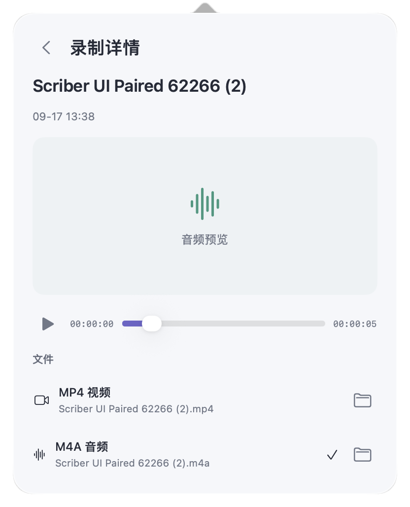

## Safe per-history rename — 2026-09-17

- Detail titles now have a filename editor. Empty/invalid names are rejected before mutation; editing pauses preview, and confirmation releases the player before moving files. The current recorder session is routed through its recorder so name/summary/recent URLs stay synchronized. Older entries use fresh validated history data. Playback reloads paused afterward. Published members of a partial recording can be renamed while unfinished companions and capture errors remain recorded.
- Each session serializes rename through its own file lock and rereads the manifest under that lock. Caller URLs are a fallback, not the write authority. Closed media carries device/inode/birth-time identity, persisted before rename; if the final manifest update fails, the reader can find a unique matching file in the same destination/staging directories and explicitly report that metadata needs synchronization. It does not open/import unrelated media or follow a mismatched filename occupant. Ambiguous identities are refused. This is rename metadata recovery, not the pending long-recording crash-recovery implementation.
- Four new component cases cover failed final metadata writes and retry from stale paths, simultaneous renames, ambiguous/replaced files, and partial recording preservation. Existing missing-file retry coverage now restores the same original file rather than creating a different inode. All **69 component cases (57 functions)**, native build/signature, independent reader/cleanup utility builds and self-review pass (`artifacts/history-rename-tests.log`, `history-rename-build.log`). The ENOSPC metadata failure is injected at the write boundary; no physical full-disk test is claimed.
- Actual native detail UI rejected an empty name, renamed a known MP4/M4A pair with one shared collision suffix, renamed it again, played the renamed video, and switched to its audio. Every media SHA-256 stayed identical and complete decode passed. A fresh app process found the new name. Evidence: history-rename-result.json and artifacts/history-rename-gui.log.
- A new real audio recording (**2.561125s /122934 frames**) was then renamed from its detail page while still the recorder's current saved session. A test process held that session's real rename lock; direct AppKit quit was requested while the app waited, and the app stayed alive until the lock was released. It finished the rename, synchronized the recorder URL/name and history entry, then exited. Its media SHA-256 remained identical. Evidence: history-rename-quit-result.json and artifacts/history-rename-quit-gui.log.
- After verification, the known QA pair and new QA audio were restored to their original names through the production rename transaction with the app closed; hashes were rechecked and the owned collision fixture was removed. No recording content was changed. The actual renamed-detail screenshot below was visually checked; raw media remains local.

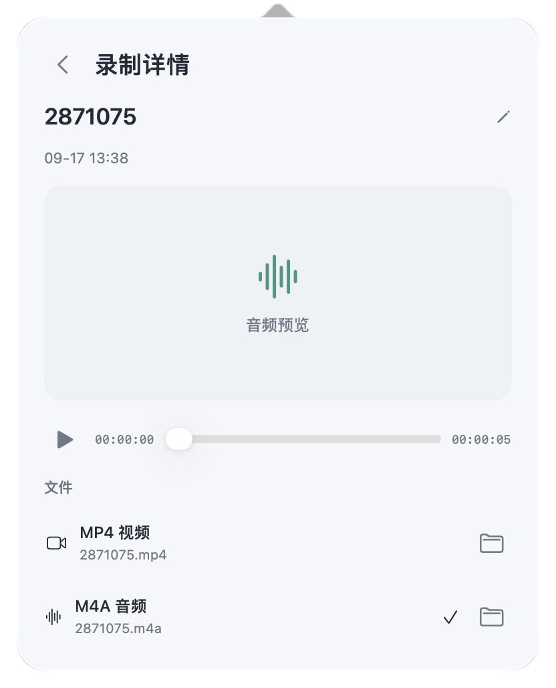

## Configurable global panel shortcut — 2026-09-17

- Added a native shortcut settings subpage with enable/disable, modifier choices and key selection. Default is⌥R. A valid shortcut includes Command, Option or Control; supported keys are letters, digits and F1–F12. Choices persist across app restart. Invalid stored preferences are retained and surfaced for correction instead of silently overwriting them.
- Global hotkeys use the macOS registered-hotkey API on the main actor, including cleanup. Replacement registers exclusively before releasing the old binding; a conflict leaves the old binding/preference active. The handler filters its registration ID and tracks press/release to avoid repeated toggles while a key is held. Normal diagnostic capture modes do not register a global shortcut. The app does not request keyboard-monitoring access for this feature.
- Three new component cases verify descriptor validation/display, disabled preference restoration and invalid-data preservation, and actual exclusive-registration conflict/release behavior across service instances. All **72 component cases (60 functions)**, native build/signature and self-review pass (`artifacts/shortcut-tests-final.log`, `shortcut-build-final.log`). Conflict registration tests briefly reserve unused four-modifier keys and release them afterward; they do not replace another registered shortcut.
- Actual native GUI used an inert regular test application as the foreground app. Default⌥R opened Scriber; changing to⌃⌥⌘1 activated the new chord while⌥R was delivered to the test host. Disabling released the new chord, reenabling restored it, and a fresh Scriber process retained the chosen chord. After Scriber quit, the key reached the host again. The default⌥R was restored through the UI and verified after another fresh launch. Evidence: shortcut-gui-result.json and artifacts/shortcut-gui-fixed.log / shortcut-gui-rest.log.
- Global invocation during a real audio recording (**2.7240625s /130755 frames**, fully decoded) preserved its writer path and advancing recording state. It opened the main recording controls from the other app. Both Scriber and its test host exited afterward; source preferences and recording files remain intact. Evidence: shortcut-recording-result.json.
- Native checks found two actual UI gaps: a visible but inactive popover was initially closed rather than brought forward, and the enable switch lacked an independent accessibility label. Both were fixed. A first screenshot caught transient resize padding; the final settled native window below was recaptured and inspected. An SDK count-type compile error was corrected before any UI test; no success was inferred from that failed build.
- Final verification initially hit a preexisting playback-fixture stall: AVPlayer reported playing/rate1 while its actual clock remained at1.2s with isMuted=true. Focused diagnostics reproduced it on the current built-in output. Test silence now uses volume0, preserving the output render clock; the same seek/play/pause/time assertions pass in both focused and final full runs. Application playback configuration was not changed, and wait failures now report their stage/player state. No timeout or behavioral assertion was relaxed.
- The shortcut does not interrupt an active capture-range chooser, folder chooser or rename operation. Conflict detection concerns system-registered hotkeys; ordinary per-application menu shortcuts are not enumerated. Device transitions, recording recovery and long-duration acceptance remain separate.

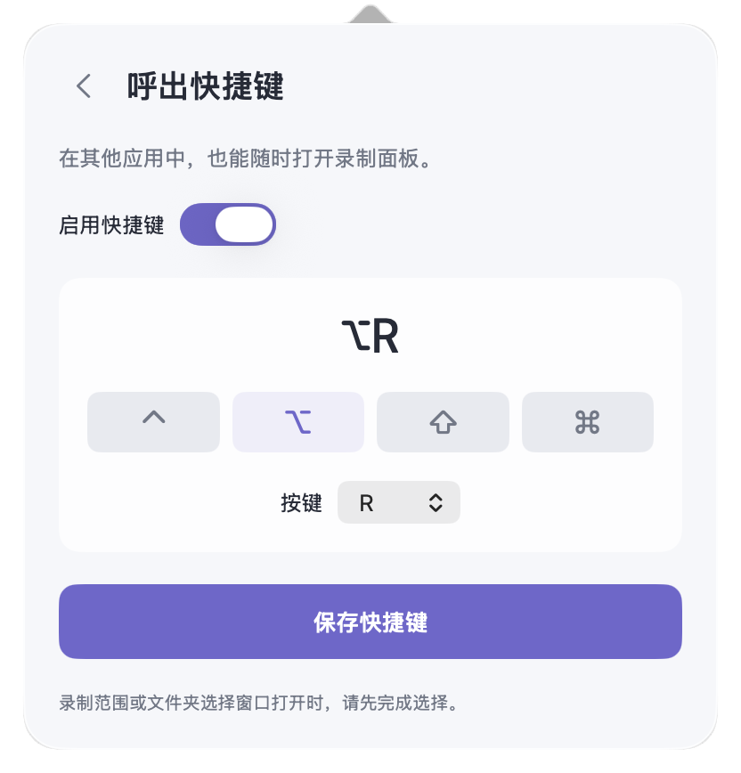

## Live audio device inventory and panel labels — 2026-09-17

- The source rows now display real device names, with full names and default/selected-device context in tooltips and accessibility labels. The approved row dimensions and panel layout are retained. An active microphone remains identified by its capture UID; a new system default is not described as captured before reconnection. Read failures show unknown device state instead of an old name presented as current. Source preferences and stream behavior are unchanged in this increment.
- CoreAudio inventory includes device UID, input/output direction, alive state, nominal rate, transport and system defaults. Reads run off the main actor, one at a time, with a one-second interval after each read, including when the popover is hidden. Identical results are coalesced; failures are retried on the next tick, and releasing the monitor cancels callbacks.
- Three new component cases cover pinned-vs-default microphone identity, missing/dead/wrong-direction devices, and monitor change/error/recovery/coalescing/release. All **75 component cases (63 functions)**, native build/signature and self-review pass (`artifacts/device-state-tests-final.log`, `device-state-app-build.log`). Injected device snapshots verify policy/lifecycle only; they are not physical disconnect evidence.
- The production reader's actual inventory independently matches macOS System Information for names, direction, rates and defaults: MacBook Pro Microphone and Speakers, both48kHz, plus Microsoft Teams Audio virtual input/output. Built-in devices are the current defaults; no USB or Bluetooth device is present. Evidence: device-state-inventory.json and device-state-system-profiler.json. A repeatable read-only probe can be built with `xcrun swiftc -swift-version 6 -parse-as-library Sources/Scriber/AudioDevices.swift tools/InspectAudioDevices.swift -o artifacts/InspectAudioDevices` and run directly.
- Actual native AX controls expose the same full device names in idle and recording states. UI Start/Stop captured **2.858708333s /137218 frames**, fully decoded, with both source preferences unchanged; Quit exited. A separate known-tone dual-source regression captured **8.151645833s /391279 frames** with the expected ordered880/1760Hz signal,48kHz microphone and full decode. Evidence: artifacts/device-state-gui.log, gui-validation/device-state-recording-result.json and artifacts/device-state-capture.log. The final native screenshot below was visually checked. No Scriber test recording was left running.
- A standalone helper build initially warned about conversion of a method reference to a Sendable reader; an explicit closure resolved it, and the Swift6 helper and app builds pass. Device reconnection, source-specific stream failures and physical transitions remain the next separate increment.

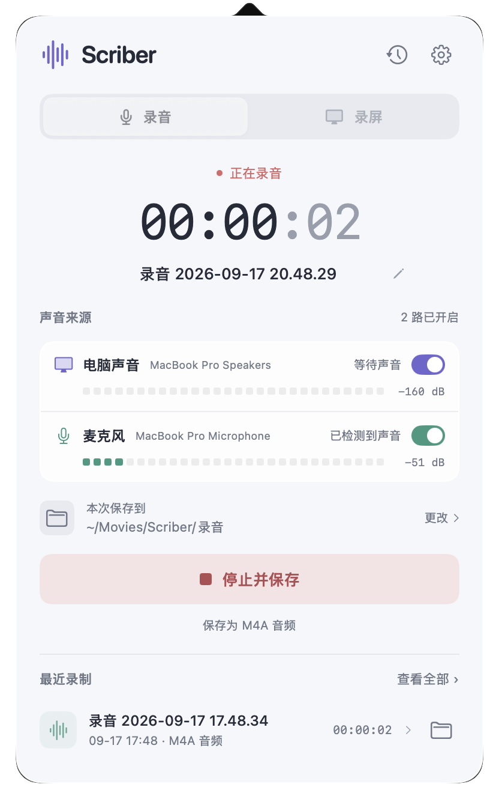

## Failed audio source isolation — 2026-09-17

- Audio stream failures are handled per source. A failed source is retired without changing the user's source preferences or stopping a surviving source. The source row and panel show an interruption; the last known working source cannot be disabled in favor of an already failed source. When no stream remains, the recorder finalizes available data and explicitly reports interruption. Historical capture errors are retained even if the user later reopens the source successfully, so missing audio is not presented as an entirely successful capture.
- A watchdog checks packet freshness every200ms and isolates streams with more than1s of missing data. Actual silent PCM still counts as capture; natural quiet is not an error. Startup stream failures and a denied microphone permit selected system audio to continue. The denied-permission branch was reviewed but not validated by changing this Mac's permissions.
- Each audio callback must match the currently bound stream identity. Deferred failure handling retains the stream for comparison to avoid object-address reuse. Retiring a failed source discards its pending resampler tail and startup packets; it preserves valid PCM already in the shared timeline. Two new component cases verify a stale16kHz converter/obsolete callback followed by a replacement stream, and preservation of buffered system audio after a missing startup microphone is retired. All **77 component cases (65 functions)**, native build/signature and self-review pass (`artifacts/source-isolation-tests-final.log`, `source-isolation-build-final.log`).
- `python3 scripts/check-source-failure.py` deliberately stops a real SCK stream. `--source system`, `--only-source`, `--video`, and `--stall` select the affected stream, last-source case, paired video, and absence of a failure notification. These are real stream-lifecycle fault injections, **not physical device-disconnection tests**. Full media decode, original source choices, surviving callback counts, frozen failed callback counts, and manifest capture errors are checked. The surviving system tone is measured from encoded media; video and standalone audio must decode identically.
- Actual results: microphone interruption retained system recording for6.1s /292800frames; system interruption retained microphone recording for6.142354167s /294833frames; sole-system interruption saved2.02s /96960frames. Final paired-video regression retained6.3061875s /302697frames, identical decoded audio and the known880Hz tone after microphone interruption. Missing-microphone-data detection retained system capture for6.16s /295680frames; sole-system missing-data detection stopped after3.085285333s wall time and preserved2.02s /96960frames of audio, without fabricating the missing final second. Evidence: artifacts/source-isolation-{mic-signal,system,last,video-final,stall,last-stall}.log. Original recordings stay local.
- Actual native controls displayed the failure row/banner, refused disabling the last healthy source, and recovered real microphone callbacks after the user explicitly switched microphone off/on. Stop saved **5.79275s /278052frames** while preserving the interruption record; full decode and process exit passed. The native screenshot below was inspected. Evidence: artifacts/source-isolation-native.log and gui-validation/source-failure-native-result.json. The diagnostic uses a temporary destination; it does not change saved directory preferences.
- The normal11-second source-toggle regression still passes actual hardware stop/restart, last-source protection, full decode and expected tone separation (`artifacts/source-isolation-switching.log`). Self-review added startup generation checks after asynchronous retirement. A direct SCStream transfer initially failed Swift6 actor checking; a documented immutable retained-reference wrapper resolved it, with stream operations remaining on the main actor. Final build/tests pass. No test app or recording remains running.
- Automatic reconnection/default-device transitions remain the next increment. This change does not claim crash recovery, physical USB/Bluetooth transitions, sleep/lock acceptance or long-duration acceptance.

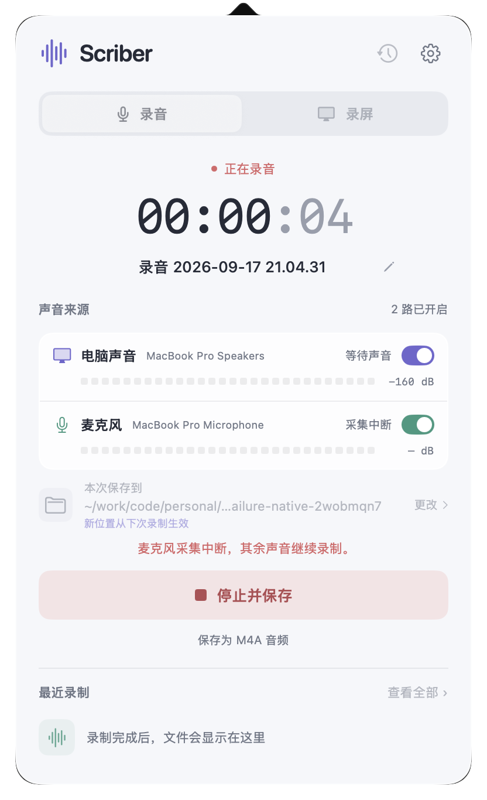

## Automatic source reconnection — 2026-09-17

- Failed or stalled requested sources now receive at most two automatic reconnect attempts per outage, at least400ms apart. Two seconds of advancing packet timestamps or a changed device endpoint rearms retries. Rate/name-only changes do not rearm them, since Bluetooth profile changes caused by capture itself could otherwise cause repeated restarts. A permanently failed source leaves working sources running; exhaustion of all sources finalizes available media.
- Normal recording follows the system default microphone. A still-available explicitly supplied diagnostic microphone remains pinned; an unavailable one falls back to the current default. Disabled user sources are excluded from recovery. Device names change with the actual selected capture UID, and recovery is reported only after the new stream delivers real packets. The panel uses the existing jade color for recovery notices and clears them after an explicit source selection change. Interruption history remains even after recovery; no zero-loss claim is made.
- New source additions are prepared before committing the mix/removing old streams. An unavailable or silent addition is retired and leaves the previous selection/capture running. The normal source-toggle regression passes11.156055s wall time with real stream stop/restart and tone separation. Source connection errors now have their own wording instead of being mislabeled as encoding failures. Initial inventory reads do not claim a device change.
- Three policy cases cover bounded/rearmed retries and default/pinned/unavailable microphone selection. All **80 component cases (68 functions)**, final app build/signature and self-review pass (`artifacts/reconnect-tests-final.log`, `reconnect-app-build-final.log`). Swift Testing initially copied a mutating value receiver in its call macro; explicit boolean comparisons preserve the actual policy/assertions. The previous stale-stream, startup-buffer and paired-timeline coverage remains intact.
- Real stopped-stream recovery passed for microphone (**6.216020833s /298369frames**) and sole system audio without an error notification (**6.047708333s /290290frames**). Persistent microphone faults exhausted exactly two retries while system capture continued (**10.16s /487680frames**); persistent sole-system faults exhausted retries and preserved **2.04s /97920frames**. A failed addition of an unavailable microphone preserved system recording (**6.08s /291840frames**) with no microphone frames or automatic mic retries. Paired video with automatic microphone recovery produced **6.3313125s /303903frames**, full decode, identical MP4/M4A audio and the known system tone. Evidence: artifacts/reconnect-{mic,sole-stall,permanent,permanent-sole,failed-addition-final,video}.log. These deliberate real-stream faults are not physical USB/Bluetooth transitions.
- Actual AppKit quit entered during an in-progress reconnect, preserved **2.28s /109440frames**, fully decoded, and exited. The diagnostic records `stoppedDuringRecovery` at stop entry instead of inferring it from an earlier sample. Evidence: artifacts/reconnect-quit.log. Source trace, reconnect counts and the actual microphone UID support further hardware validation. `scripts/check-source-failure.py` now checks recovery by default; `--permanent`, `--stall`, `--only-source`, `--failed-addition` and `--video` exercise the corresponding paths.
- **Native GUI follow-up is pending.** This Mac became locked: `CGSSessionScreenIsLocked=1`, and the scoped AX tree exposed only menu bars. The native test could not display the panel and was stopped; its owned9.192375s recording finalized and the app exited. AX/screen/HID permissions still passed. Unlock and physical-earphone connection were each requested once; neither is assumed completed. This is an external test limitation, not a passing UI check.
- The illustration below is an **offscreen native SwiftUI render from real recovered capture state**, inspected for text/layout/color only. It is not a desktop screenshot or evidence of GUI clicks. Actual recovery controls/default-route hardware transitions remain in the final acceptance work. Long-recording recovery, sleep/lock behavior and the required8h/2h tests are still outstanding.

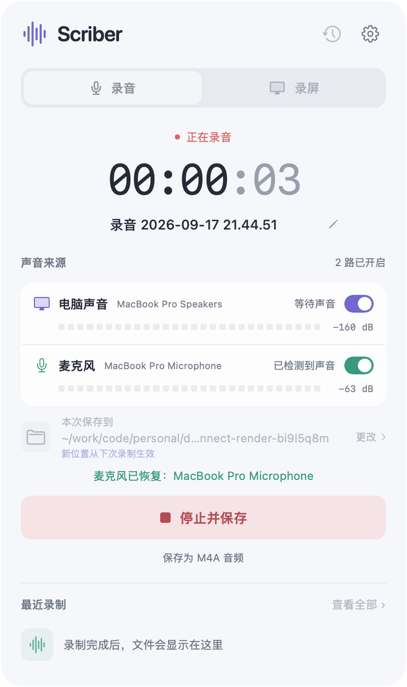

## Recoverable writer checkpoints — 2026-09-17

- Both writers request an initial2s movie fragment and subsequent10s fragments before writing starts. Normal stopping still produces the regular final file set. This preserves indexed media after process death; it does **not** yet implement startup detection, ownership checks or recovery/publication. Exact checkpoint ends depend on AAC packets, keyframes and flushing; the first short fragment may not exist if interruption happens early.
- A real-time encoder probe found that AVAssetWriter's `.m4a` path exposed2112 untrimmed AAC priming samples (44ms) after SIGKILL, although both files opened. Audio now uses audio-only MPEG-4 through the `.mp4` writer path while retaining the `.m4a` filename and AAC codec. It has no video track. That writes the same priming edits as the video container and preserves matching decoded prefixes. The original failed-sync probe remains under artifacts/fragment-probe; no bytes were adjusted to make it pass.
- A static-picture probe initially left the MP4 without a moov index after13s. Real capture of the owned static window confirmed3 changed pictures and413 idle callbacks over14s, with valid host-clock idle timestamps. The production screen adapter now repeats the last captured picture at most once per second when SCK explicitly reports idle; keyframes have a1s time bound. Blank/suspended/error states cannot produce repeats. A2s callback-receipt timeout detects loss of status delivery rather than treating it as a static scene indefinitely.
- Three new component cases verify that an idle payload cannot replace the last real picture, repeats are limited and decode as that original picture, suspension blocks repeats, and absent callbacks report an error. All **83 component cases (71 functions)**, final app build/signature and self-review pass (`artifacts/fragments-tests-final.log`, `fragments-app-build-final.log`). The paced codec fixtures are generated test media, not screen/microphone recordings or long-duration acceptance.
- Normal fractional-duration control preserves exactly **684336 frames /14.257s** in both files. Moving and static codec SIGKILL fixtures retain **575424 frames /11.988s** after about13s of input, with exact FFmpeg PCM equality, native frame/time equality and bounded native sample differences. AVAssetReader's Float32 output can vary by rounding between paths: measured max1.1920928955078125e-7; the native comparator checks <1e-6 while FFmpeg equality remains exact. An inspector initially failed to serialize an undefined video-sample duration; unknown values now remain JSON null, and the same files were rechecked. Evidence: fragments-normal-final.log, fragments-crash-final.log and fragments-sparse-final.log.
- Actual Scriber SIGKILL after **14s written /14.0862885s wall** retained **574400 frames /11.966666667s** in both static-window outputs. Full decode, native decoding, exact common audio, the880Hz signal (amplitude0.043125) and all four captured quadrant colors passed. There were3 real picture updates,417 idle callbacks and14 repeats. A separate real dual-source audio-only SIGKILL retained574400 frames too. These captures used SCK and the microphone; fixture pixels were never fed directly to those encoders. Raw media stays local. Evidence: artifacts/fragments-real-{static,audio}-crash.log and capture-crash-ud_p6w2_ / capture-crash-bu6w97xx.
- Normal real regressions pass: dual-source audio **8.156416667s /391508frames** with ordered test tones, and static-window video **14.207229167s /681947frames**, full paired decode and repeated-picture progress. Evidence: fragments-real-audio-normal.log and fragments-real-static-normal.log. All owned recording/fixture processes exited or were confirmed killed. The existing locked-desktop GUI limitation is unchanged; backend window capture is not GUI interaction or a completed lock-transition test.
- Create the local evidence folder with `mkdir -p artifacts`. Build the encoder fixture with `xcrun swiftc -swift-version 6 -parse-as-library Sources/Scriber/{AudioSampleWriter,VideoSampleWriter,RecordingFragments,AudioPCMConverter,AudioTimelineMixer,MixedAudioOutput,ScreenVideoOutput}.swift tools/CrashWriterFixture.swift -o artifacts/CrashWriterFixture`; build the native reader with `xcrun swiftc -swift-version 6 -parse-as-library tools/InspectMedia.swift -o artifacts/InspectMedia`. Run `python3 scripts/check-writer-fragments.py --finish`, then the default SIGKILL case and `--sparse-video`. Actual capture checks use `python3 scripts/check-capture-crash.py` and `--window` with the signed app built. These tests deliberately kill only their own scoped capture process.
- AVAssetWriter writes media before its moov/moof index and can leave an unindexed, open-ended trailing mdat. Future recovery must validate the indexed prefix and preserve original files, not assume that any complete-looking media box is playable. These short tests measure process-interruption behavior; they do not prove power-loss durability or replace the required8h/2h tests. Startup recovery, disk/sleep handling and final hardware/UI acceptance remain required.

## Recording session ownership — 2026-09-17

- `RecordingSessionFiles.begin` acquires a per-session `capture.lock` before publishing `session.json`. `AudioRecorder` retains that lease through encoder shutdown, media relocation and final metadata publication, then releases it before reporting completion. An early canceled/failed start drops its unclaimed lease. File-only preparation retains its separate `create` API; normal capture uses `begin`.
- The lease uses nonblocking OS file locking rather than a PID file. It opens the directory/lock without following final symlinks, rejects nonregular or multiply linked lock files, verifies the locked inode, and marks descriptors close-on-exec. Release is synchronized/idempotent; the empty lock file remains in place to prevent another inode being substituted by routine release. Process death releases the kernel lock automatically.
- Four component cases cover exclusion through paired finalization, scope/idempotent release without closing a reused descriptor, symlink/hardlink/FIFO rejection, and an independent process owner killed with SIGKILL. All **87 component cases (75 functions)**, app build/signature, script syntax and self-review pass (`artifacts/session-lease-tests-final.log`, `session-lease-build-final.log`). The first process test correctly found a lock still held after killing a launcher: PATH's Python is a depot_tools shell wrapper. The helper now reports its actual owner PID; the test kills that owned process and closes its stdin for cleanup. No unrelated process was terminated.
- Real dual-source audio held the lock during recording and released it after saving **5.148416667s /247124frames**, while the same Scriber process stayed alive. Real MP4/M4A capture likewise released only after both outputs were marked closed/published (**5.268708333s /252898frames**). Both outputs fully decode. A real audio capture killed after **3.08s written /147840frames** released the lease and retained a decodable fragment prefix. Evidence: artifacts/session-lease-real-{save,video,crash}.log and corresponding lease-verification.json files.
- Repeat with `python3 scripts/check-session-lease.py`, `--video`, and `--crash` after building the app. The diagnostic-only `--keep-check-open` option lets the test prove release before process exit. Every owned test app is then closed. This supplies ownership for subsequent recovery; startup detection, restoring unfinished files, disk/sleep handling and the remaining full acceptance are still outstanding.

## Validated media-prefix recovery — 2026-09-18

- The recovery primitive scans bounded top-level MPEG-4 box headers, supports32/64-bit sizes, and excludes torn final boxes. It requires a movie index, copies with a1MiB buffer, refuses linked/nonregular sources and occupied destinations, and checks source identity/size/mtime after copying. A complete-looking box is not treated as usable media without further validation. Original media is never moved or rewritten.
- Native passthrough export produces a closed MPEG-4/M4A candidate in a separate work directory. Track counts, AAC/H.264 formats, rates and dimensions are checked; every output track is then fully decoded with AVAssetReader before a result is returned. The operation runs on a concurrent executor and propagates cancellation to copying/export/decoding. It preserves all indexed track data, including a valid video tail beyond the audio endpoint, without inventing missing sound or truncating useful pictures just to equalize durations.
- Six component cases cover torn index tails, extended/open-ended boxes, oversized bounds, missing indexes, links, collision refusal, native audio recovery, wrong media kinds, false indexes and cancellation. All **93 component cases (81 functions)**, native app build/signature and self-review pass (`artifacts/media-recovery-tests-final.log`, `media-recovery-build-final.log`). An initial SDK compilation error was corrected: mediaType is an immutable track property, not an async-load key.
- Existing real SIGKILL media from the owned static-window capture was recovered through the production copier/exporter. Audio retained **574400 frames /11.966666667s**; video retained its **13s indexed picture track /16 frames** and the same574400 audio frames. Recovered audio matches original indexed audio byte-for-byte in FFmpeg, and decoded video-picture hashes are unchanged. The differing track endpoints are retained honestly; this is partial recovery, not replacement audio or a zero-loss promise.
- Copies with the last index or indexed media block cut in half fall back to **94144 audio frames /1.961333333s**; the video copy retains6 pictures through3s and that same audio prefix. A copy with no complete movie index is refused. All source hashes stay unchanged. Held-session attempts are refused before creating a recovery directory. Evidence: artifacts/media-recovery-real-{audio,video}-final.log and media-recovery-dhq0rmc7 / media-recovery-sr4hnk0v. Generated crash fixtures were checked separately in media-recovery-audio.log.
- Build the offline tool with `mkdir -p artifacts` and `xcrun swiftc -swift-version 6 -parse-as-library Sources/Scriber/{RecordingFileSet,RecordingSessionLease,MovieFilePrefix,MediaRecovery}.swift tools/RecoverMedia.swift -o artifacts/RecoverMedia`. It takes an absolute source-media path and a new work-directory path, holds the source-session lease, and leaves its manifest unchanged. Repeat validation with `python3 scripts/check-media-recovery.py /absolute/crash-sample.m4a` (or `.mp4`); truncations affect copies only. The tool reports ordinary errors cleanly.
- This increment returns validated candidates. It does not yet publish them into the original recording record, manage crash-safe recovery transactions, or run automatically at startup. Those steps, disk/sleep behavior, pending hardware/GUI acceptance and real8h/2h tests remain required.

## Session recovery publication — 2026-09-18

- Recovery now holds both capture ownership and the existing rename lock while rereading the authoritative manifest, preparing validated candidates and publishing them. The recording ID/date stay unchanged, so the existing history reference resolves the restored files. A bounded `recovery.json` seals candidate identities/size/mtime before moves; the prepared manifest repeats those identities before paired publication. Retry finds moved files by identity and does not export or publish duplicates.
- Raw inputs that require re-export remain in the session directory and are referenced by recovery metadata. Already closed, valid media is reused; already published files are not silently recreated after user deletion. Missing/corrupt companions can leave a partial result without repeated work on unchanged input; a repaired source is retried. If the standalone audio is unusable but the video audio is valid, native passthrough extraction restores the M4A companion. Existing published audio is preserved.
- Recovery metadata keeps per-file durations, original paths, issues and the original capture error; later history renames preserve it. Publication does not invent missing audio to equalize valid track endpoints. The manifest read/write limit remains64KiB and the journal is bounded at128KiB. IO/metadata/publication failures remain retryable; unknown working-directory contents and corrupt journals are refused rather than removed or overwritten.
- Seven component cases cover same-record/history integration, collisions/idempotence, final-manifest failure after moves, partial/repaired companions, an interrupted move discovered by identity, corrupt journal preservation, audio extraction from intact video, and active capture/rename exclusion. All **100 component cases (88 functions)**, final native build/signature and self-review pass (`artifacts/session-recovery-tests-final.log`, `session-recovery-build-final.log`). Initial compile fixes corrected a throwing short-circuit and used POSIX EFBIG for oversized metadata.
- Actual recovered media from the earlier SCK SIGKILL capture was used in independent recovery processes. Processes exited without cleanup at four stages: candidates ready, prepared manifest written, media moved and final manifest committed. Reruns completed the same recording with paired names, preserved the occupied-name sentinel and raw media hashes, reused already moved file identities and produced no duplicates. Normal, audio-fallback and already-published-audio cases passed too. Full FFmpeg decoding and original audio comparisons passed in every case. Evidence: artifacts/session-publication-process-final.log and session-publication-av1vasg3/verified.json.
- Build the offline session tool with `xcrun swiftc -swift-version 6 -parse-as-library Sources/Scriber/{RecordingFileSet,RecordingSessionFiles,RecordingSessionLease,MovieFilePrefix,MediaRecovery,SessionRecovery}.swift tools/RecoverSession.swift -o artifacts/RecoverSession`. Run it with an absolute `session.json` path to recover/publish that session. For an owned test copy, `--exit-at mediaPrepared|manifestPrepared|mediaMoved|manifestCommitted` deliberately exits the process; rerun without the flag to verify recovery. Raw inputs and journals remain local.
- This is the session transaction used by the upcoming startup controller. The app does not yet invoke it automatically. Startup/UI orchestration, disk/sleep/lock behavior, physical devices and the real8h/2h acceptance remain required.

## Automatic startup recovery and native UI — 2026-09-18

- Normal app startup now discovers descriptors in known destinations and processes unfinished recordings sequentially. Fully published recordings, including user-deleted files, are skipped. Active leases are reported separately; another running Scriber instance defers automatic recovery to avoid older instances that lack leases. Corrupt history is reported without rebuilding it. Per-record errors remain visible and retryable.
- Recovery pauses/cancels when a new recording starts and resumes after recording finishes. Quit cancels recovery and defers application termination until the actual operation finishes. Committed results are retained even if cancellation arrives immediately afterward. The currently recovering entry cannot be renamed. Main-panel progress/results link to history and retry; settings also offers a manual check. History/recent rows explicitly distinguish recovered and partially recovered recordings.
- Five controller cases cover startup discovery/recovery and deleted-file preservation, active-owner retry, pause/resume, cancellation completion before quit, and corrupt-index preservation. All **105 component cases (93 functions)**, native app build/signature and self-review pass (`artifacts/startup-recovery-tests-final.log`, `startup-recovery-build-final.log`).
- A genuine normal-app capture was killed with SIGKILL and relaunched using the same isolated history. Startup automatically recovered the recording, retained its ID and original media bytes, and exposed an available history entry. A second restart produced no additional recovery or duplicate record. Capture pause was observed during the initial recording. Evidence: artifacts/startup-recovery-real-restart.log and startup-recovery-nrhr6twe/verified.json.
- Actual AppKit quit was requested while startup recovery was running with its session lease held. The app recorded quitDuringRecovery=true, canceled/finished work, released ownership and exited. A subsequent launch completed automatic recovery of the pair, and both files fully decoded. Evidence: startup-recovery-real-quit.log and startup-quit-wol9xheb/verified.json. “Locked recovery” in that log means the file-ownership lock, not a locked desktop.
- Desktop access is now available. Fresh AX/screen/HID preflight passed; actual native controls displayed the recovery notice, opened history, played/paused the recovered MP4 and switched to its M4A preview. The screenshot below is a real native window capture, inspected after correcting the old generic save-error label on recovered rows. Evidence: startup-recovery-native-ui-final.log and gui-validation/startup-recovery-ui-result.json. Earlier reconnect UI acceptance blocked by the desktop lock was also completed: actual recovered notice, source off/no automatic reenable, continuing capture and saved interruption history passed at6.42s /308160frames (`reconnect-native-unlocked.log`).
- `--validation-root /absolute/directory` isolates the normal app's history/destinations without changing personal defaults; `--validation-record-audio` starts a normal recorder capture for lifecycle checks. Invalid validation-root arguments are rejected before personal storage is accessed, verified against the unchanged personal history hash. These flags are test support, not normal usage. All owned test apps/captures exited. Current hardware inventory still contains only built-in input/output and Teams virtual audio; USB/Bluetooth remains untested.

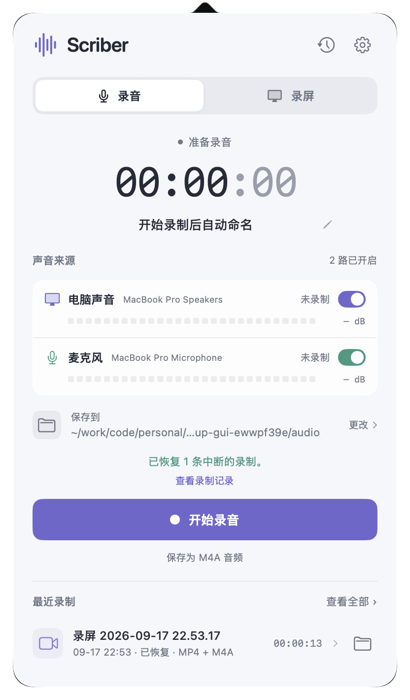

## Recording storage protection — 2026-09-18

- Before permission requests and again before session creation, Scriber checks actual filesystem available bytes and volume identity. Recording requires more than 64 MiB for audio or 256 MiB for video. A serial background probe runs once per second; insufficient space, an unavailable destination or a changed volume triggers normal encoder/session finalization. The reserve leaves room for closing buffers, indexes and metadata; it cannot guarantee success if another process fills or removes the disk between checks.
- Audio/video writer snapshots now observe asynchronous AVAssetWriter failure even without another append. A failed writer reports its native encoder error before generic backpressure. Existing raw-fragment recovery remains available when the encoder cannot finalize.
- All **108 component cases (96 functions)**, native build/signature and self-review passed (`artifacts/storage-tests-final.log`, `storage-build-final.log`). New cases check thresholds, volume identity, actual filesystem/missing-directory reads and low-space refusal before permissions or media creation.
- A disposable 512 MiB APFS disk image was filled only to about 32 MiB remaining during normal app capture. Scriber stopped with the low-space message and saved a fully decoded M4A: **4.205083333 s / 201844 frames**, available storage 31674368 bytes. Starting again was refused without creating media; deleting the test filler allowed another successful recording. The image was detached after copying evidence. The host filesystem retained about 1.1 TiB free. Evidence: `artifacts/storage-real-volume.log`, `storage-volume-fltmgqlh/verified.json`; local helper: `artifacts/check-storage-volume.py`.
- A separate real system-audio capture inherited a **96 KiB per-file RLIMIT_FSIZE**, with SIGXFSZ ignored so the kernel write error reached AVFoundation. Capture stopped after 10.56 s of accepted PCM, reported an encoder error instead of success/backpressure, and retained the 98304-byte original. This is a real file-size write failure, not an ENOSPC claim. The production recovery tool successfully published its earlier indexed prefix and full FFmpeg decode passed. Evidence: `artifacts/storage-write-limit.log`, `writer-limit-x77cfwl3/verified.json`, `storage-write-recovery.json`; local helper: `artifacts/check-write-limit.py`.
- Normal real display capture with both sources passed after the writer checks: **6.327458333 s / 303718 audio frames**, 3456×2234 video, fully decoded MP4/M4A and identical decoded audio (`artifacts/storage-video-regression.log`). These short checks do not satisfy long-duration or physical device acceptance.

## Recording power protection — 2026-09-18

- Recording now registers with IORegisterForSystemPower and holds a PreventUserIdleSystemSleep assertion through encoder closure and file publication. Video additionally holds PreventUserIdleDisplaySleep; audio permits idle display sleep. Failure to acquire protection refuses capture with a visible error. Stop and scope release remove assertions and notification resources.
- Idle sleep requests are vetoed while protected. A non-abortable will-sleep notification starts interruption/finalization and is acknowledged only after it completes. If normal stop/quit is already finishing, the notification waits for that same operation. The connection survives recorder release until acknowledgment; wake and will-not-sleep notifications are not acknowledged. Recordings do not automatically resume on wake.
- The SDK permits macOS to sleep after a **30-second notification deadline** regardless of application acknowledgment. The implementation does not guarantee closure beyond that OS limit; recoverable fragments remain the fallback. IOMessage.h uses function-like macros unavailable to Swift; a C helper verified the constants used by the callback.
- All **111 component cases (99 functions)**, native build/signature and diff self-review passed (`artifacts/power-tests-final.log`, `power-build.log`). Three new cases inspect actual native assertion properties/release and exercise deferred acknowledgment, duplicate notification coalescing, resource lifetime and ignored wake notifications. Intercepted protocol events are component evidence, not a real system sleep transition.
- Real audio and video captures independently verified their owned-process assertion types with `pmset -g assertions`, then verified assertion release while the app remained running. Audio finalized **5.1124375 s / 245397 frames**; video finalized **5.2628125 s / 252615 frames** with both files readable. Full FFmpeg decode passed. Evidence: `artifacts/power-real-assertions-final.log`, `power-assertions-s1euhrlg/{audio,video}/`; local helper: `artifacts/check-power-assertions.py`.
- The initial harness incorrectly relied on Chinese assertion names in pmset, which prints empty names on this host; it now checks owned PID and native assertion type. Its early video exit finalized successfully; the diagnostic keep-open option needed another quit after stop. No system power settings were changed. Actual user sleep, lid closure and lock/unlock transitions remain pending user wake/unlock coordination, requested once.

## Audio endurance collector calibration — 2026-09-18

- `python3 scripts/check-audio-endurance.py` records both real default sources for eight wall-clock hours by default. It writes a bounded resource trace (RSS, CPU, source frames/rates/skew and reconnect state), captures the executable hash, plays identifiable beginning/end stimuli, and performs full native and FFmpeg decoding afterward. Native decoded frames must match accepted PCM. Resource trends are explicitly left for review instead of inferring bounded memory from successful decoding.
- `--seconds 30` is a short harness calibration only. The final calibration captured **30.200354167 s / 1449617 frames** with both beginning/end tone pairs detected, peak RSS **87968 KiB**, and finalization **0.059378625 s** measured inside the app from finishing-state entry to completed publication. Evidence: `artifacts/audio-endurance-smoke-final.log`, `audio-endurance-9nxy_0gn/verified.json`. Native build/signature, script compilation and self-review passed. This does not satisfy eight-hour acceptance.
- Each run owns its child recorder and stimulus processes, uses an isolated ignored directory and finalizes the recorder on failure/cancellation. Results distinguish requested duration, real elapsed time, media duration and finalization time. The tool refuses an existing Scriber process on startup.

## Video endurance and synchronization collector calibration — 2026-09-18

- `python3 scripts/check-video-endurance.py` defaults to two real hours of window recording with both sources. The native 1920×1080 fixture displays continuous motion and emits real 880 Hz audio with matching flashes at three points near each end. The recorder receives actual ScreenCaptureKit samples; no fixture samples are passed to its encoders. `--seconds 30` is calibration only. `--alongside-audio-root /absolute/owned/run` permits the specifically verified live audio test to continue; `--app /absolute/Scriber.app` uses a separate signed build without replacing that active capture's binary.
- The collector records RSS/CPU/source-frame data, fully decodes using native APIs and FFmpeg, checks exact encoded picture counts/dimensions, and requires identical Float32 PCM hashes from MP4 and M4A. The timing verifier uses recorded flash/tone onsets: maximum absolute offset100ms and change in median start/end offset50ms. Audio onset resolution is5ms; picture timing also has the capture's frame interval. Resource trends remain explicitly subject to review after a long run.
- Final30-second calibration passed: **30.3560625 s /1457091 audio frames /878 encoded video frames**,1920×1080, peak RSS94816KiB, sampled mean CPU16.5%, file finalization0.079981708s. All six measured absolute offsets were at most15ms; start/end median-offset change was -20ms. Actual decoded picture below was inspected. Evidence: `artifacts/video-endurance-final.log`, `video-endurance-n0nk9tx5/verified.json`. Deliberately shifted local copies were rejected: added200ms overall audio delay and added70ms late-only delay (measured66.666ms drift), in `video-sync-negative.log` / `sync-rejection-265e7zzn`.
- Measurement corrections are explicit: AVAssetReader renders an extra picture in a leading empty edit, so native raw decoder counts are retained separately from pictures in nonempty media segments; the latter must equal both the writer and FFmpeg decoded counts. Track timeRange itself includes the empty edit and cannot identify that picture. FFmpeg's null output uses the demuxed time base to avoid timestamp rounding in the verification conversion. The fixture now disables its opening animation and renders before reporting readiness; this removed the initial1924px-versus1920px startup discrepancy without relaxing bounds checks.
- Read-only diagnostic geometry records the selected filter size/scale and configured pixel dimensions. All111 component cases (99 functions), Release build/signature, Swift helper builds, Python compilation, diff self-review, positive calibration and negative timing checks passed. The isolated signed diagnostic app and original Release app were both exercised; the active eight-hour binary stayed unchanged. Original audio endurance remained healthy throughout concurrent checks. Neither short calibration constitutes two-hour acceptance.

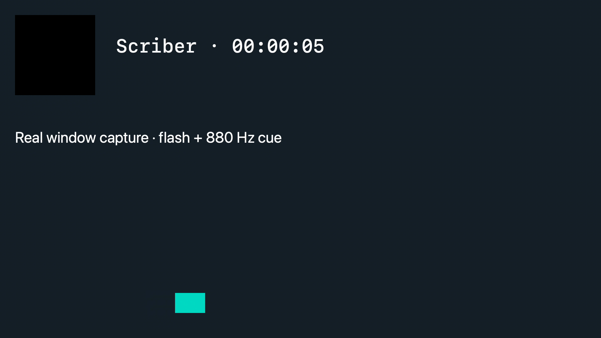

## Saved recordings with interruption warnings — 2026-09-18

- The main panel now distinguishes fully published files with warnings (「已保存 · 请查看提示」), partially published files and recordings with no saved output. Published output from a failed capture can use the existing filename editor and saved-file rename transaction. History no longer calls every fully published warning a save failure. A stopped source without a source-specific failure is labeled「已停止」instead of attributing disk/video failures to audio capture.
- All111 Release component cases (99 functions), Release app build, signed isolated native validation harness and diff self-review passed (`artifacts/saved-interruption-tests.log`, `saved-interruption-build.log`). Three actual capture cases passed: repeated real source interruption with audio saved (2.252541667s), interruption with both video/audio saved (2.941375s), and a real128KiB process file-size limit causing video failure while audio finalized (1.626041667s).
- Each case renamed its published files through AudioRecorder, preserved exact media hashes and warning/session metadata, retained a single history entry, and fully decoded every saved output with FFmpeg. Evidence: `artifacts/saved-interruption-real.log`, `saved-interruption-ehtaexao/{audio,video,partial}/verified.json`. The local harness directly invokes capture/rename APIs; it does not simulate physical disconnects or prove clicking the filename control.
- Fresh preflight found the desktop locked while AX/screen/HID permissions remained granted. Native views from these real capture states were rendered offscreen and inspected below; **these are not desktop screenshots or GUI-click evidence**. Native edit/confirm/history follow-up remains pending unlock. Both ongoing long tests and their app binaries were preserved.

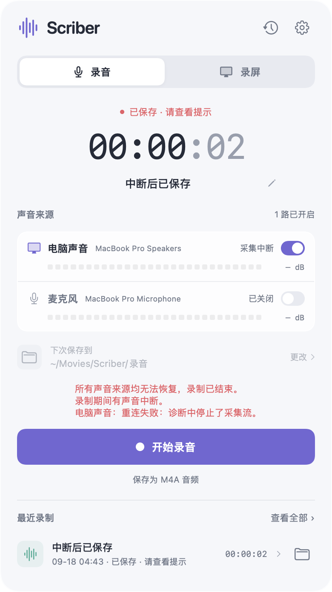

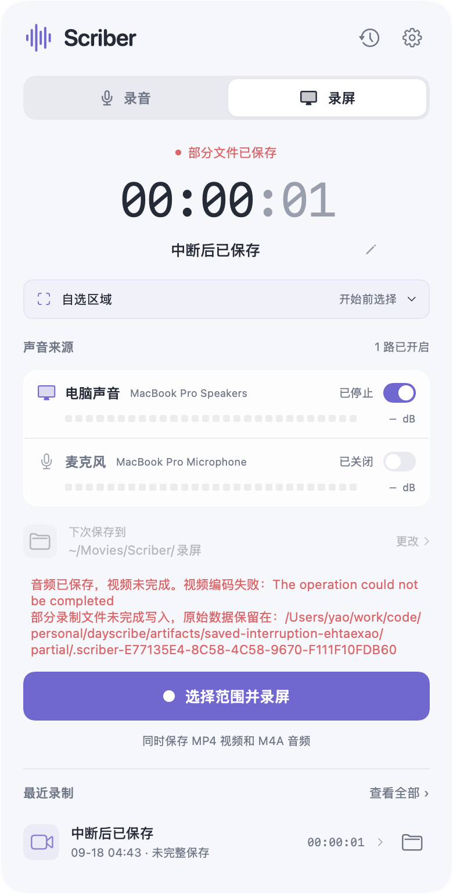

## Capture interruption versus completed video files — 2026-09-18

- The first actual two-hour trial stopped at **5485.548 s (91m26s)** because the native test fixture crashed in CoreText/NSString drawing (`VideoSyncFixture`, uncaught NSInvalidArgumentException). The Scriber process detected its disappearing target, saved the standalone audio and retained raw MP4. This is a **failed two-hour trial**, not completed endurance acceptance. Audio endurance continued independently.
- Investigation found that ScreenVideoOutput threw its capture warning after AVAssetWriter had successfully closed the video. The recorder therefore treated a usable closed video as unfinished. Encoder-close success now controls publication; the separate capture warning is preserved in session metadata and the failed/warning UI state. Failed encoders and missing tracks remain unpublished. No new held pictures are generated after blank/suspended/stopped capture.
- Three native codec/decode cases cover those interrupted statuses with prior valid audio/video. All **114 component cases (100 functions)** and Release build/signature passed (`artifacts/interrupted-video-tests.log`, `interrupted-video-build.log`).
- Actual target termination now publishes a readable pair with its interruption warning: **3.4485 s /165528 audio frames /100 video frames**, full FFmpeg decode and identical PCM. SCK may deliver a frame-state interruption or a native no-target delegate error; both are retained. Evidence: `window-close-publication-final.log`, `window-close-publication-6w_22jw8/verified.json`.
- A separate real256KiB process file-size limit still fails the video encoder and publishes only usable audio: **2.376458333 s /114070 frames**. This confirms the change does not call an encoding failure saved. Evidence: `video-write-failure.log`, `video-write-failure-ht_slwcu/verified.json`.
- Production session recovery published the first trial's retained video while reusing its saved M4A. Both fully decode with identical paired PCM; all original media hashes are unchanged (`video-endurance-yrejmrnt/recovery-verified.json`, `original-media-hashes.json`). The recovered91m file is retained as failure/recovery evidence. Recovery RSS was observed at about2.6GiB in one sample; attribution remains to be investigated separately. The fixture rendering fix and a new complete two-hour run are next.

## Endurance fixture rendering repair — 2026-09-18

- The first long trial's concrete crash stack was in repeated CoreText/NSString rendering inside VideoSyncFixture.draw. The fixture now draws its clock as geometric segments and its reference pattern as paths, with no font or attributed-string construction in that loop. It still displays a real moving window and emits real native audio cues; recorder samples still come from ScreenCaptureKit.
- Runner failures now record fixture and recorder exit codes separately and distinguish unexpected process exit from a deadline. An intentionally terminated owned fixture was correctly recorded as -SIGTERM, the trial failed instead of passing, and the corrected recorder retained both closed files with a capture warning (`artifacts/fixture-exit-check-9ego5bs9/verified.json`).
- Full30-second calibration passed **30.3008125 s /1454439 audio frames /870 video frames**,1920×1080, native/full FFmpeg decode, identical paired PCM and beginning/end sync. Maximum absolute cue offset16.667ms, median start/end change -13.333ms; finalization0.09560175s and peak recorder RSS95088KiB. The captured frame below was visually inspected. Evidence: `artifacts/vector-fixture-calibration.log`, `video-endurance-sekse8j3/verified.json`.
- Swift helper build, Python compilation and self-review passed. This removes the observed fixture failure path; a new complete two-hour run is still required and is not inferred from calibration. The original eight-hour audio run is untouched.

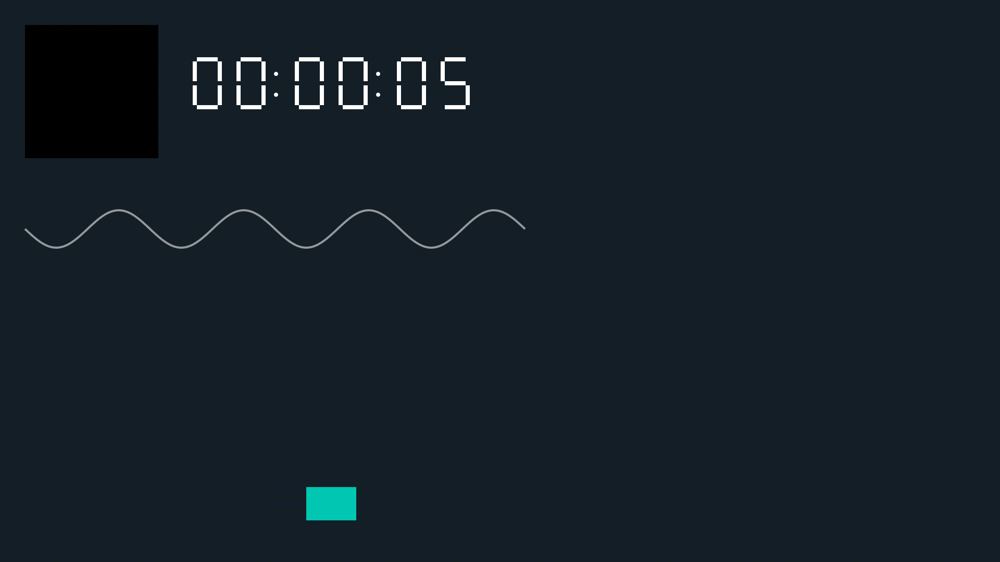

## Bounded recovery-prefix copy memory — 2026-09-18

- Investigation of the recovered91m file identified FileHandle buffers retained by the detached Swift task's autorelease lifetime. A generated256MiB box-copy fixture peaked at276086784 bytes RSS even though each read was limited to1MiB. Explicit per-chunk autorelease pools now release those Foundation objects after each completed write; cancellation, original identity checks and no-overwrite behavior remain intact.
- The same generated input copied with peak8830976 bytes RSS, and original/unpooled/pooled copies have identical SHA256. The production fix then copied the actual **2746554537-byte**91m video with peak **7684096 bytes (~7.3MiB)**; source and output exactly match the previously recorded original hash. These are **copy-stage** measurements, not an8MiB claim for native exporting/decoding or the full app. Evidence: `artifacts/prefix-memory-t4job4ip`, `prefix-memory-fixed-s3y829d_/verified.json`.
- A >3MiB component case verifies exact bytes across multiple chunks and unchanged source. All **115 component cases (101 functions)**, Release build and self-review passed (`recovery-copy-memory-tests.log`, `recovery-copy-memory-build.log`).
- Reproduce memory measurement on an inactive owned file with `xcrun swiftc -O -swift-version 6 -parse-as-library Sources/Scriber/MovieFilePrefix.swift tools/InspectPrefixCopyMemory.swift -o artifacts/InspectPrefixCopyMemory`, then pass absolute source and new destination paths. The tool reports actual process peak RSS and copied bytes; it does not certify media decoding.
- The second complete two-hour recording is running with the repaired geometric fixture and interrupted-video publication fix. Original eight-hour audio continues independently. Neither ongoing test is marked passed by these memory checks.

## Restored mode and range-type preferences — 2026-09-18

- SPEC's remembered-choice default now includes recording mode and range TYPE, which previously reset with SwiftUI state at app restart. First use remains audio/region; the normal panel initializes from the restored values. Only enum preferences are stored: a concrete window, display or rectangle is never restored as a capture target, and no recording starts automatically.
- User actions persist each preference independently through the recorder's supplied defaults store; active recording/preparation/finalization refuses mode/range changes. Nil-default diagnostic models stay isolated. Unrecognized stored values fall back for display without deleting the original preference.
- All **116 component cases (102 functions)**, Release build and self-review passed (`artifacts/recording-options-tests.log`, `recording-options-build.log`). A new case covers restoration, independent changes, invalid values, nil-store isolation and absence of an active target after restoration.
- Two separate native helper processes wrote and reread a private defaults domain: video/window restored with idle state and no target. The helper explicitly flushed its own domain because it has no AppKit termination cycle; it did not modify personal preferences. Evidence: `artifacts/recording-options-712h1lm7/verified.json`. The restored native view below was rendered offscreen and inspected. **Actual button/restart interaction remains pending unlock**, alongside the earlier saved-interruption UI follow-up.

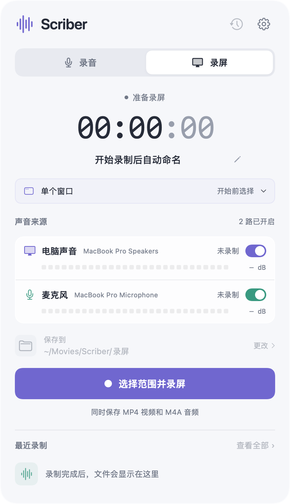

## Refreshed delivery candidate — 2026-09-18

- `build/candidate/Scriber.app` now contains merged Sources from79295eb (tree08c6e0f352e7808ed40235e22bb639494d456e32), including interrupted-video publication, bounded recovery-prefix copying and remembered mode/range type. The earlier candidate is archived locally. Existing eight-hour and second two-hour capture binaries remain unchanged.
- Release build and existing-development-identity signature passed. System launch and permission checks, normal-app isolated dual capture, AppKit quit/save, full decoding and fresh-process restoration of one available history record passed **4.576833333 s /219688 frames**. Personal history remained unchanged. Evidence: `artifacts/delivery-candidate-r2.json`, `delivery-candidate-r2-build.log`, `delivery-candidate-r2-smoke.log`, `delivery-candidate-jl471nk2/verified.json`.
- This verifies the updated package and normal lifecycle, not GUI clicks under the locked desktop. Long test results, physical device/sleep/lock transitions and PR41/47 native interaction follow-up remain required. A fresh repository audit confirms all43 goal PRs5–47 are merged ancestors of the current default branch.

## Actual two-hour video: preserved-file acceptance review — 2026-09-18

The second real-time window recording completed, and its unchanged media passed independent review. **The original automatic validation failed on its first native decode; that failure remains recorded.** This is a reviewed-file acceptance result, not a claim that the original runner completed without an error.

- Run: `artifacts/video-endurance-urdcxlow`, requested7200s, wall capture **7200.106560125s**, mixed-audio timeline **7200.35425s**. The app exited0 with both files saved, no capture error, source failure or reconnect. Actual system and built-in microphone streams each used48kHz; the moving geometric window and audible synchronization cues were captured through ScreenCaptureKit.
- Provenance: run revision `066063a3571d15a7c0b02b6531e027ac1e4a09c4`; frozen `artifacts/window-stop-app/Scriber.app` binary SHA256 `0fbf46f19cce6fcc45d91290a9d3c29726f7bf32d12913b47c3c7dc7e4d4282d`. The later delivery candidate is a different binary and has its own short lifecycle check. Neither this recording nor the original eight-hour audio binary was rebuilt for the review.
- MP4: **1920×1080 H.264, 211875 encoded pictures, 3505341970 bytes**. Standalone M4A: **78536716 bytes**. Both AAC tracks fully decode to **345617004 stereo frames at48kHz**, from0 to7200.35425s. Full FFmpeg Float32 PCM hashes are identical: `c86a9e3f0eca8acd28d51c23314565d9e6087a33a3a0e091c406f4658065bba0`.
- The first frozen `InspectMedia` call failed with AVFoundation **-11821 Cannot Decode**, underlying OSStatus **-12137**; its unhandled top-level error caused SIGTRAP. The recorder had already finished successfully. `failure.json` and `artifacts/video-endurance-2h-r2.log` are preserved. The cause is **not established**.
- Investigation then completed an independent full FFmpeg decode with exit0 and empty error output, a packet timestamp audit, a traced native full decode, a native last30s probe and one rerun of the original frozen inspector. **Both native full rechecks exited0** on the same files with exact audio/frame counts. They each produced211876 raw pictures, including one leading empty-edit picture;211875 fall in actual media segments, matching the encoded and independently FFmpeg-decoded frame count. Native floating-point AAC hashes vary between reads, so paired equality uses the same FFmpeg PCM decoder, as in the existing acceptance collector.
- Packet PTS strictly increase, with no packet duration at or below one video time-base tick. First nonempty video segment begins0.043333333s; track end7200.355s differs from the audio end by0.00075s. Actual pictures decoded near6s and7198s were visually inspected: reference clock, waveform, moving marker and ending synchronization flash remain intact. This is media inspection, not native panel interaction evidence.
- Beginning cue offsets (audio minus picture): **-18.333, -3.333, +6.667ms**. Ending offsets: **-13.333, +3.333, +16.667ms**. Median change **+6.666ms** passes the unchanged absolute100ms/drift50ms thresholds. Audio onset measurement resolves5ms; video frame quantization also applies. Evidence: `sync.json`, `artifacts/video-endurance-r2-sync.log`.
- Reviewed all238 resource samples through7169.994s: frames from both sources and encoded pictures advance, sampled source failures are empty and maximum source clock skew remains0. Peak recorder RSS **96.703MiB**; first warmed/end10-sample medians **94.336/96.461MiB**. Successive15-minute RSS medians are **94.31,95.12,95.74,93.70,94.29,94.89,95.52,96.25MiB**: small bounded variation in this run, rather than retaining the3.5GB movie in memory. Warmed mean sampled CPU **15.62% of one core**; finalization **0.100016375s**. These are sampled recorder measurements, not fixture/system totals or proof of indefinite-duration bounds.
- Media SHA256 was recomputed after all full decodes and matches the prior independent audit: M4A `a2af46e6bbe52498ca077a7d279543fe69b9be52882dfe985061e68dd30be19e`, MP4 `1d4a0d787afb835a7b9357031ad8c13ae19995cd8566afce971f46b0d55b6a51`. Nothing was repaired, remuxed, replaced or re-recorded to make these checks pass.
- Separate review evidence: `acceptance-review.json`, `review-resource-metrics.json`, `review-ffprobe-count.json`, `native-original-rerun.json`, `native-original-rerun-exit.json`, `native-traced-output.json`, `native-traced-exit.json`, `independent-ffmpeg-exit.json`, `independent-audio-hashes.json`, `packet-audit.json`, `review-start.png`, `review-end.png`. No original `verified.json` was fabricated. Raw media and diagnostics remain local/ignored. Documentation self-review and evidence consistency checks passed; product code is unchanged, so the existing116-case Release result remains the applicable component baseline.

The earlier91m fixture-crash attempt remains a failed endurance attempt with separate recovered-file evidence. The actual eight-hour audio test and physical device/power/native-GUI follow-ups remain unfinished.

## Native playback and seeking on the actual two-hour pair — 2026-09-18

- `tools/CheckRecordedPlayback.swift` links the current production `RecordingPlaybackModel` and uses an isolated history index referencing the existing session manifest. It opens each published M4A/MP4 with AVPlayer, seeks to6s and3s before the end, observes actual playback progress, pauses and closes. For video it samples native `AVPlayerItemVideoOutput` buffers and saves the first picture from each section. It accepts only a new output directory and reports errors without an unhandled top-level trap.
- The preserved two-hour pair passed all four sections. Completed seeks matched requested positions; playback advanced **1.265–1.309s** in **1.383–1.429s** of observed wall time. Native video output yielded **38/39 distinct advancing picture timestamps** at **1920×1080**. These are sampled playback pictures, not a full-file frame count. The actual buffers were visually inspected: the beginning/end reference clocks show00:00:05 and01:59:56 with intact moving markers and reference waveforms.
- Source manifest bytes stayed unchanged, and both media SHA256 values still match the two-hour audit above. An existing output directory was rejected with exit2 without replacing its report. A malformed owned manifest produced exit1/failure.json and no passing report. Tool compilation, these actual playback/guard checks, documentation consistency and self-review passed. Product Sources and running capture binaries are unchanged.
- Evidence: `artifacts/long-media-playback-67d05d55/verified.json`, `integrity-and-guards.json`, `mp4-section-0.png`, `mp4-section-1.png`, `artifacts/recorded-playback-build.log`, `long-media-playback.log`. The player was muted and had no visible panel: this verifies native model/player seeking and picture output, **not audible output, GUI clicks, full-duration playback or physical-device transitions**. It supplements the full-file decoding evidence and does not establish the cause of the original native-reader exception.

Reproduce against an inactive, completed Scriber session with at least12s of media. Video must be a moving fixture that supplies at least5 distinct pictures within each1.25s section; this tool is not the static-screen playback check. It bounds seek-position error at50ms and records measured positions. Outputs and source files remain separate:

```sh
python3 - <<'PY'
from pathlib import Path
import subprocess
sources = [str(p) for p in sorted(Path('Sources/Scriber').glob('*.swift'))
           if p.name != 'ScriberMain.swift']
subprocess.run(['xcrun', 'swiftc', '-O', '-swift-version', '6', '-parse-as-library',
                *sources, 'tools/CheckRecordedPlayback.swift',
                '-o', 'artifacts/CheckRecordedPlayback'], check=True)
PY
artifacts/CheckRecordedPlayback /absolute/session.json /absolute/NEW-output-directory
```

## Candidate native preference and audio-warning GUI follow-ups — 2026-09-18

- The desktop became unlocked during read-only observation of the original eight-hour capture. Fresh public Accessibility/screen/input preflights passed. Tests then operated the signed `build/candidate/Scriber.app` through actual accessibility controls, guarded foreground typing, native menus and exact owned PIDs. The original capture continued without restart or binary replacement. This observed unlock does not replace the still-pending controlled lock/sleep tests.
- **PR47 preference GUI follow-up passed:** normal candidate launch selected video/window using actual buttons, native UI quit, fresh process restored video/window. Selecting display then audio and restarting again restored audio/display; returning to video exposed the remembered display range. All launches stayed idle with no session, media paths or power assertion. Only the two exercised standard preference keys were snapshotted and restored; both were originally absent and remained absent afterward. This deliberately used a normal defaults-backed launch: `--validation-root` supplies nil defaults and cannot prove persistence. Evidence: `artifacts/recording-options-native-b1nfox3_/verified.json`, `preferences-before.json`, `preferences-restored.json`, actual window captures and `artifacts/recording-options-native.log`.
- **PR41 fully saved audio-warning GUI follow-up passed:** actual system capture was deliberately interrupted through the diagnostic source control, exhausting recovery and saving **2.04s /97920 frames**. The candidate stayed open with “已保存 · 请查看提示”. Real filename-button, text-selection/Unicode typing and confirm-button actions renamed the published M4A; its SHA256 stayed `69335f91f2ffa02c90f799b35ca0ad5af6a93bea278322e820319b1762aaae39`. The original capture warning remained in the session manifest. Full FFmpeg decode passed. After native UI quit, a normal candidate with a private history root discovered the same session and displayed its new name with “已保存 · 请查看提示，00:00:02”. Personal history remained unchanged, and final native navigation/quit completed.
- The first two warning-script runs were incomplete because of **harness** issues: the quit selector saw both a native menu item and a backing SwiftUI button, then a later run attempted Settings while still on the history page. The script now selects the fresh enabled native menu item and uses the actual back button before Settings. Both failures and their logs remain in `saved-warning-native-ja4oocug` and `saved-warning-native-j7rbpy9c`. No product assertion was weakened or failure removed. Complete third-run evidence: `artifacts/saved-warning-native-aij9hzxn/verified.json`, actual window captures, AX snapshots and `artifacts/saved-warning-native-r3.log`.
- All actual screenshots were visually inspected. The crops below show the restored controls, renamed warning state and the isolated test history row; full screenshots and raw diagnostics remain local. The preference screenshot's full window also shows the expected recovery deferral for the independently running eight-hour Scriber instance. Product Sources are unchanged; these checks close the named native follow-ups, **not the video/partial-save GUI cases or physical-device transitions**. Documentation/link/diff and evidence-consistency review passed.

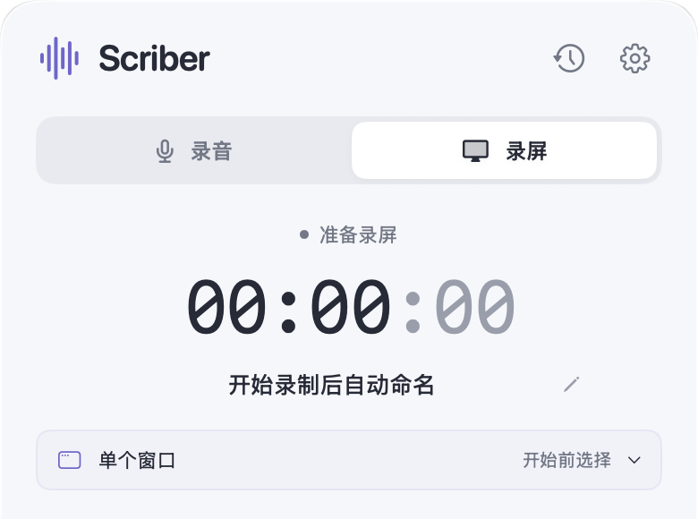

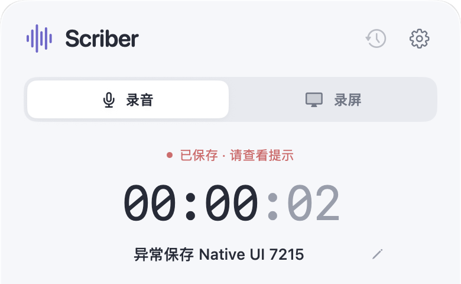

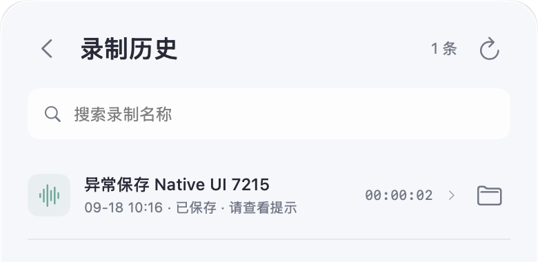

## Native video/partial-save warnings and actionable target-loss text — 2026-09-18

- **Full video GUI follow-up:** a real moving fixture window was captured, then only its owned process was terminated after over2s. The candidate retained both closed files with a capture warning: **2.5149375s /120717 audio frames /65 video frames**. Actual warning, filename editor/confirm and native quit/restart actions passed; both published members kept identical bytes after paired rename, full decoding passed and paired FFmpeg PCM matched. Normal private history retained the warning/name, and native video playback/position/pause passed. Evidence: `artifacts/video-warning-native-u2zegv7s/verified.json`, `artifacts/video-warning-native.log`.
- **Partial-save GUI follow-up:** a131072-byte kernel file-size limit applied only to the new candidate child caused an actual video writer failure while the owned fixture stayed alive. Audio finalized **1.972395833s /94675 frames**; video remained unfinished. The real panel showed “部分文件已保存”, allowed filename edit/confirm for the published M4A and retained its hash. The unfinished MP4 path and raw SHA256 were unchanged. After reopening normal private history, the row showed “未完整保存”; detail selected the available M4A, disabled video preview and played/paused audio with advancing time. Personal history was unchanged. Evidence: `artifacts/partial-warning-native-h8ijear3/verified.json`, `artifacts/partial-warning-native.log`. This is an owned-process write failure, not a new full-volume or physical-device test.
- Actual video images exposed an unhelpful raw English framework message after the target disappeared. Video start/stop errors with typed ScreenCaptureKit `noWindowList`, `noDisplayList` or `noCaptureSource` codes now say **“所选窗口或屏幕已不可用，请重新选择录屏范围后再开始。”** The mapping is video-specific; permission guidance and unrelated error descriptions retain their existing handling. File closure/publication behavior is unchanged.
- All **116 component cases (102 functions)** and Release build passed. A separately signed updated app was built at `artifacts/video-target-message-app-752c83de/Scriber.app` with the existing development identity; source-input and patch hashes are recorded in `artifacts/video-target-message-validation-build.json`. Its real window-loss GUI regression asserted the exact new text and passed **2.465854167s /118361 audio frames /63 video frames**, paired unchanged renamed files, identical PCM and native history/video playback. Evidence: `artifacts/video-warning-native-le2209d_/verified.json`, `artifacts/video-warning-localized-native.log`, `video-target-message-tests.log`, `video-target-message-build.log`.
- Native screenshots were inspected; the images below contain only owned test content. Raw media, device identifiers and full private diagnostic captures remain local. The updated message build is separate from the earlier candidate package; the final candidate/default bundle still needs refreshing after merge. These results complete PR41's remaining native warning/rename/history follow-ups, not the physical-device or power acceptance.
- During these tests the system briefly used AirPods Pro and later returned to built-in devices. Original eight-hour capture stayed active; its trace records microphone24/48kHz changes and10 reconnection attempts, with no pending source failure at the later observation. `artifacts/audio-endurance-stxfoqmw/observed-device-transitions.json` preserves the observations. This is not a controlled unplug sequence or proof of ten physical actions. The original collector assumes48kHz when comparing cumulative **native** source frames; that assumption cannot certify a mixed-rate microphone total. Preserve its original final outcome and separately review the completed media and rate-transition evidence; do not equate a native-frame deficit with missing recording time. No eight-hour pass is asserted here.

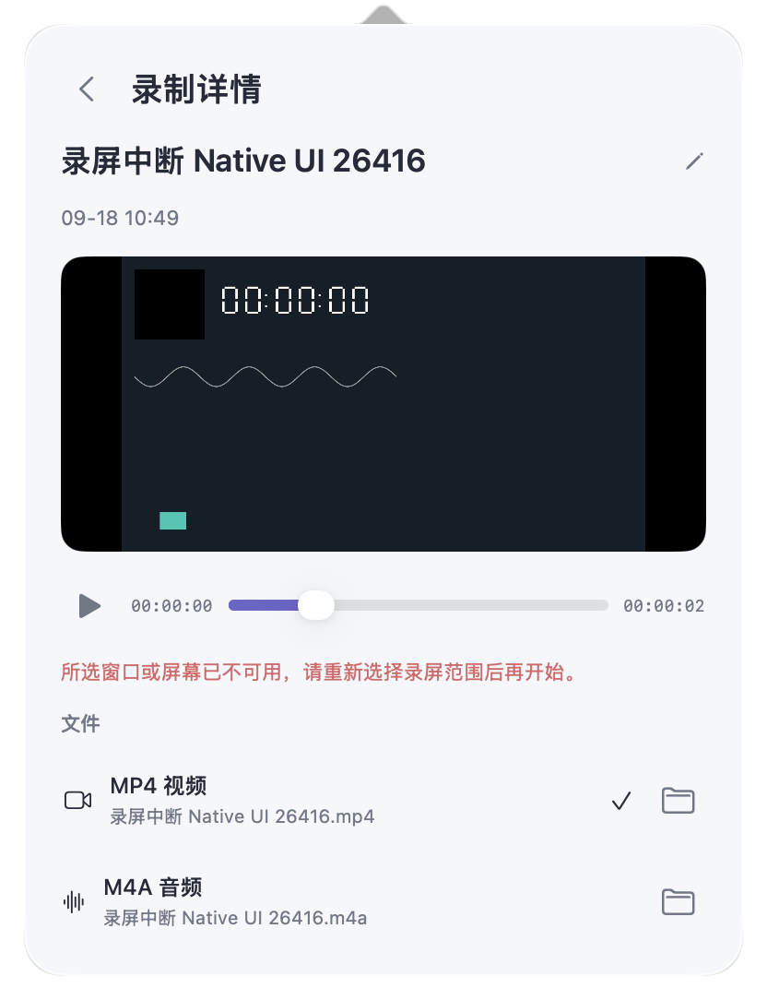

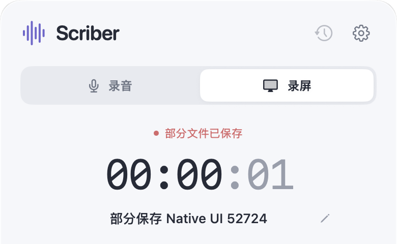

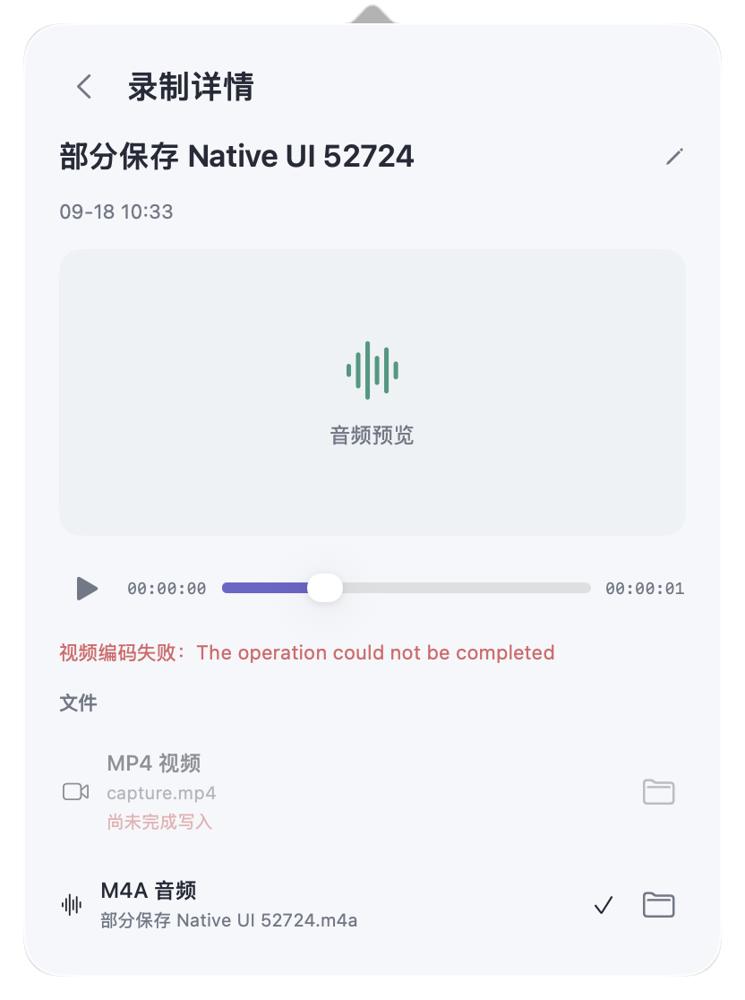

## Candidate refreshed after native GUI follow-ups — 2026-09-18

- `build/candidate/Scriber.app` now matches merged Sources from2a86beb (treeb061be2af52f3cfe2cb33c41d4239170844c915d), including the video-target guidance verified above. Binary SHA256 is `240e6ac6cc2026eaf4d5d2932151aab257767575725c749c3540f2e00f79991a`. Source-input hashes were matched to the signed source commit and merged tree before copying; the existing development signature verified afterward. The earlier candidate is archived locally.
- Refreshed normal-app lifecycle smoke passed **4.553104167s /218549 frames**: LaunchServices launch, permissions, isolated dual-source capture, AppKit quit/save, full decoding and fresh-process restoration of one available history record. Personal history remained unchanged. Evidence: `artifacts/delivery-candidate-r3.json`, `artifacts/delivery-candidate-r3-smoke.log`, `artifacts/delivery-candidate-lov6h_kk/verified.json`.
- Original eight-hour capture remains on its frozen default bundle, whose binary hash was checked unchanged. The refreshed package smoke is separate from the actual native GUI checks above and does not complete the eight-hour/device/power acceptance. Replace the default bundle only after its owned capture exits.

## Actual eight-hour audio file review, with device-change warning — 2026-09-18

The original session recorded for eight actual hours and published a valid file. **File/duration/resource checks passed the separate review below; the original clean-run check failed, and uninterrupted microphone coverage is not proven.** These conclusions remain separate.

- Frozen run `artifacts/audio-endurance-stxfoqmw` completed **28800.091889625s wall time** and saved **28800.16s /1382407680 stereo frames at48kHz**, AAC/M4A, **264451632 bytes**. The manifest marks M4A closed and published. Finalization took **0.076891209s**, native power protection released, and both owned capture/runner processes exited. The recording was not restarted, concatenated, repaired or accelerated.
- The app retained **“录制期间有声音中断。麦克风：系统输入设备已变化。（已恢复）”** with the saved file. The original runner stopped at its line136 `status == completed` assertion, before decoding or its fixed48kHz source-frame check. `failure.json`, the final result/manifest and `artifacts/audio-endurance-8h.log` remain unchanged; no original `verified.json` was created. A successful publication does not erase that warning.
- Independent review fully decoded the entire file with the frozen native `InspectMedia` and FFmpeg. Both counted **1382407680 frames**; the FFmpeg Float32 pipe produced **11059261440 bytes**, exit0 and an empty error log. Native audio starts at0 and ends at28800.16s. File SHA256 remained **`87638f14eaa807eb6dbf11233e49f80e55f40a186fed04fdd966df4193ac8091`** after decoding. FFmpeg PCM SHA256: `5bf3dea7fa2597b3ae476faaca38c8df28b26143f126d6ecd8ef518ecadced79`.
- The original `tone_amplitudes` function was executed unchanged, independently of the stopped collector. Beginning880/1760Hz amplitudes were **0.043886/0.042745**; ending amplitudes **0.042388/0.042573**, all above the existing **0.005** threshold. Native production playback-model/AVPlayer checks also loaded the eight-hour M4A, sought to6s and28797.16s, advanced to7.294991s and28798.468995s, and paused/closed. That playback check was muted and headless; it is not audible-output or GUI-click evidence.
- Reviewed **953 resource samples** through28790.723s: peak recorder RSS **85.094MiB**, first warmed/end medians **85.094/79.969MiB**, mean sampled CPU **8.470% of one core**. Quarter-hour medians range74.13–85.02MiB; no growth comparable to retaining the whole recording was observed. Recorded source clock-skew maxima remain0. The mixer reported **1754 clipped scalar samples**, about **0.00006344%** of its stereo output samples; this is retained, not described as zero clipping.
- Microphone native rates included24kHz and48kHz, with36 recorded reconnect attempts; the final state had built-in48kHz input and no pending source failure. Native frame totals from different rates cannot be divided by the final48kHz rate to infer lost duration. The old binary did not persist exact normalized per-source coverage or gap intervals. These data therefore **do not certify gap-free microphone audio**, prove which physical actions occurred, or complete the controlled USB/Bluetooth acceptance. The factual user clarification about active AirPods switching remains pending.
- Separate evidence: `file-acceptance-review.json`, `review-original-media.json`, `review-native.json`, `review-native-exit.json`, `review-ffmpeg.json`, `review-ffmpeg.log`, `review-stimuli.json`, `review-resources.json`, `review-ffprobe.json`, `review-integrity.json`, `observed-device-transitions.json`, `route-observations.jsonl`; native playback `artifacts/audio-endurance-playback-49eba7d2/verified.json`. Decoder-specific idle-sleep assertions were held only during post-capture validation and ended with those decoder processes. Raw media and private device diagnostics remain local. Evidence consistency and documentation review passed.

This completes the measured real-time eight-hour **file** result, while preserving the source-continuity limitation and failed original clean-run outcome. Final device/power acceptance and default-bundle delivery remain required.

## Remaining acceptance

Controlled USB/Bluetooth transitions and assessment of the observed microphone reconnections, actual sleep/lid/lock transitions, and final default-bundle delivery remain outstanding. Eight-hour audio file checks and two-hour video file checks have reviewed evidence with their original warning/validation failures preserved. Neither those results nor short control checks certify uninterrupted microphone coverage or replace the remaining hardware/power acceptance.
