# Native implementation validation

This log concerns the native application. Browser-prototype checks in design/QA.md do not prove capture functionality.

## Native application shell — 2026-09-16

- Environment: Apple Silicon, macOS 26.6.2, Xcode 26.6, Swift 6.3.3.
- SwiftPM debug compilation passed; generated bundle executable is Mach-O arm64.
- App Info.plist passed plutil validation; bundle identifier is com.luyao618.Scriber.
- Local ad-hoc app signature passed codesign --verify --strict.
- App launched through Launch Services and running Scriber process was observed.
- Build script refuses to overwrite an already-running Scriber bundle; guard verified.
- Native view rendered using SwiftUI ImageRenderer and visually inspected. This is an offscreen render of the application view, not a desktop screenshot or proof of menu bar interaction.
- Automated native GUI connector timed out and then was unavailable in the current tool inventory. Actual menu bar/mode-switch confirmation was requested from the user and remains pending.

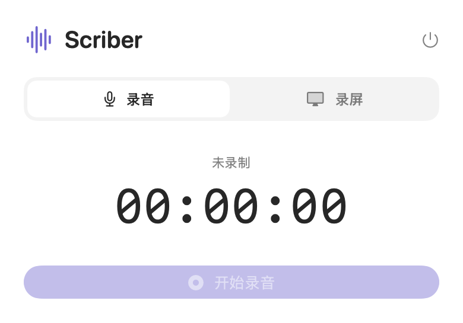

## Microphone recording — 2026-09-16

- Real capture used the system-default MacBook Pro built-in microphone. The attached Jabra USB headset was the default output; its microphone and Bluetooth routes have not yet been validated.
- A requested 5-second capture produced a 48 kHz, mono AAC/M4A with a 5.013333-second container duration, decoding without errors. Measured peak was -48 dBFS. This was ambient input, not an identifiable calibration signal.
- A separate requested 30-second capture completed normally; AVAsset presentation duration was 29.972 seconds and measured peak was -21.4 dBFS.
- Graceful-quit testing initially exposed a termination deadlock. Stack evidence showed AppKit waiting inside a main-actor task while completion was queued to the same actor. The file itself was already closed and playable.
- The microphone-specific quit path now uses AVAudioRecorder.stop's documented synchronous file-close guarantee. A corrected check requested 120 seconds but sent SIGTERM after about 2 seconds: the process exited, the result reported interrupted, and its 2.069333-second file decoded successfully. This is not counted as a 120-second recording.
- Final normal-capture regression on the developer-signed build also passed an actual 5-second recording and complete decode. Local evidence is retained in ignored artifacts/microphone-check-* and artifacts/microphone-quit-check-* directories; audio is not committed.
- Reproducible scripts/check-microphone.py checks passed: --seconds 5 produced 5.013s AAC and normal process exit; --seconds 30 --interrupt-after 2 produced 2.155s AAC, interrupted status and process exit. Both files completely decoded. Evidence is retained in ignored artifacts/mic-check-6s6x5iq6 and artifacts/mic-check-kylhpe4x.
- Build signing now prefers the sole existing Apple Development identity for consistent update identity. No new certificate, credential, or trust setting is created.
- The native meter is drawn from actual measured dBFS using SwiftUI segments. Screenshot below is an offscreen idle-view render, not hardware/screen-capture evidence.

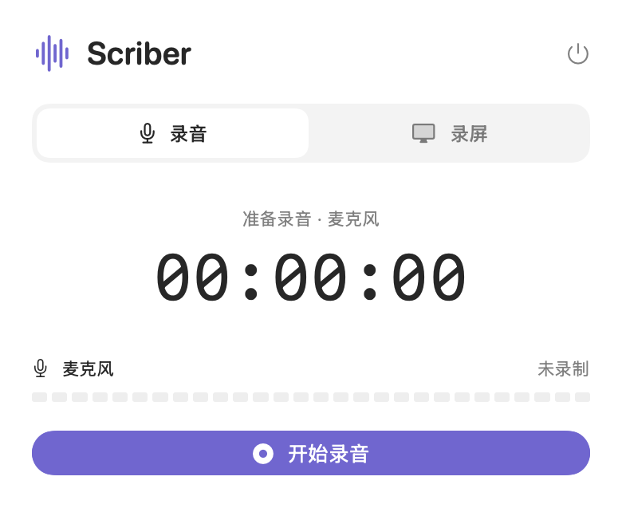

## PCM writer component — 2026-09-16

swift test passes three cases: generated PCM fixture encoded to AAC and fully decoded with expected frame count/duration/RMS/peak; a repeated old timestamp is rejected while the already-written valid prefix remains playable; an empty capture cannot report success. These are codec/component tests, not evidence of actual system-audio capture.

## System audio source — 2026-09-16

- Initial real capture was denied by macOS TCC: zero frames and no media output. The diagnostic reported failure, not success. Later app-owned public permission preflight reported both screen and microphone authorized; no TCC database or permission setting was changed by the implementation.
- Actual ScreenCaptureKit capture passed through the current Jabra USB system output: requested 8s, media timeline 8.02s / 384960 frames, stereo AAC completely decoded. Two externally played stimulus frequencies (880Hz and 1760Hz) were detected with strong energy relative to a 3127Hz control frequency. Trailing silence was retained.
- A separate 30s-request check stopped via SIGTERM after about 5s: 5.16s / 247680 frames retained, result correctly marked interrupted, process exited and file decoded completely. The measured tone centroids were 1.282s and 3.281s, confirming the two stimulus segments' order and approximate two-second separation.
- Evidence remains local in artifacts/system-audio-check-tty2hz1l and artifacts/system-audio-check-1twzdhgq. The WAV is only the playback stimulus; the analyzed M4A came from the actual macOS capture callback.
- Codec cases additionally cover stereo planar and interleaved PCM. All five cases pass. Diagnostic UI rendering is offscreen evidence only.
- Microphone regressions after the system-source integration passed: normal 5s capture (5.013s container) and 30s-request/2s interruption (2.112s container), both with process exit and complete decode. Evidence is in ignored artifacts/mic-check-j703d3rw and artifacts/mic-check-xj5uzvxb.

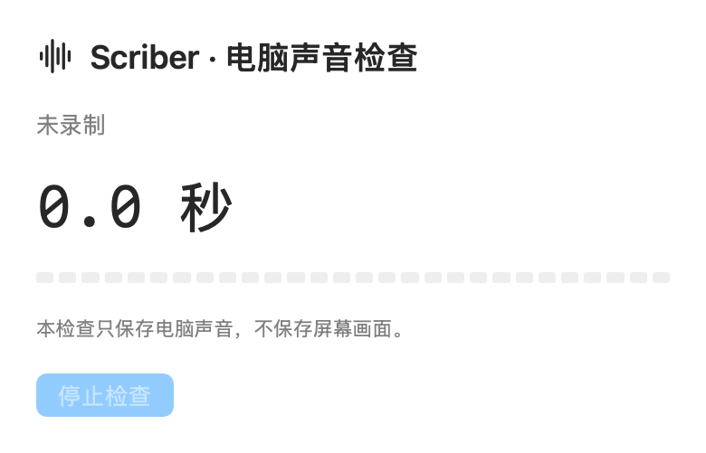

## Approved native panel restoration — 2026-09-16

- Restored the approved panel structure and palette: 390pt pearl surface, rounded brand/header actions, inset mode selector, split-color clock and filename, two-source card, destination, rectangular start/stop action, and recent recording section. The recording state uses the real microphone's elapsed time, filename and measured power; no demo values are injected.
- Offscreen SwiftUI renders below were visually compared with design/screenshots/panel-preview.png. They show idle audio/video states; the approved reference shows an active video recording. The native host fitting sizes are 390×631pt for audio and 390×678pt for video. NSPopover now follows preferred content size instead of a fixed 400pt height.
- System audio selection, video recording, renaming, destination changes and full history remain explicitly unavailable at this increment. Recent recording displays the latest successful microphone file from this app session and reveals that actual file in Finder. This is not yet persistent history.
- Debug build and Apple Development bundle signature verification passed. A real 5s microphone regression produced a 5.013s AAC/M4A that completely decoded; measured peak was −34.2dBFS. Local evidence: artifacts/mic-check-4j6uhz8e. No capture or writer code changed in this PR.
- The desktop CUA connector again timed out after launching the application. These images are offscreen renders of the native SwiftUI view, not desktop screenshots. Menu-bar clicks, dynamic popover resizing, keyboard navigation and nested settings interaction still require actual GUI verification.

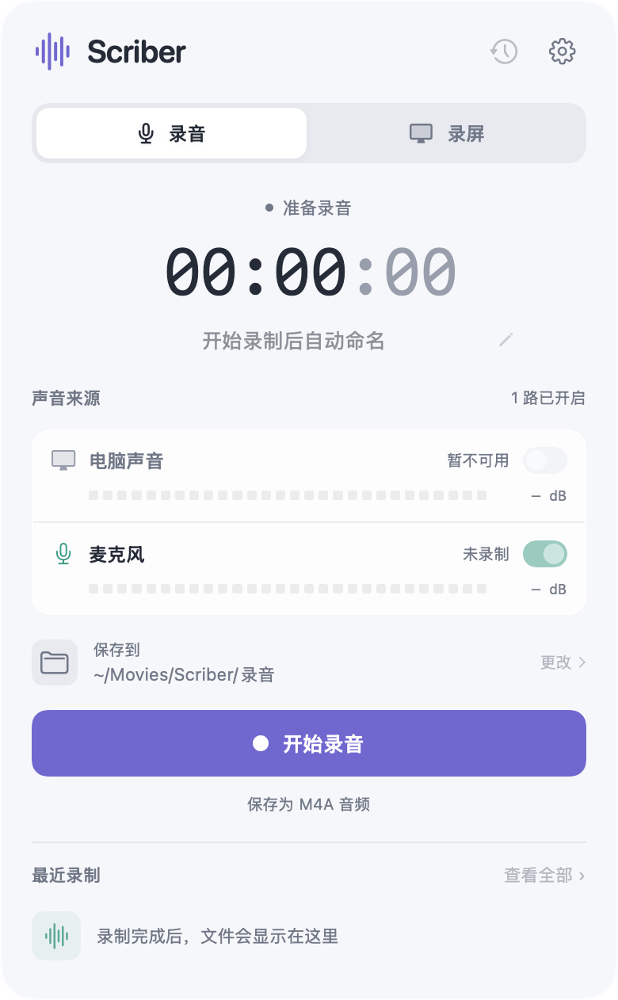
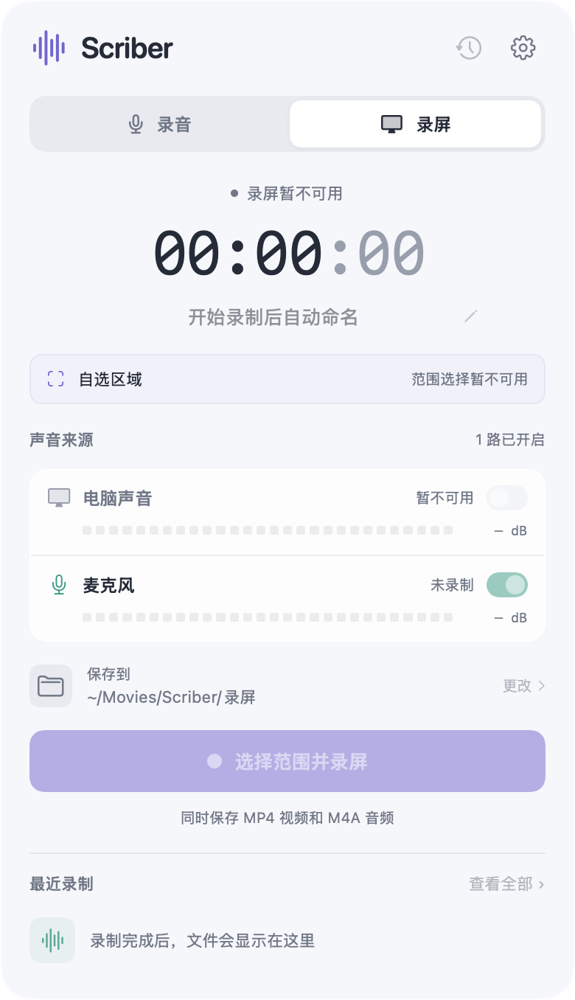

## Common-timeline mixer component — 2026-09-16

- Added a queue-confined 48kHz stereo PCM mixer with a fixed two-second ring per source and a 250ms holdback for callback arrival differences. Output blocks are emitted synchronously. These bounds apply to the mixer component; complete capture-pipeline memory behavior still requires integration and long tests.
- Seven generated-PCM tests verify cross-source arrival ordering and capture-time offsets, left/right channel preservation, source changes inside a buffered block, pre-epoch trimming, gaps and final silence, per-source RMS and saturation counts, explicit rejection of late/overlapping/excessively distant data, and propagation of downstream write failures. A wraparound test verifies old samples are cleared and buffered duration stays bounded.
- The mixer sums selected sources and clamps samples to the legal PCM range, reporting the number of saturated samples. Source changes cannot disable every source or rewrite audio already emitted.
- All seven mixer cases plus the existing five AAC writer cases pass. Debug app build/signature verification passes. These are deterministic component checks, not evidence of actual mixed hardware capture, device resampling or the required 8h/2h recordings. The approved panel is unchanged in this increment.

## Streaming native PCM conversion — 2026-09-16

- Added a queue-confined AVAudioConverter adapter for continuous native PCM to interleaved 48kHz stereo. Mono maps equally to left/right; stereo retains its channel order. Converter state survives packet boundaries, and CoreMedia sample data is copied into a bounded input buffer. Each input call accepts at most one second of native audio; output has an explicit size ceiling.
- Initial independent impulse tests exposed the latency introduced by primeMethod.none (48 output frames for 16kHz, 17 for 44.1kHz). Switching to normal priming removes the shift; both impulse positions now fall within one output frame of their known source times. Temporary input starvation uses noDataNow; final endOfStream drains the filter tail.
- Eleven converter cases pass: six native-rate/layout/representation combinations (16/44.1/48/96kHz, mono/stereo, planar/interleaved, Float32/Int16), two fractional-tail/CoreMedia cases, two impulse-timing cases, and invalid-input/lifecycle handling. Streaming results match single-buffer conversion within 0.00005 sample amplitude, retain known tones and channel identity, and have the correct cumulative duration. Fractional final duration is rounded down once to the last complete 48kHz frame (less than 20.84µs), without per-packet truncation.
- All 23 component cases (13 test functions across three suites) pass, as does the native debug build/signature check. These generated fixtures do not prove actual microphone/system mixing, device switching, or long-duration capture. Native capture timestamp mapping and integration are still next.

## Actual mixed audio pipeline — 2026-09-16

- AudioRecorder now feeds selected ScreenCaptureKit system/microphone outputs through continuous native-format conversion and a common earliest-capture epoch into one M4A. Startup data is bounded (8MiB, 256 buffers, two-second timestamp span) and ordered by capture time once each selected source arrives. Writer rejection propagates before mixed PCM is reclaimed; shutdown drains converter/mixer tails before closing AAC.
- Fresh app-owned preflight confirmed both screen/audio and microphone permissions. Actual SCK source timestamps share the host clock; the first mixed test preserved the microphone's 233.99ms later start. Measured cumulative source clock skew was zero frames in these short captures; this does not establish long-duration synchronization.

| Actual source selection | Native rates | PCM timeline / ffprobe container duration | Local evidence |
|---|---|---|---|
| System + built-in microphone | 48k + 48k | 8.233979s / 8.298667s | artifacts/system-audio-check-7287lqrh |
| Built-in microphone only, acoustic fixture | 48k | 8.032s / 8.085333s | artifacts/system-audio-check-qg9wtf6q |
| Jabra BIZ 2400 II USB microphone only, acoustic fixture | 16k → 48k | 8.000s / 8.064000s | artifacts/system-audio-check-sd3ldai7 |
| System + Jabra USB microphone, interrupted after ~5s of a 30s request | 48k + 16k | 5.214375s / 5.269333s | artifacts/system-audio-check-6qipotlj |
| System only regression | 48k | 8.020s / 8.064000s | artifacts/system-audio-check-ptgy7o4n |

AAC container durations currently exceed the submitted PCM timelines by about 44–65ms. Both measurements are retained separately; precise presentation timing and codec padding must be checked when integrating synchronized video and independent audio output.

- Every listed capture produced exactly one fully decoded stereo AAC/M4A, with identifiable 880/1760Hz stimulus segments in the expected order, zero reported clipping, and successful process exit. Source-frame and native-rate reports verify the actual selected inputs. Acoustic checks disabled system capture and played the fixture through built-in speakers using AVAudioPlayer.currentDevice; this is sound recorded by physical microphones, not a fixture injected into the encoder. Default input remained the built-in microphone and default output remained Jabra after validation.
- The first Jabra acoustic attempt (artifacts/system-audio-check-vfo9nhsp) captured/converted/decoded correctly but failed tone identification because the signal was too weak. It is retained as failed calibration evidence. A repeat with fixture peak 3000/32767 instead of 1000 passed the same thresholds; the checks were not relaxed. Bluetooth and live device changes are still untested.
- Twenty-five component cases pass, including complete adapter→encoder checks for source offset/both frequencies and refusal to report success if a selected source never arrives. Debug build, bundle signature and fixture-tool compilation pass. The diagnostic panel below is an offscreen native render, not proof of desktop interaction. The normal approved panel still uses the earlier microphone path; real mixed controls are the next UI increment.

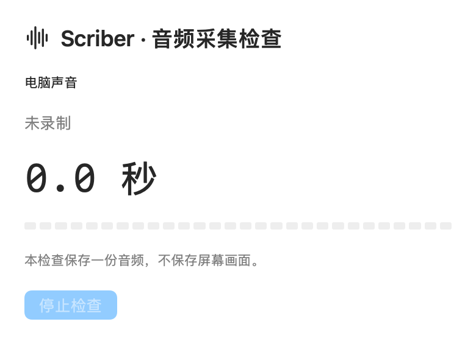

## Live panel integration — 2026-09-17

- The approved panel now uses AudioRecorder for both source toggles, measured independent levels, microphone-device help, elapsed time, filename, last saved file and asynchronous stop. Default-both source selection is persisted; disabling every source is rejected with a visible message. The old separate AVAudioRecorder path is removed.
- Initial shared-stream trials (artifacts/source-switch-check-u5efy63s and source-switch-check-p_thn9wb) passed recorded-signal gating but **failed** callback-stop checks: captureMicrophone=false continued delivering nonzero microphone PCM. The replacement owns separate system/microphone SCStreams sharing one host-clock mixer/encoder. Each disabled stream is explicitly stopped and its converter tail drained before restart. A locked-session trial (source-switch-check-zpgw307m) correctly failed with zero frames; it is not counted as capture evidence.
- On the unlocked Mac, all four independent-stream trials below passed: system-only → microphone-only → both transitions, rejection of an empty selection, stopped raw callbacks for disabled sources, resumed callbacks for active sources, suppression of the 880Hz system fixture while system capture was off, exactly one fully decoded M4A and process exit. Default playback output was Jabra USB; no system/Teams device settings were changed.

| Initial sources / microphone | PCM timeline / AAC container | Local evidence |
|---|---|---|
| Both / built-in 48kHz | 11.537063s / 11.584000s | artifacts/source-switch-check-bx4wgi4y |
| System, add built-in microphone | 11.065292s / 11.114667s | artifacts/source-switch-check-cn1up1nj |
| Built-in microphone, add system | 11.019375s / 11.072000s | artifacts/source-switch-check-nmx5p8cy |
| Both / Jabra USB 16kHz | 11.155438s / 11.200000s | artifacts/source-switch-check-kwpuia6x |

- These are requested 11s captures. The media timeline includes source startup before both streams have finished starting; the diagnostic wall timer begins when the recorder reports recording. Short capture duration can therefore exceed the requested wait. PCM and AAC durations remain separately recorded.
- The first AppKit quit trial (artifacts/system-audio-check-zx77nz2b) **failed**: calling terminate from a main-dispatch block entered AppKit's nested termination loop while holding the queue needed by the asynchronous stop task. A process sample was retained; the hung diagnostic was force-stopped for repair. SIGTERM now enters AppKit from RunLoop.main.perform, outside a dispatch drain or Swift task.
- Corrected AppKit terminateLater/reply validation passed (artifacts/system-audio-check-0hk8jtbp): a 30s request interrupted at about5s, PCM5.350375s / AAC container5.397333s, one fully decoded M4A with both ordered fixture tones, interrupted status and actual process exit. This is not a30s capture.
- Unified microphone-command regressions also pass: normal5s request →5.120s AAC (artifacts/mic-check-amyc3_k7); 30s request interrupted at about2s →2.112s AAC (artifacts/mic-check-ap2nftfg). Both fully decode and exit; ambient input only, not new acoustic calibration evidence.
- Twenty-seven component cases pass (17 test functions), including persisted nonempty selection and a16kHz source stop/restart with preserved epoch and flushed resampling tail. The updated app build and Apple Development signature verification pass without compiler warnings.
- The recording/saved screenshots below render our own native panel from actual capture state, not fixture UI state. They preserve the approved layout and show actual measured levels and saved-file data. CUA getApp still times out (-10005); desktop clicks, keyboard navigation and actual popover resizing remain unverified.

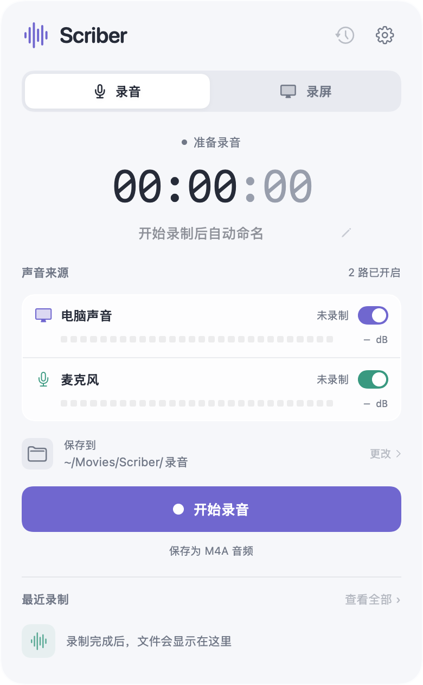
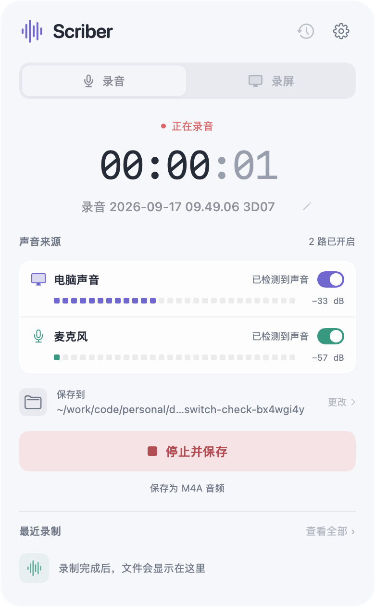
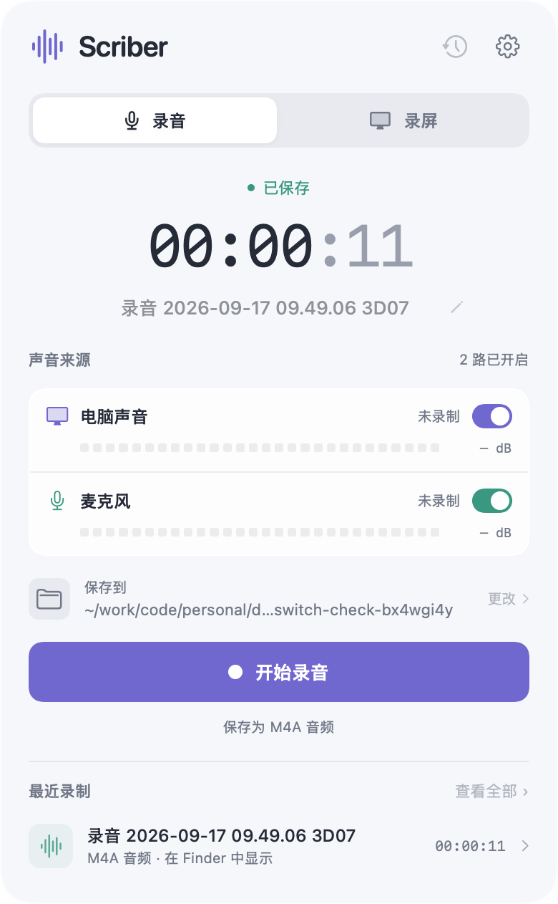

## Video writer component — 2026-09-17

- Added queue-confined H.264/MP4 plus stereo AAC writing. The screen adapter supplies BGRA frames and both tracks use one zero-based timeline; mixed48kHz Float32 PCM can be sent unchanged to this encoder and the separate M4A writer on the same serial queue. No pending sample arrays are retained. Invalid format/timing, missing tracks, encoder backpressure and write failures are explicit errors; a rejected sample still permits finalization of the valid prefix.
- Three generated-fixture cases pass (two test functions): normal encoding; a rejected old video timestamp followed by a completely decoded valid prefix; and empty/missing-track/invalid-dimension lifecycle checks. A1.2s fixture contains30 picture frames starting at200ms, with the picture changing from red to blue and audio changing from silence to880Hz at700ms. All picture timestamps survive within1ms, decoded tone onset is within30ms of the known event, and MP4/M4A tone onsets match within one48kHz sample.
- Initial assertions incorrectly counted the AVAssetReader-generated leading black gap buffer as an extra encoded picture. Inspection showed black at0, then all30 real frames at their original200ms-and-later timestamps. Tests now explicitly require the black leading gap, all30 picture timestamps and the700ms color transition; no timing tolerance was widened.
- All30 component cases (19 test functions) pass, along with debug app build/signature and self-review. These are generated codec/timing fixtures, not actual screen-capture or2h synchronization evidence. The panel still explicitly disables recording video; actual capture integration follows separately.

## Actual main-display capture and paired files — 2026-09-17

- AudioRecorder's diagnostic video mode now runs a dedicated ScreenCaptureKit display stream alongside independently controlled system/microphone streams. BGRA screen frames and both audio encoders use one host-clock epoch. The screen adapter retains only the latest surface, holds a static final picture to the audio endpoint, and reports blank/suspended/failed capture or missing initial picture instead of normal recording. Intentional stop is distinguished from interruption.
- Actual main display backing size is3456×2234. The initial trial (artifacts/system-audio-check-1ey_ci_c) failed before capture because CoreGraphics returned scaled desktop dimensions1728×1117. Dimensions now use SCK contentRect×pointPixelScale rounded to even H.264 values.
- A subsequent trial (artifacts/system-audio-check-pxe9czch) recorded129 frames and preserved standalone audio but failed MP4 finalization because host-clock arithmetic rounded the requested endpoint just below the exact PCM frame time. Video completion now normalizes to the same48kHz frame grid. Invalid endpoints preserve a decodable written prefix and report an error instead of cancelling the existing output. Partial audio/video success is reported explicitly.

| Real scenario | Shared PCM/video endpoint | SCK / encoded picture frames | Local evidence |
|---|---|---|---|
| Both, built-in microphone, normal8s wait | 8.475729s | 238 /239 | artifacts/system-audio-check-ig7gsjqk |
| System + Jabra USB16kHz, AppKit quit at about5s of30s | 5.500375s | 72 /73 | artifacts/system-audio-check-bz82nqqz |
| Audio source switching during11s video | 11.462271s | 289 /290 | artifacts/source-switch-check-dj9acjsi |
| Built-in microphone only, acoustic fixture | 8.224917s | 155 /156 | artifacts/system-audio-check-nc0n664t |
| System only, normal8s wait | 8.201813s | 85 /86 | artifacts/system-audio-check-qzdo2lal |
| Final endpoint build: both, AppKit quit at about5s of30s | 5.439396s | 36 /37 | artifacts/system-audio-check-s10hnr3k |

- Each scenario produced one H.264/AAC MP4 plus one corresponding M4A, both completely decoded, then exited. The additional encoded frame holds the last actual captured picture to the common endpoint. Static screen captures have variable frame intervals, so received-frame count is not expected to equal30×seconds. First encoded picture PTS matches the source's relative host timestamp within2ms; source PTS/DTS are strictly increasing. One extracted frame was visually inspected for readable content and complete display bounds, and remains private under ignored artifacts.
- Fixed-tone checks identified880/1760Hz in the expected order. Paired audio comparisons were exactly equal over the decoded common timeline. The microphone-only fixture was played through built-in speakers with system capture disabled, verifying physical microphone capture. Source-switch checks verified disabled raw callbacks stop and video continues through changes; offline analysis uses the video's common epoch. No Teams/default device settings were changed.
- The initial ffmpeg null decode guessed a constant output timebase for variable-rate picture samples and printed repeated-DTS messages. Rechecking the same file with `-fps_mode passthrough -enc_time_base:v demux -xerror` succeeded with empty stderr; the script now preserves the source timebase and checks actual packet PTS/DTS ordering explicitly.
- Final M4A writing now ends the presentation session at the last submitted PCM sample. The final paired trial decoded exactly261091 samples from **each** file, with maximum sample difference0. MP4 timeline is5.439396s; M4A format/container metadata still reports5.504000s because of AAC padding, while its decoded presentation matches the shared endpoint. The validation distinguishes container duration from presentation/sample duration.
- Pure-audio regression also passed on the final build (artifacts/system-audio-check-0tgl6_5_):8.171688s submitted PCM, both identifiable tones, complete decode and process exit. All32 component cases (20 functions), app build/signature, script syntax and self-review passed. Added checks cover explicit common epoch/leading silence/final silence, audio sample mirroring, exact audio presentation duration and playable video prefix after an invalid endpoint.
- Full-screen recording is available through `--display-video-check` / `scripts/check-system-audio.py --video`; the normal approved panel still disables video until its range selector is implemented. These short tests do not establish content-level long-duration A/V sync, window/region selection, desktop GUI interactions, device transitions or the required2h recording.

## Window/region target resolution — 2026-09-17

- Added explicit display, window and display-local region targets. A window limits only the picture; system sound remains global. Region geometry clips a drag to its starting screen, converts AppKit bottom-left global points to top-left local points, and derives even backing-pixel dimensions. Missing targets and invalid geometry are rejected instead of falling back to another screen. Native picker filters can use the same resolver when the UI is connected.
- Three new component cases cover offset/negative display coordinates, clipping, Retina and fractional dimensions, nonfinite/empty/off-display geometry, and strict diagnostic argument parsing. All 35 component cases (23 functions), native build/signature, script syntax and self-review pass.
- Actual target tests display a separate app-owned four-color window and record it **through ScreenCaptureKit**, first as an independent window and then as a rectangle on its display. No fixture pixels are passed to the encoder. Each test verifies the MP4/M4A pair, exact 960×600 output, all four quadrant locations and decoded primary colors. The helper checks its real window frame against the requested location and closes after testing.

| Display used for the fixture | Target-check evidence | Window capture | Region capture |
|---|---|---|---|
| Main display 1 | artifacts/target-check-wptt8l7i | system-audio-check-eyu70gh6 | system-audio-check-wn75movr |
| External display 2, left of main | artifacts/target-check-phzk0_nx | system-audio-check-o60r1qqo | system-audio-check-m23c_eve |
| Portrait display 3, vertical offset | artifacts/target-check-knomwyvs | system-audio-check-t_60uyl8 | system-audio-check-ys0xlsv7 |

All three tested screens exposed 2× backing scale. The six captures passed; the extracted fixture-window frame below was also visually inspected. Ordinary desktop recordings remain local; this image contains only our test fixture.

- The first window-color trial (target-check-kcrww8t_ / system-audio-check-w320whgw) failed: SCK used the display profile and the encoded video had no color tags, turning pure sRGB green into roughly RGB(127,255,82). Explicit sRGB capture and sRGB-transfer/BT.709-primary/matrix output corrected the colors to near pure primaries. Original color thresholds were retained; packet color tags are now checked too.
- The first external-region trial (target-check-h8ywcpin) failed because the **fixture helper** passed a global origin to NSWindow's screen-relative initializer, doubling the screen offset. A geometry probe confirmed requested x−1540 versus actual x−3140. The helper now uses a local origin and reports/asserts its actual global frame. Production region geometry did not need changing; the corrected external and portrait checks passed.
- A nonexistent window ID (artifacts/target-invalid-5pc_yv9n) reported an unavailable-target error, zero screen/audio frames, no successful media and process exit. It did not record the main display as a fallback.
- Reproduce with `scripts/check-capture-targets.py` or `--display-id <connected display ID>`. The approved panel still awaits its native range chooser; these tests verify target resolution and actual recorded bounds, not GUI selection clicks.

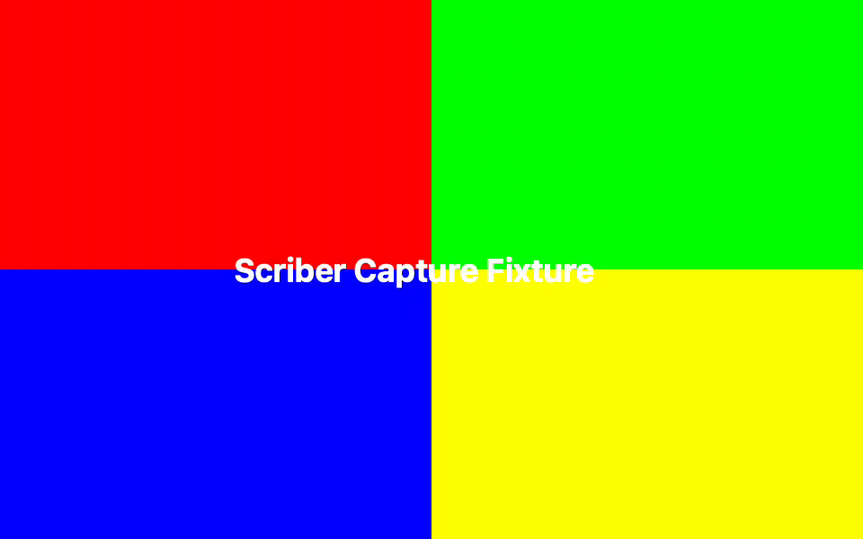

## Native range selector and video panel — 2026-09-17

- The approved panel now starts video through its range choice. Single window/display use SCContentSharingPicker; region mode opens an overlay per display, shows backing-pixel dimensions, confirms with Return/keypad Enter or the start button, and cancels with Escape. Mode/range lock during recording; source toggles remain live. The panel shows actual video time, filename, target, source levels and save state, and recent recording references the paired files.
- All 36 component cases (24 functions), native build/signature and self-review pass. Synthetic events on our unattached overlay view verify clipping and input logic; they remain separate from the actual GUI checks below. A prior automatic panel capture (artifacts/system-audio-check-dxxln4o4) also passed with 8.388208s /402634 identical decoded audio samples.
- After macOS preflight reported Accessibility and screen capture authorized for the responsible ChatGPT host, the agent performed native GUI validation using scoped AX snapshots/actions, System Events keys, authorized HID mouse input and window screenshots. The unavailable CUA connection did not require the user to perform the tests. Evidence is retained under artifacts/gui-validation; raw recordings stay local.
- Actual menu-bar opening and audio/video mode switching resize the content from390×631pt to390×678pt. Range and settings popovers open and their controls work. Escape cancels region selection; the OS picker's Cancel returns without starting another recording.
- The first real drag on a non-key display initially only activated its overlay; a second drag selected correctly. Added acceptsFirstMouse so selection begins on the first drag. The fixed build passed a **first** native drag from(200,200) to(680,500), Return start, locked range controls, and UI Stop, producing the expected960×600 picture. This defect was not detected by direct synthetic view events.

| Actual GUI flow | Recorded duration / audio frames | Local evidence |
|---|---|---|
| Fixed first region drag → Return → Stop | 3.481229s /167099 | gui-validation/region-native-result.json |
| OS Share “Scriber Capture Fixture” Window → live source changes → Stop | 3.139354s /150689 | gui-validation/native-window-result.json |
| OS Share Built-in Retina Display → close/reopen panel → Stop | 73.700333s /3537616 | gui-validation/native-display-result.json |
| Audio Start → Stop | 2.390875s /114762 | gui-validation/native-audio-result.json |
| OS display choice → Settings → Quit while recording | 3.356271s /161101 | gui-validation/native-active-quit-result.json |

- Every listed video produced fully decoded MP4/M4A files with exactly matching decoded audio and submitted frame counts. The window file was960×600 with the expected four fixture colors, proving the native picker selected that window. Display capture was3456×2234. Audio mode produced only M4A. Closing/reopening the panel preserved recording and advancing frame counts.
- During the actual window recording, disabling/re-enabling the microphone updated the checkbox and capture selection. Attempting to disable the remaining computer source preserved it and displayed the last-source warning. Both sources were restored afterward.
- Actual Settings→Quit finalized both video/audio and exited. The earlier idle Quit caused AXPress to return cannotComplete because the process had already exited; process disappearance verified the successful action. A direct CGEvent postToPid key attempt did not prove delivery and was replaced by System Events for keyboard tests. An initial recording with uncontrolled input was excluded from agent-controlled selection evidence. A screenshot timing exception delayed the display test's stop, so its actual73.7s duration is reported above, not a claimed3s test.
- The real saved-panel screenshot below was captured from the native window and visually checked against the approved layout. The fixture was closed and the tested app exited. Filename/path/history editing, global shortcut, device transitions, recovery and long-duration tests remain separate work.

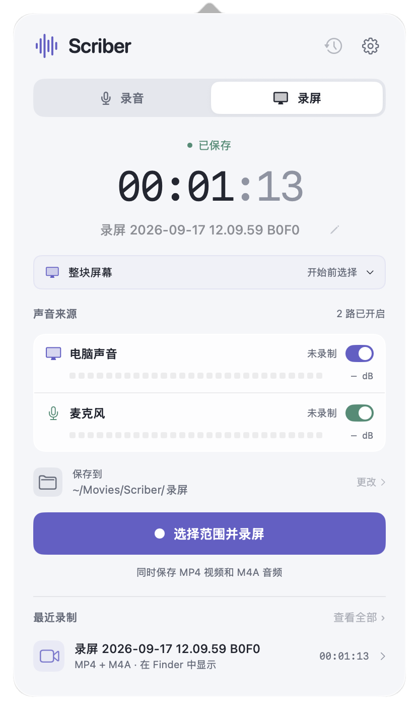
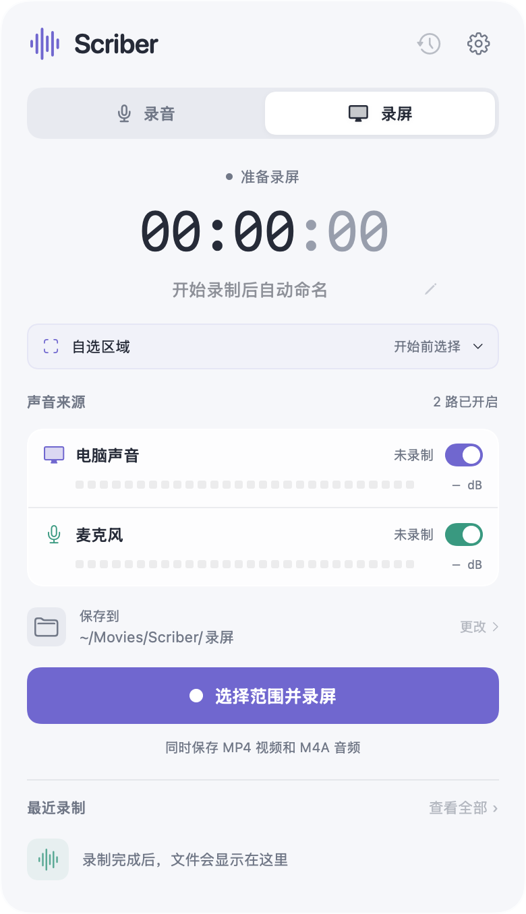

## Closed recording file safety — 2026-09-17

- `RecordingFileSet` relocates a closed M4A or MP4/M4A pair with a shared basename. Unicode names are normalized; empty/hidden/path/control/overlong names are rejected. A collision in either extension advances the whole pair to the same numbered suffix. macOS `RENAME_EXCL` enforces no overwrite at the actual move, including a collision arriving after preflight.
- Seven new filesystem cases pass: name validation; existing file/dangling-link collisions and unchanged-name operation; collision during the second move; injected disk-full rollback; rollback blocked by a new source occupant; invalid/missing/aliased/symlink inputs and absent destination; concurrent paired saves. Tests use real temporary directories and exclusive moves; disk-full/access errors are injected at the move boundary, not claimed as physical disk-exhaustion tests. Failure results retain per-file locations, including a split pair after failed rollback. No recordings or directories are deleted.
- Existing generated-codec cases now relocate their closed outputs before decoding. Four audio variants retain duration/decoded samples; three MP4/M4A variants retain H.264/AAC, picture timing and matching tone onset after paired relocation. All **43 component cases (31 functions)** pass. Local evidence: `artifacts/file-set-tests.log`.
- This increment is the tested file-operation primitive. The recorder still uses its existing output paths until the next session/UI integration PR; no filename/path controls or crash recovery are claimed here. Pair movement is not an atomic filesystem transaction, and cross-volume moves deliberately fail without copying/deleting. Session staging must be created on the destination volume.

## Real recorder session files — 2026-09-17

- The recorder now creates a private UUID staging directory on the chosen destination volume and keeps encoder URLs fixed. A desired title is supplied before capture or changed during recording. Stop freezes that title, closes the encoders, then uses the exclusive relocation primitive; final audio/video summary URLs and recent-file Finder targets reflect the actual result. A partial save lists only successfully published files and retains unfinished media. The panel keeps showing the desired title and destination, with its approved layout unchanged.
- Each session retains a small atomically written `session.json` with its ID, start time, title, actual paths, closed/published members and finalization error. Filesystem work runs outside the main actor and media queue. This descriptor does **not** yet provide crash recovery: abrupt termination during encoding or paired relocation is still part of the later recovery increment. In-flight name changes currently become durable at finalization.
- Four new session cases cover paired collision suffixes and manifest round trip; publishing only the closed member while retaining incomplete media; manifest-write failure retaining closed files in staging; and rejecting an invalid initial title before permissions/capture/filesystem creation. All **47 component cases (35 functions)**, native build/signature, Python syntax and self-review pass (`artifacts/session-files-tests.log`, `session-files-build.log`).

| Real capture with a title change during recording | Duration / decoded audio frames | Local evidence |
|---|---|---|
| Built-in microphone + system sound, one M4A | 8.1618125s /391767 | system-audio-check-_f4tw_pf |
| Owned fixture window, 960×600 MP4 + M4A | 8.206625s /393918 | system-audio-check-ev5uuayq |
| Region video, 640×480, AppKit quit during capture | 5.441875000s /261210 | system-audio-check-99z2aq8r |

- Each run rejects `../outside`, applies “录制中改名 Café” while frames are arriving, proves the open writer path stays unchanged, and verifies the final media/manifest paths after stop. Audio signals, ordered test tones, full media decode, paired audio equality and process exit pass. These are real ScreenCaptureKit runs with a diagnostic name-change action, **not** clicks on an editable filename field; the UI editing controls follow separately.
- The first audio attempt (`system-audio-check-_c1thner`) completed 8.149416667s but the Python harness stopped before decode because Foundation returned the path name in decomposed Unicode. The harness now compares the basename after NFC normalization, matching Swift String's canonical comparison; the full recording/decode was rerun successfully. No audio thresholds were relaxed.
- The following images are offscreen native panel renders from the real renamed recording and saved video states, visually checked for title/destination and recent pair display. They are not evidence of a GUI rename action. Raw media remains local.

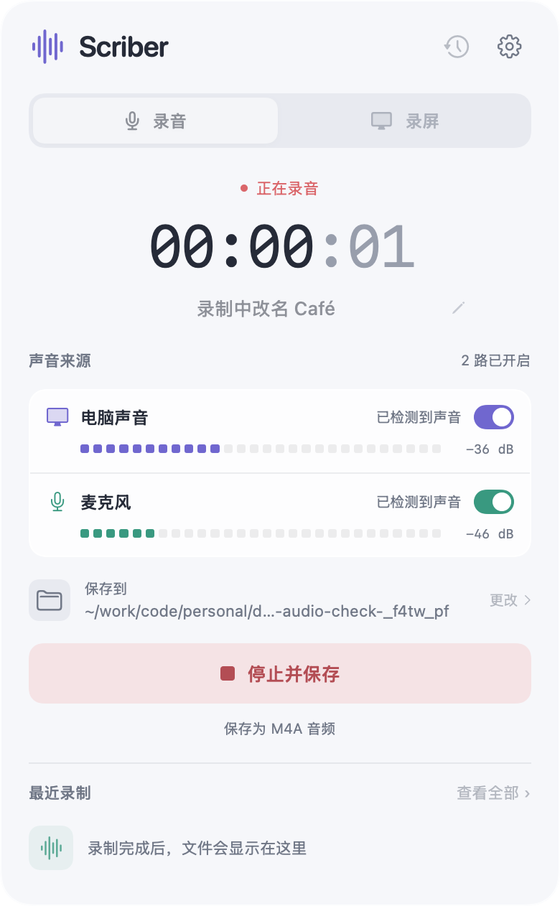
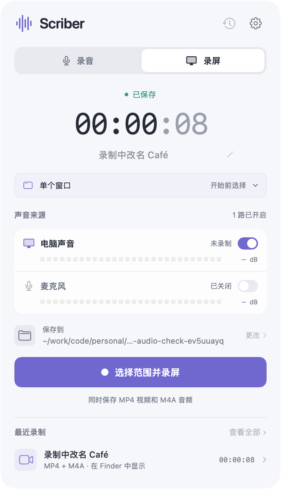

## Native filename editing — 2026-09-17

- The approved centered filename/pencil row is now editable. Return/checkmark confirms, Escape or closing the panel discards the unconfirmed draft. The field focuses after attachment and disables autocorrection. A name can be supplied before audio or video, changed while writing, or changed after saving. Saved paired rename uses the no-overwrite primitive and updates session metadata, summary URLs and recent Finder paths. Invalid in-flight text does not block Stop: the last confirmed name remains in use and is shown in the error hint.
- Each mode retains its last confirmed custom title for subsequent recordings during this app run; collisions are numbered. With no custom title, start still generates a timestamp. Folder preferences and full history are separate increments.
- Added a component case for repeated saved-pair renames, collisions, retained bytes and metadata, and invalid-name refusal. All **48 component cases (36 functions)** and native build/signature pass; diff self-review completed (`artifacts/name-ui-tests.log`, `name-ui-build.log`).
- Fresh Accessibility/screen/input preflight passed. Actual scoped AX controls, foreground-checked HID Unicode text, Command+A and Return/Escape keyboard events exercised the normal app. These tests do not call a hidden rename diagnostic action.

| Native GUI flow | Real duration / audio frames | Evidence under artifacts/gui-validation |
|---|---|---|
| Audio: cancel/invalid name, Chinese title before/during recording, saved collision rename | 4.209020833s /202033 | name-audio-result.json |
| Region video: initial/in-flight Chinese title, Stop with invalid draft, saved paired collision rename | 5.613375s /269442 | name-video-result.json |

- Renaming preserved the full SHA-256 of each encoded file. All renamed media fully decodes; the video's two decoded audio streams are byte-identical and contain269442 samples. Existing collision fixtures were preserved, old renamed paths disappeared, and the session manifests contain the new actual paths. Actual Quit was verified by process exit. Raw test recordings remain local.
- GUI testing found and fixed two shell issues: the accessory app had no Edit menu, so Command+A selected zero characters; a transient NSPopover consumed Escape before SwiftUI's handler, retaining an unconfirmed draft. The app now provides standard responder edit commands and cancels the draft when its main popover closes. Deferred focus was verified on the final video build by AXFocused=true after one pencil click.
- Harness limitations were kept separate from product results: AXSetValue changed the displayed text without triggering SwiftUI's binding, so tests use real text input. Redundant frontmost activation and closed-popover animation timing interrupted some observations. The video was already safely stopped; saved rename continued on those same files (name-video-gui.log → name-video-rename-hid.log), without restarting capture or changing its reported duration. No keyboard/GUI success is inferred solely from an action's return code.

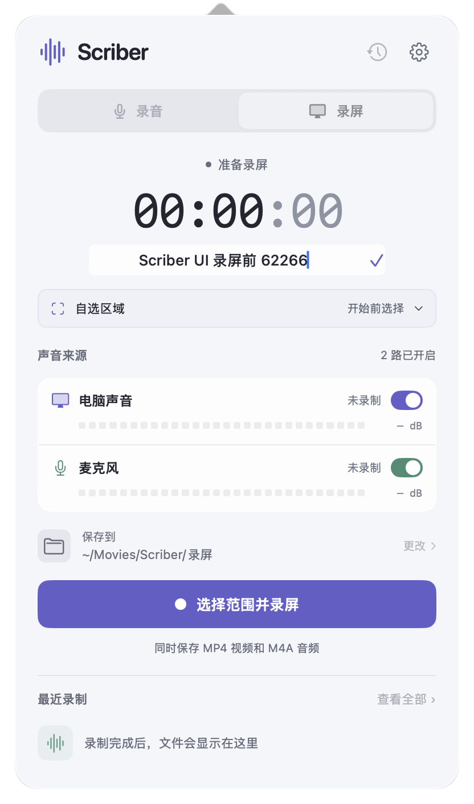
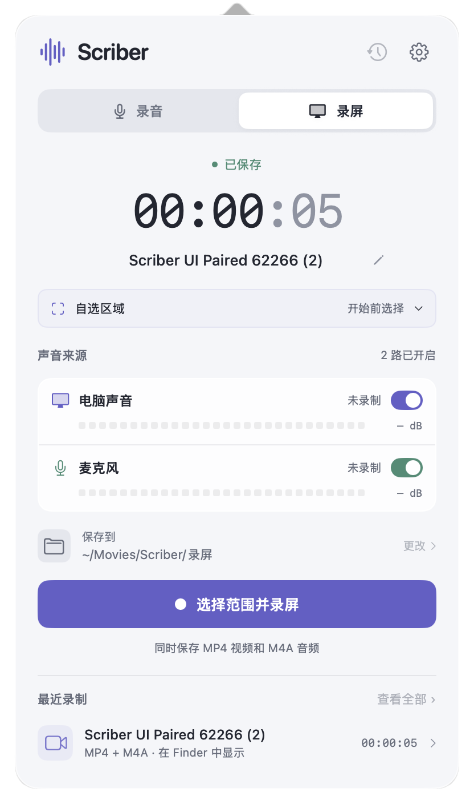

## Native recording destinations — 2026-09-17

- The approved two-card destination subpage opens from the main destination row or settings. Audio and video use separate persisted folder preferences; video and standalone audio share the video preference. The system NSOpenPanel runs asynchronously, supports folder selection/creation, and leaves preferences unchanged on Cancel. A directory is captured before start's first suspension, so changing a preference cannot move the active session. The main panel shows the current directory and a visible/accessibility “next recording” hint; after saving, a changed preference is labeled as the next destination.
- Two component cases cover independent preferences and restoration, invalid file/missing-directory rejection, the initial destination snapshot, and retaining an unavailable absolute preference instead of silently substituting the default. All **50 component cases (38 functions)**, native build/signature and self-review pass (`artifacts/destination-tests.log`, `destination-build.log`).
- Actual normal-app GUI checks selected existing local folders through the native parent menu and folder rows, cancelled the chooser, changed directories during real capture, restarted the app and captured again. The current/next checks temporarily used the Scriber parent folder and its existing audio/video children; the original effective preferences were subsequently restored with the app closed and verified after relaunch. No recorded media was moved to implement a preference change.

| Real GUI capture | Duration / audio frames | Evidence under artifacts/gui-validation |
|---|---|---|
| Audio, change destination while recording; save to the initial folder | 4.5903125s /220335 | directory-audio-current-result.json |
| Next audio after app restart; use the persisted new folder | 2.5409375s /121965 | directory-audio-next-result.json |
| Region video, change destination while recording; keep MP4/M4A in initial folder | 4.514458333s /216694 | directory-video-current-result.json |
| Next region video; both files use the new video folder | 2.620375s /125778 | directory-video-next-result.json |
| Quit path while folder chooser is open during audio | 4.274770833s /205189 | directory-picker-quit-result.json |
| Direct AppKit termination while folder chooser is open during audio | 2.954979167s /141839 | directory-appkit-picker-quit-result.json |

- Every listed media file fully decodes. Both video pairs are960×600 and have byte-identical decoded audio with the exact reported frame counts. Frame counters advanced while the chooser was open. Quit cancelled the chooser, finalized audio, preserved the folder preferences and exited; the second quit used `--quit-via-appkit` to exercise terminateLater directly. Original folders are confirmed in directory-restored-preferences.json and both quit results. The tested app is exited.
- Harness limitations remain separate from acceptance: long path input/AXSetValue in the system Go-to-Folder field was not a reliable edit under the active input method; those attempts were not counted. Folder navigation then used actual menus and rows, with pointer targets verified by AX hit-testing. The harness now waits for visible controls before toggling an animating popover. An earlier failed UI-cleanup attempt left an84.4s audio trial running until a verified graceful termination; it is retained locally but excluded from successful directory-switch acceptance. Later cleanup always falls back to graceful termination of its own recording process. A late restore-only UI observation failed after the successful video checks; effective preferences were restored through the app's preferences while closed and verified on relaunch. Neither input-source settings nor clipboard contents were changed.
- These are short real capture and native GUI checks, not the required long tests or crash-recovery acceptance. Actual screenshots below show the current/next path hint and the restored destination subpage; raw media remains local.

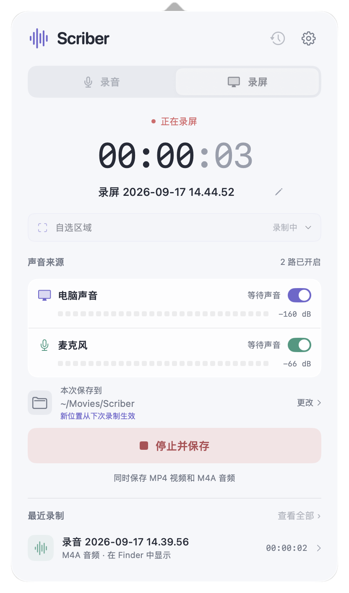
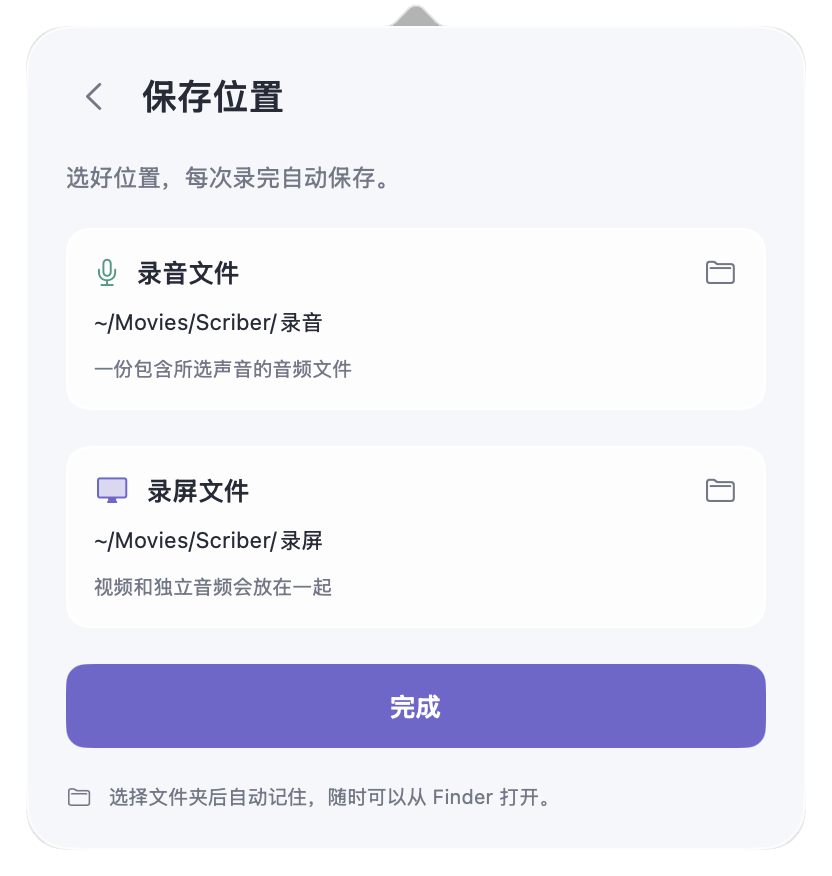

## Durable history registry — 2026-09-17

- Normal-app recordings now register their stable session ID/date/manifest URL in `~/Library/Application Support/Scriber/history.json` **before** opening encoders or starting streams. The registry holds no duplicate media paths. Each manifest includes optional schema version, presentation duration and capture error; rename preserves these and the registry reads its current name/paths. Older manifests without these fields remain readable, with unknown duration represented explicitly.
- Registration reads the existing index under a cross-instance file lock and atomically replaces it after validation. Only an absent file starts an empty index; corrupt/future/duplicate/linked/oversized indexes are refused and preserved. Missing/unreadable individual manifests and missing/unfinished/non-regular media are reported per entry without dropping other entries. Manifest paths are constrained to that session's staging or destination directory. File availability is based on the recorded encoder-close state and filesystem, not a fresh decoder certification.
- Registry registration failure refuses capture before media starts. Manifest reads run outside the registry actor so a slow recording folder does not hold up local index registration. Index and manifest reads are bounded. A failed metadata read blocks rename before moving files; a later successful rename retry clears its file-operation error while retaining any original capture error and duration.
- Nine new component cases cover store/process-style recreation and current renamed metadata; idempotent rediscovery; concurrent separate-store registration; corrupt/future/duplicate indexes; missing/unfinished entries; unrelated media paths; linked/oversized indexes; failed writes (including a valid existing index in a read-only fixture directory); legacy manifests and corrupt-metadata rename refusal. All **59 component cases (47 functions)**, native build/signature, independent reader build and self-review pass (`artifacts/history-store-tests.log`, `history-store-build.log`). Initial tests exposed FileHandle's missing-file Cocoa code4 versus260; index reads now use explicit POSIX ENOENT handling and refuse links/non-regular files.

| Actual normal-app recording | Duration / audio frames | Evidence under artifacts/gui-validation |
|---|---|---|
| Audio registered before writing, then saved | 4.011333333s /192544 | history-audio-result.json |
| Video from a fresh app process, preserving the first reference | 4.229645833s /203023 | history-video-result.json |

- The native Start/Stop flow used real capture. A separate `ReadRecordingHistory` process observed the active audio as unfinished with unknown duration, then observed the finalized name, exact presentation duration, paths and available files. After app restart, the video created one additional grouped entry, preserving the audio entry. After app exit, fresh reader processes returned both records. All media fully decodes; MP4 and M4A decode to203023 identical audio samples. Evidence: history-registration-result.json and artifacts/history-registration-gui.log. The app exited and raw media remains local.
- Rebuild the read-only reader with `xcrun swiftc -parse-as-library Sources/Scriber/RecordingFileSet.swift Sources/Scriber/RecordingSessionFiles.swift Sources/Scriber/RecordingHistoryStore.swift tools/ReadRecordingHistory.swift -o artifacts/ReadRecordingHistory`, then pass an absolute index path.
- This PR supplies persistent data and recorder integration. History list/discovery/playback UI and crash recovery remain separate; no rendered history list or successful recovery is claimed. Existing unindexed beta recordings are left intact for the next discovery increment; unrelated media is not imported.

## Native persistent history list — 2026-09-17

- The approved history subpage now shows real grouped recordings, name search, compact dates, known durations, refresh and Finder actions. Main-panel recent recording restores from history. Live rows use the current recorder title/timer; preparation, recording, saving, incomplete and unavailable states remain explicit. Legacy records without duration show “—”, not a guessed value. Playback/detail and per-history rename are the next increment.
- Startup, history refresh and directory changes discover only direct `.scriber-UUID/session.json` descriptors in default/current known recording directories (including the Scriber root). Unrelated media, nested searches and symlinked session directories are skipped. Valid discoveries are registered in one locked atomic update, and already registered identities do not rewrite the index. Invalid descriptors report warnings; a corrupt registry is never implicitly rebuilt.
- The observable model coalesces refresh requests, preserves its last good rows on read failure, and rechecks current files before Finder reveal. Three new component cases cover constrained/idempotent discovery, corrupt-index preservation, and missing-file/failure model behavior plus safe unknown/large-duration formatting. All **62 component cases (50 functions)**, native build/signature and self-review pass (`artifacts/history-list-tests.log`, `history-list-build.log`).
- Actual native GUI initially displayed13 indexed/discovered real sessions. Numeric keyboard search “62266” returned one grouped pair, “99999” returned the empty-match state, and reopening after restart restored the unfiltered list. Finder AX selection confirmed the exact MP4/M4A pair, excluding the same-name collision fixture. Evidence: history-search-result.json, history-finder-result.json and scoped AX snapshots under artifacts/gui-validation.
- For a known QA video only, a guarded temporary hardlink preserved its bytes while its original path was hidden. Native refresh displayed the missing-file status; the original path was restored with unchanged SHA-256 and refresh cleared the warning. No media was deleted or changed. Evidence: history-missing-result.json and artifacts/history-missing-gui.log. AX selected-text replacement was unsupported in the harness; actual digit key events exercised search without changing input source or clipboard.
- A new real audio recording lasted **2.161125s /103734 frames** and fully decoded. It appeared as a live row, updated after Stop, and survived app restart, increasing the list from13 to14 entries; the main panel restored this new recent recording too. The app exited after the final actual screenshot. Evidence: history-list-live-result.json and artifacts/history-list-live-gui.log.
- The screenshot below is an actual native window capture, visually checked against the approved layout. Raw recordings and the personal history registry remain local. Older recordings outside known directories or without Scriber session descriptors are not imported.

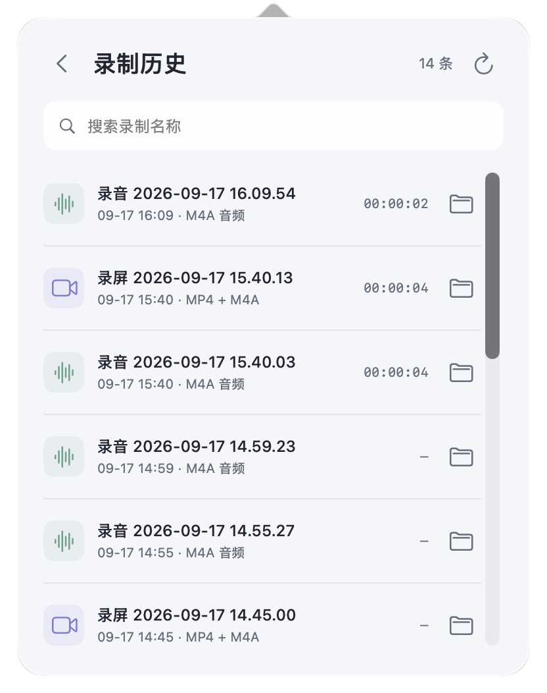

## Remaining acceptance

History detail playback/per-entry rename, global shortcut, Bluetooth, device changes, recovery, real8-hour audio /2-hour video tests, and final native GUI validation remain outstanding. Explicit stop and AppKit-driven audio/video quit are verified; sleep/lock behavior still requires dedicated checks.
