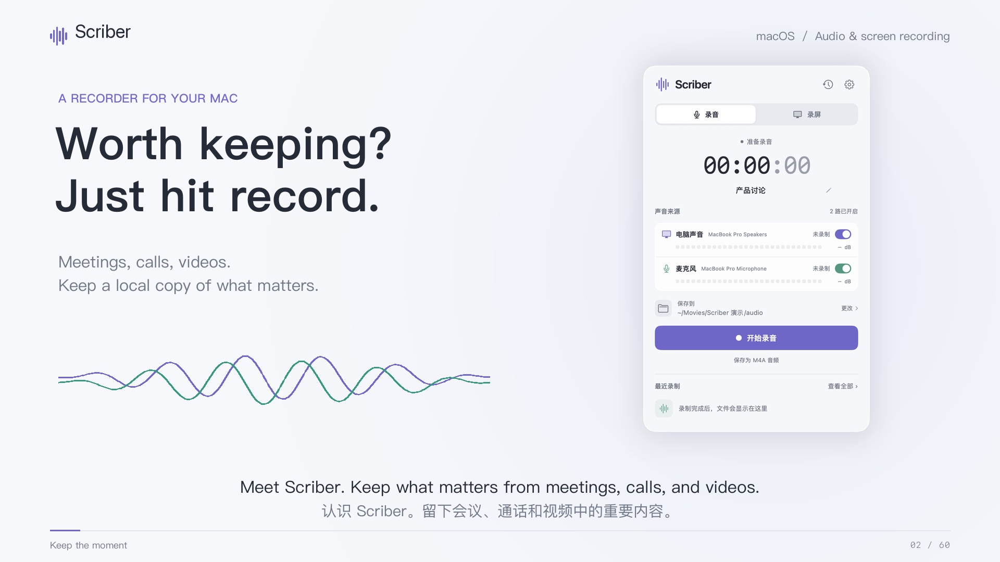

# Scriber · Record it. Put it to work.

当前版本为 **60 秒、1080p、英文配音、英文画面说明、中英双语字幕**。英文在上、中文在下，直接显示在画面中，无需开启播放器字幕。配乐保持轻柔，低于旁白。

[下载英文版 MP4](https://raw.githubusercontent.com/luyao618/dayscribe/main/video/scriber-intro-en.mp4) · [中英字幕](scriber-en-bilingual.srt) · [英文旁白与来源](VOICE.md) · [成片检查](VERIFICATION-en.md)

[](https://raw.githubusercontent.com/luyao618/dayscribe/main/video/scriber-intro-en.mp4)

## 内容与来源

- 视频的标题、说明、文件示意与旁白为英文。实拍操作拍摄于 Scriber 的中文界面，保留拍摄时的真实画面；应用后来新增的英文界面未在这版视频中演示。
- 面板、声音开关、录制中改名、区域选择和视频播放来自签名 Scriber.app 的真实原生操作，使用隔离历史及「产品讨论」「方案演示」等示例内容。原生 UI 片段没有音轨，成片不会混入真实麦克风或系统声音。
- 英文旁白由本地 Kokoro 标准 `af_heart` 声音生成，是 AI 配音，不克隆特定人物。脚本、模型来源、实际时长、字幕和独立转写检查见 [VOICE.md](VOICE.md)。
- `music.py` 合成原创器乐；说明文字、声音线条与文件动画为本项目绘制，没有使用第三方配乐或品牌素材。字体使用本机 PingFang SC 与 SF，不分发字体文件。
- 参考 [hermes-on-herdr 产品短片](https://github.com/nocoo/hermes-on-herdr/tree/main/video) 的简洁叙事与留白，没有复用其代码、配乐、品牌或画面。
- Agent 总结由用户选择的其他工具完成。Scriber 提供本地文件，不内置 AI 或转录。产品验收限制见 [验收记录](../docs/ACCEPTANCE.md)。

## 本地观看

运行 `python3 video/serve.py`，打开 <http://127.0.0.1:8877/video/>。支持播放、暂停、拖动进度、章节跳转、全屏与下载。服务仅监听本机，并支持视频跳转所需的 HTTP 字节范围请求。

字幕已压入成片，预览页不重复加载额外字幕轨。[双语](scriber-en-bilingual.srt)、[英文](scriber-en-en.srt)、[中文](scriber-en-zh.srt) SRT 及对应 VTT 文件保留用于编辑和其他播放器。

## 重新生成英文版

需要 macOS 系统字体、Python 3.11+ 和 FFmpeg。应用本身不依赖这些制作工具。已提交无损旁白和原生素材；重建视频无需下载声音模型，也无需再次录音。

```sh
python3 -m venv video/.venv
video/.venv/bin/pip install -r video/requirements.txt
video/.venv/bin/python video/render_en.py --stills
video/.venv/bin/python video/render_en.py
cp video/output/scriber-intro-en.mp4 video/scriber-intro-en.mp4
cp video/output/poster-en.jpg video/poster-en.jpg
video/.venv/bin/python video/verify.py --edition en
```

`render_en.py` 会将已有英文旁白与原创配乐混合后编码，并将两种语言的字幕直接绘入画面。旁白本身的重新生成方法见 [VOICE.md](VOICE.md)。分镜见 [STORYBOARD.md](STORYBOARD.md)，逐句文字见 [narration-en.json](narration-en.json)，原生素材哈希见 [provenance.json](assets/provenance.json)。

原[中文无旁白初版](scriber-intro-zh.mp4)、`render.py` 和[原验证记录](VERIFICATION.md)继续保留。不同字体、编码器或运行库的再生成结果可能略有差异，当前交付文件以 [verification-en.json](verification-en.json) 中的哈希为准。
